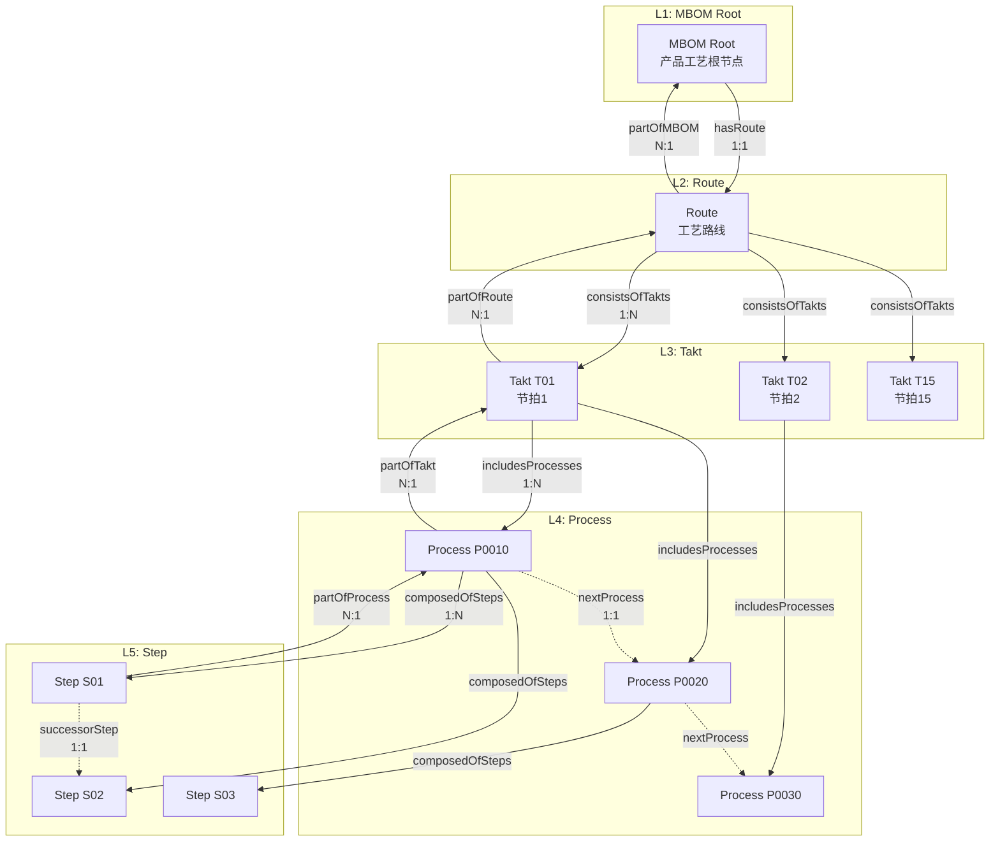

# MBOM实体数据契约

**Entity Data Contract - MBOM (Manufacturing Bill of Materials)**

---

## 契约元信息

| 项目 | 内容 |
|-----|------|
| **契约版本** | v1.0.0 |
| **所属总契约** | 00_总契约.md v1.0.0 |
| **生效日期** | 2025-11-10 |
| **实体类型** | MBOM (含5种子类型) |
| **所属层级** | 过程定义层 (Process Definition Layer) |
| **契约状态** | 🟢 生效中 |

---

## 1. 实体概述

### 1.1 实体定义

**MBOM** (Manufacturing Bill of Materials, 制造物料清单) 是过程定义层的核心实体,定义产品的完整制造工艺路线,采用五层树形结构组织:

```
MBOM Root (L1) - 产品MBOM根节点
  └─ Route (L2) - 工艺路线
      └─ Takt (L3) - 节拍/工段
          └─ Process (L4) - 工序
              └─ Step (L5) - 工步
```

通过`mbomType`属性区分5种具体子类型:
- **MBOMRoot**: L1层,产品MBOM根节点
- **Route**: L2层,工艺路线定义
- **Takt**: L3层,节拍时间段定义
- **Process**: L4层,工序定义
- **Step**: L5层,最小执行单元工步定义

### 1.2 实体用途

| 子类型 | 层级 | 用途 | 典型实例数 |
|-------|-----|------|-----------|
| MBOMRoot | L1 | 产品工艺根定义,版本管理入口 | 2 (M670/M803) |
| Route | L2 | 完整工艺路线定义,总周期时间 | 2 |
| Takt | L3 | 节拍时间段,目标CT定义 | 15 |
| Process | L4 | 具体工序定义,工位绑定 | 141 |
| Step | L5 | 最小操作单元,标准工时 | 74 |

**总实例数**: 234个MBOM实体

### 1.3 典型URN示例

```
urn:ngsi-ld:MBOM:M000004670327:V1.0                      (MBOMRoot)
urn:ngsi-ld:MBOM:RT_M000004670327:V1.0                   (Route)
urn:ngsi-ld:MBOM:M000004670327:T01                       (Takt)
urn:ngsi-ld:MBOM:M000004670327:T01:P0010                 (Process)
urn:ngsi-ld:MBOM:M000004670327:T01:P0010:S01             (Step)
```

---

## 2. 核心字段契约 (所有子类型通用)

### 2.1 必填字段

| 字段名 | NGSI-LD类型 | 数据类型 | 约束 | 说明 | 示例 |
|-------|------------|---------|------|------|------|
| **id** | - | URN | 必填,唯一 | 全局唯一标识符 | `urn:ngsi-ld:MBOM:M000004670327:T01:P0010` |
| **type** | - | String | 必填,固定值 | 固定为"MBOM" | `"MBOM"` |
| **@context** | - | Array | 必填 | NGSI-LD上下文 | `["https://uri.etsi.org/ngsi-ld/v1/ngsi-ld-core-context.jsonld", "https://example.com/contexts/mbom-context.jsonld"]` |
| **mbomType** | Property | String | 必填,枚举 | 子类型标识 | `"Takt"` |
| **status** | Property | String | 必填,枚举 | 状态 | `"active"`, `"draft"`, `"retired"`, `"deprecated"` |

### 2.2 推荐字段

| 字段名 | NGSI-LD类型 | 数据类型 | 约束 | 说明 | 示例 |
|-------|------------|---------|------|------|------|
| **metadata** | Property | Object | 推荐 | 元数据信息 | `{"createdAt": "2025-08-01T00:00:00Z", "modifiedAt": "2025-08-15T10:30:00Z"}` |

---

## 3. 子类型契约

### 3.1 枚举值: mbomType

```
MBOMRoot  - MBOM根节点 (L1)
Route     - 工艺路线 (L2)
Takt      - 节拍/工段 (L3)
Process   - 工序 (L4)
Step      - 工步 (L5)
```

**验证规则**:
- ✅ 必须从上述枚举值中选择
- ❌ 不允许自定义mbomType值

---

### 3.2 MBOMRoot (MBOM根节点) 特有字段

**层级**: L1

| 字段名 | NGSI-LD类型 | 数据类型 | 必填 | 枚举值/约束 | 说明 |
|-------|------------|---------|-----|------------|------|
| **mbomCode** | Property | String | ✓ | 唯一 | MBOM业务编码 |
| **mbomName** | Property | String | ✓ | - | MBOM名称 |
| **mbomVersion** | Property | String | ✓ | 格式: `V{major}.{minor}` | 版本号 |
| **productCode** | Property | String | ✓ | 引用Product | 关联产品代码 |
| **effectiveFrom** | Property | DateTime | - | ISO 8601 | 生效起始时间 |
| **effectiveTo** | Property | DateTime | - | ISO 8601 | 生效结束时间 |
| **hasRoute** | Relationship | URN | ✓ | 指向Route | MBOM根指向路线 (1:1) |
| **totalProcesses** | Property | Integer | - | >= 0 | 总工序数 |
| **totalSteps** | Property | Integer | - | >= 0 | 总工步数 |

**关系约束**:
- `hasRoute` → Route: 1对1强制关系
- 反向关系: Route.partOfMBOM ← MBOMRoot

**URN格式**: 
```
urn:ngsi-ld:MBOM:{productCode}:{version}
示例: urn:ngsi-ld:MBOM:M000004670327:V1.0
```

**示例**:
```json
{
  "@context": [
    "https://uri.etsi.org/ngsi-ld/v1/ngsi-ld-core-context.jsonld",
    "https://example.com/contexts/mbom-context.jsonld"
  ],
  "id": "urn:ngsi-ld:MBOM:M000004670327:V1.0",
  "type": "MBOM",
  "mbomType": {"type": "Property", "value": "MBOMRoot"},
  "mbomCode": {"type": "Property", "value": "M000004670327"},
  "mbomName": {"type": "Property", "value": "M670侧墙制造MBOM"},
  "mbomVersion": {"type": "Property", "value": "V1.0"},
  "productCode": {"type": "Property", "value": "M000004670327"},
  "status": {"type": "Property", "value": "active"},
  "effectiveFrom": {"type": "Property", "value": "2025-08-01T00:00:00Z"},
  "hasRoute": {
    "type": "Relationship",
    "object": "urn:ngsi-ld:MBOM:RT_M000004670327:V1.0"
  },
  "totalProcesses": {"type": "Property", "value": 117},
  "totalSteps": {"type": "Property", "value": 74}
}
```

---

### 3.3 Route (工艺路线) 特有字段

**层级**: L2

| 字段名 | NGSI-LD类型 | 数据类型 | 必填 | 枚举值/约束 | 说明 |
|-------|------------|---------|-----|------------|------|
| **routeCode** | Property | String | ✓ | 唯一 | 路线业务编码 |
| **routeName** | Property | String | ✓ | - | 路线名称 |
| **lineCode** | Property | String | ✓ | - | 产线代码 |
| **partOfMBOM** | Relationship | URN | ✓ | 指向MBOMRoot | 所属MBOM根 (N:1) |
| **consistsOfTakts** | Relationship[] | URN[] | ✓ | 指向Takt列表 | 包含的节拍列表 (1:N) |
| **taktCount** | Property | Integer | - | >= 1 | 节拍总数 |
| **totalCycleTime** | Property | Object | - | 带单位的数值 | 总周期时间 |
| **requiredMeasurements** | Property | Array[Object] | - | 测量要求对象数组 | Route级测量要求定义 |

**关系约束**:
- `partOfMBOM` ← MBOMRoot: N对1反向关系
- `consistsOfTakts` → Takt[]: 1对N关系
- 反向关系: Takt.partOfRoute ← Route

**totalCycleTime 结构**:
```json
{
  "type": "Property",
  "value": 4620,
  "unitCode": "MIN"
}
```

**requiredMeasurements 结构**:
```json
{
  "type": "Property",
  "value": [
    {
      "modalityCode": "TotalCycleTime",
      "ruleId": "RULE_CT_LT_500MIN",
      "timing": "post",
      "aggregator": "sum",
      "capturedByResourceClass": "MES_SYSTEM",
      "description": "总周期时间不超过500分钟"
    }
  ]
}
```

**URN格式**: 
```
urn:ngsi-ld:MBOM:RT_{productCode}:{version}
示例: urn:ngsi-ld:MBOM:RT_M000004670327:V1.0
```

**示例**:
```json
{
  "@context": [
    "https://uri.etsi.org/ngsi-ld/v1/ngsi-ld-core-context.jsonld",
    "https://example.com/contexts/mbom-context.jsonld"
  ],
  "id": "urn:ngsi-ld:MBOM:RT_M000004670327:V1.0",
  "type": "MBOM",
  "mbomType": {"type": "Property", "value": "Route"},
  "routeCode": {"type": "Property", "value": "RT_M000004670327"},
  "routeName": {"type": "Property", "value": "M670侧墙标准工艺路线"},
  "lineCode": {"type": "Property", "value": "TS361202"},
  "status": {"type": "Property", "value": "active"},
  "partOfMBOM": {
    "type": "Relationship",
    "object": "urn:ngsi-ld:MBOM:M000004670327:V1.0"
  },
  "consistsOfTakts": [
    {"type": "Relationship", "object": "urn:ngsi-ld:MBOM:M000004670327:T01"},
    {"type": "Relationship", "object": "urn:ngsi-ld:MBOM:M000004670327:T02"}
  ],
  "taktCount": {"type": "Property", "value": 15},
  "totalCycleTime": {
    "type": "Property",
    "value": 4620,
    "unitCode": "MIN"
  }
}
```

---

### 3.4 Takt (节拍/工段) 特有字段

**层级**: L3

| 字段名 | NGSI-LD类型 | 数据类型 | 必填 | 枚举值/约束 | 说明 |
|-------|------------|---------|-----|------------|------|
| **taktSeq** | Property | Integer | ✓ | >= 1 | 节拍序号 |
| **taktName** | Property | String | ✓ | - | 节拍名称 |
| **targetCT** | Property | Object | - | 带单位的数值 | 目标节拍时间(Cycle Time) |
| **defaultTimeWindow** | Property | String | - | `perPiece`, `perBatch`, `perShift`, `perDay` | 默认时间窗口粒度 |
| **partOfRoute** | Relationship | URN | ✓ | 指向Route | 所属路线 (N:1) |
| **includesProcesses** | Relationship[] | URN[] | ✓ | 指向Process列表 | 包含的工序列表 (1:N) |
| **processCount** | Property | Integer | - | >= 1 | 工序总数 |
| **estimatedDuration** | Property | Object | - | 带单位的数值 | 估算总时长 |
| **requiredMeasurements** | Property | Array[Object] | - | 测量要求对象数组 | Takt级测量要求定义 |

**关系约束**:
- `partOfRoute` ← Route: N对1反向关系
- `includesProcesses` → Process[]: 1对N关系
- 反向关系: Process.partOfTakt ← Takt

**targetCT 结构**:
```json
{
  "type": "Property",
  "value": 420,
  "unitCode": "MIN"
}
```

**URN格式**: 
```
urn:ngsi-ld:MBOM:{productCode}:T{seq}
示例: urn:ngsi-ld:MBOM:M000004670327:T01
```

**示例**:
```json
{
  "@context": [
    "https://uri.etsi.org/ngsi-ld/v1/ngsi-ld-core-context.jsonld",
    "https://example.com/contexts/mbom-context.jsonld"
  ],
  "id": "urn:ngsi-ld:MBOM:M000004670327:T01",
  "type": "MBOM",
  "mbomType": {"type": "Property", "value": "Takt"},
  "taktSeq": {"type": "Property", "value": 1},
  "taktName": {"type": "Property", "value": "清洗打磨侧墙坯"},
  "targetCT": {
    "type": "Property",
    "value": 420,
    "unitCode": "MIN"
  },
  "defaultTimeWindow": {"type": "Property", "value": "perPiece"},
  "status": {"type": "Property", "value": "active"},
  "partOfRoute": {
    "type": "Relationship",
    "object": "urn:ngsi-ld:MBOM:RT_M000004670327:V1.0"
  },
  "includesProcesses": [
    {"type": "Relationship", "object": "urn:ngsi-ld:MBOM:M000004670327:T01:P0010"},
    {"type": "Relationship", "object": "urn:ngsi-ld:MBOM:M000004670327:T01:P0020"}
  ],
  "processCount": {"type": "Property", "value": 2}
}
```

---

### 3.5 Process (工序) 特有字段

**层级**: L4

| 字段名 | NGSI-LD类型 | 数据类型 | 必填 | 枚举值/约束 | 说明 |
|-------|------------|---------|-----|------------|------|
| **procCode** | Property | String | ✓ | 格式: `P{seq}` | 工序代码 |
| **procName** | Property | String | ✓ | - | 工序名称 |
| **stationCode** | Property | String | ✓ | 引用Station | 执行工位代码 |
| **processKind** | Property | String | - | `Manual`, `SemiAuto`, `FullAuto`, `Inspection`, `Transport`, `Other` | 工序类型 |
| **partOfTakt** | Relationship | URN | ✓ | 指向Takt | 所属节拍 (N:1) |
| **composedOfSteps** | Relationship[] | URN[] | ✓ | 指向Step列表 | 包含的工步列表 (1:N) |
| **nextProcess** | Relationship | URN | - | 指向Process | 后续工序 (1:1) |
| **stdTime** | Property | Object | - | 带单位的数值 | 标准工时 |
| **stepCount** | Property | Integer | - | >= 1 | 工步总数 |
| **requiredResources** | Property | Array[Object] | - | 资源需求对象数组 | 所需资源列表 |
| **requiredMeasurements** | Property | Array[Object] | - | 测量要求对象数组 | Process级测量要求定义 |

**关系约束**:
- `partOfTakt` ← Takt: N对1反向关系
- `composedOfSteps` → Step[]: 1对N关系
- `nextProcess` → Process: 1对1可选关系(工序链)
- 反向关系: Step.partOfProcess ← Process

**processKind 枚举说明**:
- `Manual`: 人工工序
- `SemiAuto`: 半自动工序
- `FullAuto`: 全自动工序
- `Inspection`: 检验工序
- `Transport`: 运输工序
- `Other`: 其他

**stdTime 结构**:
```json
{
  "type": "Property",
  "value": 60,
  "unitCode": "MIN"
}
```

**requiredResources 结构**:
```json
{
  "type": "Property",
  "value": [
    {
      "resourceClass": "AutoEquipment",
      "resourceId": "urn:ngsi-ld:TwinObject:AutoEquipment:361-01173",
      "quantity": 1,
      "capability": "MIG焊接"
    },
    {
      "resourceClass": "Person",
      "roleId": "urn:ngsi-ld:Role:Welder",
      "quantity": 1,
      "skillLevel": "Intermediate"
    }
  ]
}
```

**URN格式**: 
```
urn:ngsi-ld:MBOM:{productCode}:T{taktSeq}:P{procCode}
示例: urn:ngsi-ld:MBOM:M000004670327:T01:P0010
```

**示例**:
```json
{
  "@context": [
    "https://uri.etsi.org/ngsi-ld/v1/ngsi-ld-core-context.jsonld",
    "https://example.com/contexts/mbom-context.jsonld"
  ],
  "id": "urn:ngsi-ld:MBOM:M000004670327:T01:P0010",
  "type": "MBOM",
  "mbomType": {"type": "Property", "value": "Process"},
  "procCode": {"type": "Property", "value": "P0010"},
  "procName": {"type": "Property", "value": "清洗打磨侧墙坯"},
  "stationCode": {"type": "Property", "value": "FrontWelding"},
  "processKind": {"type": "Property", "value": "SemiAuto"},
  "status": {"type": "Property", "value": "active"},
  "partOfTakt": {
    "type": "Relationship",
    "object": "urn:ngsi-ld:MBOM:M000004670327:T01"
  },
  "composedOfSteps": [
    {"type": "Relationship", "object": "urn:ngsi-ld:MBOM:M000004670327:T01:P0010:S01"},
    {"type": "Relationship", "object": "urn:ngsi-ld:MBOM:M000004670327:T01:P0010:S02"}
  ],
  "nextProcess": {
    "type": "Relationship",
    "object": "urn:ngsi-ld:MBOM:M000004670327:T01:P0020"
  },
  "stdTime": {
    "type": "Property",
    "value": 60,
    "unitCode": "MIN"
  },
  "stepCount": {"type": "Property", "value": 2}
}
```

---

### 3.6 Step (工步) 特有字段

**层级**: L5 (最小执行单元)

| 字段名 | NGSI-LD类型 | 数据类型 | 必填 | 枚举值/约束 | 说明 |
|-------|------------|---------|-----|------------|------|
| **stepSeq** | Property | Integer | ✓ | 1-999 | 工步序号 |
| **stepName** | Property | String | ✓ | - | 工步名称 |
| **stationCode** | Property | String | ✓ | 引用Station | 执行工位代码 |
| **stdTime** | Property | Object | ✓ | 带单位的数值 | 标准工时 |
| **stepDescription** | Property | String | - | 最长1000字符 | 工步详细说明 |
| **processKind** | Property | String | - | 同Process.processKind | 工步类型 |
| **partOfProcess** | Relationship | URN | ✓ | 指向Process | 所属工序 (N:1) |
| **predecessorStep** | Relationship | URN | - | 指向Step | 前序工步 (1:1) |
| **successorStep** | Relationship | URN | - | 指向Step | 后续工步 (1:1) |
| **isOptional** | Property | Boolean | - | true/false | 是否可选工步 |
| **canRunInParallel** | Property | Boolean | - | true/false | 是否支持并行执行 |
| **requiredResources** | Property | Array[Object] | - | 资源需求对象数组 | 所需资源列表 |
| **requiredMeasurements** | Property | Array[Object] | - | 测量要求对象数组 | Step级测量要求定义 |

**关系约束**:
- `partOfProcess` ← Process: N对1反向关系
- `predecessorStep` → Step: 1对1可选关系(工步链前向)
- `successorStep` → Step: 1对1可选关系(工步链后向)

**requiredMeasurements 结构** (Step级最精细):
```json
{
  "type": "Property",
  "value": [
    {
      "modalityCode": "WeldingCurrent_Auto",
      "ruleId": "RULE_WELD_I_180_200A",
      "timing": "in",
      "aggregator": "mean",
      "capturedByResourceClass": "SENSOR",
      "targetValue": 190,
      "tolerance": 10,
      "description": "焊接电流应在180-200A范围内"
    },
    {
      "modalityCode": "DimensionMeasurement_Auto",
      "ruleId": "RULE_DIM_DEVIATION_LT_0.5MM",
      "timing": "post",
      "aggregator": "max",
      "capturedByResourceClass": "SENSOR",
      "description": "尺寸偏差不超过0.5mm"
    }
  ]
}
```

**URN格式**: 
```
urn:ngsi-ld:MBOM:{productCode}:T{taktSeq}:P{procCode}:S{stepSeq}
示例: urn:ngsi-ld:MBOM:M000004670327:T01:P0010:S01
```

**示例**:
```json
{
  "@context": [
    "https://uri.etsi.org/ngsi-ld/v1/ngsi-ld-core-context.jsonld",
    "https://example.com/contexts/mbom-context.jsonld"
  ],
  "id": "urn:ngsi-ld:MBOM:M000004670327:T01:P0010:S01",
  "type": "MBOM",
  "mbomType": {"type": "Property", "value": "Step"},
  "stepSeq": {"type": "Property", "value": 1},
  "stepName": {"type": "Property", "value": "清洗侧墙表面"},
  "stationCode": {"type": "Property", "value": "FrontWelding"},
  "stdTime": {
    "type": "Property",
    "value": 30,
    "unitCode": "MIN"
  },
  "stepDescription": {
    "type": "Property",
    "value": "使用清洗液清洗侧墙表面,去除油污和杂质"
  },
  "processKind": {"type": "Property", "value": "Manual"},
  "status": {"type": "Property", "value": "active"},
  "partOfProcess": {
    "type": "Relationship",
    "object": "urn:ngsi-ld:MBOM:M000004670327:T01:P0010"
  },
  "successorStep": {
    "type": "Relationship",
    "object": "urn:ngsi-ld:MBOM:M000004670327:T01:P0010:S02"
  },
  "isOptional": {"type": "Property", "value": false},
  "canRunInParallel": {"type": "Property", "value": false}
}
```

---

## 4. 实体关系图谱

### 4.1 MBOM层级关系



### 4.2 关系清单表

| 关系名 | 源实体 | 目标实体 | 基数 | 必填 | 说明 |
|-------|-------|---------|------|-----|------|
| **垂直层级关系** |
| hasRoute | MBOMRoot | Route | 1:1 | ✓ | MBOM根指向路线 |
| partOfMBOM | Route | MBOMRoot | N:1 | ✓ | 路线所属MBOM |
| consistsOfTakts | Route | Takt | 1:N | ✓ | 路线包含节拍列表 |
| partOfRoute | Takt | Route | N:1 | ✓ | 节拍所属路线 |
| includesProcesses | Takt | Process | 1:N | ✓ | 节拍包含工序列表 |
| partOfTakt | Process | Takt | N:1 | ✓ | 工序所属节拍 |
| composedOfSteps | Process | Step | 1:N | ✓ | 工序包含工步列表 |
| partOfProcess | Step | Process | N:1 | ✓ | 工步所属工序 |
| **水平链式关系** |
| nextProcess | Process | Process | 1:1 | - | 工序链:指向后续工序 |
| predecessorStep | Step | Step | 1:1 | - | 工步链:指向前序工步 |
| successorStep | Step | Step | 1:1 | - | 工步链:指向后续工步 |

---

## 5. 全局规范

### 5.1 URN命名规范

**格式定义**:

| 子类型 | URN格式 | 示例 |
|-------|--------|------|
| MBOMRoot | `urn:ngsi-ld:MBOM:{productCode}:{version}` | `urn:ngsi-ld:MBOM:M000004670327:V1.0` |
| Route | `urn:ngsi-ld:MBOM:RT_{productCode}:{version}` | `urn:ngsi-ld:MBOM:RT_M000004670327:V1.0` |
| Takt | `urn:ngsi-ld:MBOM:{productCode}:T{seq}` | `urn:ngsi-ld:MBOM:M000004670327:T01` |
| Process | `urn:ngsi-ld:MBOM:{productCode}:T{taktSeq}:P{procCode}` | `urn:ngsi-ld:MBOM:M000004670327:T01:P0010` |
| Step | `urn:ngsi-ld:MBOM:{productCode}:T{taktSeq}:P{procCode}:S{stepSeq}` | `urn:ngsi-ld:MBOM:M000004670327:T01:P0010:S01` |

**命名约束**:
- ✅ productCode: 产品物料号,如 `M000004670327`
- ✅ version: 格式为 `V{major}.{minor}`,如 `V1.0`, `V2.1`
- ✅ taktSeq: 两位或三位数字,如 `T01`, `T15`
- ✅ procCode: 格式为 `P{四位数字}`,如 `P0010`, `P0020`
- ✅ stepSeq: 两位或三位数字,如 `S01`, `S10`

### 5.2 状态枚举值

**status字段**:
```
draft       - 草稿状态,正在编制中
active      - 生效状态,当前使用
retired     - 退役状态,已停用但保留记录
deprecated  - 废弃状态,不再使用
```

**验证规则**:
- ✅ 初始创建: `draft`
- ✅ 审核通过: `draft` → `active`
- ✅ 版本升级: `active` → `retired`
- ✅ 彻底废弃: `retired` → `deprecated`

### 5.3 processKind枚举值

**适用于**: Process.processKind, Step.processKind

```
Manual       - 人工工序/工步
SemiAuto     - 半自动工序/工步
FullAuto     - 全自动工序/工步
Inspection   - 检验工序/工步
Transport    - 运输工序/工步
Other        - 其他
```

### 5.4 时间单位规范

**unitCode字段** (用于stdTime, targetCT, totalCycleTime等):

```
MIN   - 分钟 (推荐使用)
SEC   - 秒
HOUR  - 小时
```

### 5.5 requiredMeasurements 结构规范

**通用结构** (适用于Route/Takt/Process/Step):

```json
{
  "type": "Property",
  "value": [
    {
      "modalityCode": "<Modality实体的业务代码>",
      "ruleId": "<质量规则ID>",
      "timing": "pre | in | post",
      "aggregator": "mean | max | min | sum | p95",
      "capturedByResourceClass": "SENSOR | MES_SYSTEM | QCTool | Manual",
      "targetValue": <目标值,可选>,
      "tolerance": <容差,可选>,
      "description": "<测量说明>"
    }
  ]
}
```

**timing枚举**:
- `pre`: 工序/工步之前测量
- `in`: 工序/工步过程中测量
- `post`: 工序/工步之后测量

**aggregator枚举**:
- `mean`: 平均值
- `max`: 最大值
- `min`: 最小值
- `sum`: 求和
- `p95`: 95分位数

---

## 6. 典型查询场景

### 6.1 查询产品完整MBOM树

**场景**: 给定产品代码,查询完整的5层MBOM树结构

**步骤**:
1. 查询MBOMRoot (通过productCode)
2. 通过hasRoute关系查询Route
3. 通过consistsOfTakts关系查询所有Takt
4. 通过includesProcesses关系查询每个Takt的Process列表
5. 通过composedOfSteps关系查询每个Process的Step列表

**伪代码**:
```python
# 1. 查询MBOM根
mbom_root = query(
    "id LIKE 'urn:ngsi-ld:MBOM:M000004670327:V%'",
    "mbomType.value = 'MBOMRoot'",
    "status.value = 'active'"
)

# 2. 查询Route
route_id = mbom_root.hasRoute.object
route = get_entity(route_id)

# 3. 查询所有Takt
takt_ids = route.consistsOfTakts[].object
takts = [get_entity(takt_id) for takt_id in takt_ids]

# 4. 查询每个Takt的Process
for takt in takts:
    process_ids = takt.includesProcesses[].object
    takt.processes = [get_entity(proc_id) for proc_id in process_ids]
    
    # 5. 查询每个Process的Step
    for process in takt.processes:
        step_ids = process.composedOfSteps[].object
        process.steps = [get_entity(step_id) for step_id in step_ids]
```

### 6.2 查询工序执行链路

**场景**: 给定某个Process,查询其在工序链中的前后关系

**步骤**:
1. 查询当前Process
2. 通过nextProcess关系查询后续工序
3. 递归查询,直到nextProcess为空

**伪代码**:
```python
def get_process_chain(process_id):
    process = get_entity(process_id)
    chain = [process]
    
    # 查询后续工序
    current = process
    while current.nextProcess:
        next_proc = get_entity(current.nextProcess.object)
        chain.append(next_proc)
        current = next_proc
    
    return chain

# 使用示例
chain = get_process_chain("urn:ngsi-ld:MBOM:M000004670327:T01:P0010")
# 返回: [P0010, P0020, ...]
```

### 6.3 查询工位关联的所有工序

**场景**: 给定工位代码,查询该工位执行的所有工序

**步骤**:
1. 查询所有Process实体
2. 过滤stationCode = 目标工位

**伪代码**:
```python
processes = query(
    "type = 'MBOM'",
    "mbomType.value = 'Process'",
    "stationCode.value = 'FrontWelding'"
)
```

### 6.4 计算节拍的总标准工时

**场景**: 给定Takt,计算其包含的所有Step的标准工时总和

**步骤**:
1. 查询Takt包含的所有Process
2. 查询每个Process包含的所有Step
3. 累加所有Step的stdTime

**伪代码**:
```python
def calculate_takt_total_time(takt_id):
    takt = get_entity(takt_id)
    total_time = 0
    
    for proc_rel in takt.includesProcesses:
        process = get_entity(proc_rel.object)
        
        for step_rel in process.composedOfSteps:
            step = get_entity(step_rel.object)
            total_time += step.stdTime.value
    
    return total_time

# 使用示例
total = calculate_takt_total_time("urn:ngsi-ld:MBOM:M000004670327:T01")
# 返回: 420 (单位:分钟)
```

---

## 7. 数据质量约束

### 7.1 必填字段完整性检查

**验证规则**:
- ✅ 所有子类型的必填字段必须存在且非空
- ✅ URN格式必须符合各子类型的格式定义
- ✅ 枚举字段的值必须在允许的枚举值范围内

### 7.2 关系完整性检查

**验证规则**:
- ✅ hasRoute → Route: 必须指向有效的Route实体
- ✅ partOfMBOM → MBOMRoot: 必须指向有效的MBOMRoot实体
- ✅ consistsOfTakts → Takt[]: 必须指向有效的Takt实体列表,且不为空
- ✅ partOfRoute → Route: 必须指向有效的Route实体
- ✅ includesProcesses → Process[]: 必须指向有效的Process实体列表,且不为空
- ✅ partOfTakt → Takt: 必须指向有效的Takt实体
- ✅ composedOfSteps → Step[]: 必须指向有效的Step实体列表,且不为空
- ✅ partOfProcess → Process: 必须指向有效的Process实体
- ❌ 不允许悬空引用 (Dangling Reference)
- ❌ 不允许循环引用 (Circular Reference)

### 7.3 数值约束检查

**验证规则**:
- ✅ taktSeq, processSeq, stepSeq: 必须 >= 1
- ✅ taktCount, processCount, stepCount: 必须 >= 0
- ✅ stdTime.value, targetCT.value: 必须 > 0
- ✅ unitCode: 必须为 `MIN`, `SEC`, `HOUR` 之一

### 7.4 层级一致性检查

**验证规则**:
- ✅ 同一产品的所有MBOM实体,productCode必须一致
- ✅ Takt的URN中的productCode,必须与所属Route的一致
- ✅ Process的URN中的taktSeq,必须与所属Takt的一致
- ✅ Step的URN中的procCode,必须与所属Process的一致

---

## 8. 变更历史

### v1.0.0 (2025-11-10)

**变更类型**: 初始版本

**变更内容**:
- 创建MBOM实体契约,涵盖5层结构 (Root/Route/Takt/Process/Step)
- 定义完整的字段契约和关系契约
- 制定URN命名规范和枚举值规范
- 提供典型查询场景示例

**影响范围**:
- 任务1(平台): 需实现MBOM实体的CRUD和验证
- 任务2(地图): 需根据MBOM定义渲染工艺流程图
- 任务3(应用): 需基于MBOM进行计划可行性验证和价值流分析
- 任务4(仿真): 需读取MBOM进行仿真配置

---

**文档结束**

---

**契约维护记录**

| 版本 | 日期 | 修订人 | 修订内容 |
|-----|------|-------|---------|
| v1.0.0 | 2025-11-10 | 数字孪生项目组 | 初始版本 |
