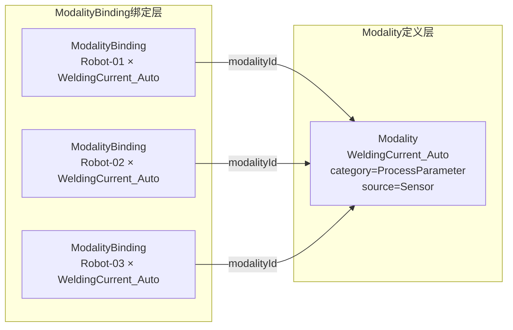
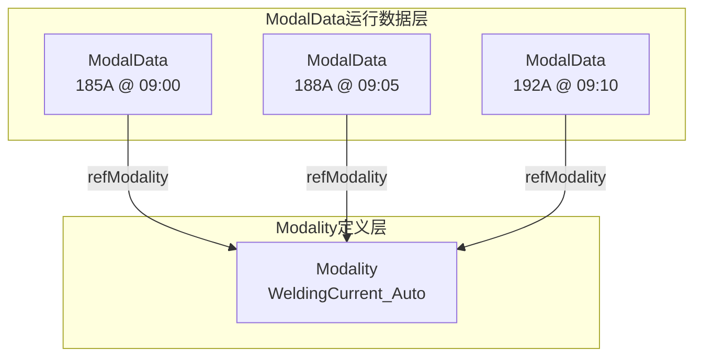

# Modality实体数据契约

**Entity Data Contract - Modality**

---

## 契约元信息

| 项目 | 内容 |
|-----|------|
| **契约版本** | v1.0.0 |
| **所属总契约** | 00_总契约.md v1.0.0 |
| **生效日期** | 2025-11-10 |
| **实体类型** | Modality (数据模态) |
| **所属层级** | 执行场景层 (Execution Scene Layer) |
| **契约状态** | 🟢 生效中 |

---

## 1. 实体概述

### 1.1 实体定义

**Modality** (数据模态) 是数字孪生系统的数据字典,定义一种可观测数据的业务类型及其采集规范。

**核心作用**:
- **数据类型定义**: 基于"物理量 × 采集方式"双维度定义数据类型
- **数据规范**: 定义值类型、单位、值域、精度等技术规范
- **语义标准化**: 统一系统中数据的语义理解
- **质量基准**: 为ModalData提供验证基准

**设计理念**: 
- 同一物理量,采用不同采集方式时,定义为**不同的Modality**
- 例如: `焊接电流(自动采集)` vs `焊接电流(人工录入)` 是两个独立的Modality

### 1.2 双维度定义原则

```
Modality = 物理量/业务特征 (category) × 采集方式 (source)
```

| 维度 | 字段名 | 说明 | 示例 |
|-----|-------|------|------|
| **维度1**: 物理量/业务特征 | category | 数据的业务分类 | `ProcessParameter`, `QualityCharacteristic`, `Geometry` |
| **维度2**: 采集方式 | source | 数据的来源方式 | `Sensor`, `Manual`, `Calculated`, `Simulated` |

**典型示例**:

| Modality名称 | category | source | 说明 |
|-------------|----------|--------|------|
| `WeldingCurrent_Auto` | ProcessParameter | Sensor | 焊接电流(自动传感器采集) |
| `WeldingCurrent_Manual` | ProcessParameter | Manual | 焊接电流(人工录入) |
| `DimensionMeasurement_Auto` | QualityCharacteristic | Sensor | 尺寸测量(自动测量设备) |
| `DimensionMeasurement_Manual` | QualityCharacteristic | Manual | 尺寸测量(人工测量) |
| `DimensionDeviation` | QualityCharacteristic | Calculated | 尺寸偏差(计算得出) |

### 1.3 实例数量

**当前系统**: 40个Modality实例

**分类统计** (按category):
- ProcessParameter (工艺参数): ~15个
- QualityCharacteristic (质量特性): ~10个
- Geometry (几何参数): ~8个
- Environment (环境参数): ~4个
- Other: ~3个

### 1.4 典型URN示例

```
urn:ngsi-ld:Modality:WeldingCurrent_Auto
urn:ngsi-ld:Modality:RobotLinearSpeed
urn:ngsi-ld:Modality:DriveTemp
urn:ngsi-ld:Modality:DimensionMeasurement_Auto
urn:ngsi-ld:Modality:DimensionDeviation
```

---

## 2. 核心字段契约

### 2.1 必填字段

| 字段名 | NGSI-LD类型 | 数据类型 | 约束 | 说明 | 示例 |
|-------|------------|---------|------|------|------|
| **id** | - | URN | 必填,唯一 | 全局唯一标识符 | `urn:ngsi-ld:Modality:WeldingCurrent_Auto` |
| **type** | - | String | 必填,固定值 | 固定为"Modality" | `"Modality"` |
| **@context** | - | Array | 必填 | NGSI-LD上下文 | `["https://uri.etsi.org/ngsi-ld/v1/ngsi-ld-core-context.jsonld"]` |
| **name** | Property | String | 必填,1-100字符 | 模态名称 | `"焊接电流(自动采集)"` |
| **category** | Property | String | 必填,枚举 | 数据类别(维度1) | `"ProcessParameter"` |
| **valueType** | Property | String | 必填,枚举 | 数据值类型 | `"Number"` |
| **source** | Property | String | 必填,枚举 | 数据来源方式(维度2) | `"Sensor"` |

### 2.2 推荐字段

| 字段名 | NGSI-LD类型 | 数据类型 | 约束 | 说明 | 示例 |
|-------|------------|---------|------|------|------|
| **description** | Property | String | 推荐,最长500字符 | 详细描述 | `"机器人末端执行器的线性运动速度,从机器人控制器自动采集"` |
| **unit** | Property | String | 推荐,最长50字符 | 计量单位 | `"A"`, `"mm"`, `"°C"`, `"rpm"` |
| **allowedRange** | Property | Array[Number] | 推荐,长度2 | 正常值域 [min, max] | `[0, 500]` |
| **accuracy** | Property | String | 推荐 | 测量精度 | `"±0.5%"`, `"±1A"`, `"±0.1mm"` |
| **sampleModel** | Property | String | 推荐,枚举 | 采样模式 | `"continuous"`, `"perPiece"`, `"onEvent"` |
| **valueFormat** | Property | String | 推荐,枚举 | 数据格式 | `"scalar"`, `"timeseries"`, `"profile"` |
| **domain** | Property | String | 推荐,枚举 | 应用领域 | `"process"`, `"quality"`, `"geometry"` |
| **version** | Property | String | 推荐 | 版本号 | `"1.0.0"` |

### 2.3 高级可选字段

| 字段名 | NGSI-LD类型 | 数据类型 | 说明 | 示例 |
|-------|------------|---------|------|------|
| **isDerived** | Property | Boolean | 是否为衍生数据 | `true`, `false` |
| **derivedFrom** | Relationship[] | URN[] | 衍生来源Modality列表 | `[<Modality URN>]` |
| **derivationRule** | Property | String | 衍生规则/公式 | `"deviation = measured - target"` |
| **relatedModalities** | Relationship[] | URN[] | 相关Modality列表 | `[<Modality URN>]` |
| **businessNote** | Property | String | 业务说明 | `"用于打磨和定位过程的速度控制"` |

---

## 3. 详细字段定义

### 3.1 核心字段

#### 3.1.1 name (模态名称)

**类型**: Property  
**值类型**: String  
**约束**: 1-100字符,必填  

**命名建议**:
- 格式: `{物理量/特征}_{采集方式后缀}`
- 中文名称: 用于人类可读显示
- 英文代码: 用于系统标识(URN)

**示例**:
```json
{
  "type": "Property",
  "value": "焊接电流(自动采集)"
}
```

#### 3.1.2 category (数据类别) - 维度1

**类型**: Property  
**值类型**: String  
**约束**: 必填,枚举  

**枚举值**:
```
ProcessParameter       - 工艺参数 (如焊接电流、速度、压力)
QualityCharacteristic  - 质量特性 (如尺寸、外观、缺陷)
Geometry               - 几何参数 (如位置、姿态、角度)
Environment            - 环境参数 (如温度、湿度)
Energy                 - 能源相关 (如功率、电流、电压)
State                  - 状态数据 (如设备状态、报警)
Event                  - 事件数据 (如开始、完成、异常)
Other                  - 其他
```

**选择指南**:
- 工艺控制相关 → `ProcessParameter`
- 质检相关 → `QualityCharacteristic`
- 位置姿态相关 → `Geometry`
- 车间环境相关 → `Environment`
- 功耗能源相关 → `Energy`
- 设备状态相关 → `State`
- 事件触发相关 → `Event`

**示例**:
```json
{
  "type": "Property",
  "value": "ProcessParameter"
}
```

#### 3.1.3 valueType (数据值类型)

**类型**: Property  
**值类型**: String  
**约束**: 必填,枚举  

**枚举值**:
```
Number     - 数值 (浮点数)
Integer    - 整数
Boolean    - 布尔值 (true/false)
Text       - 文本字符串
Object     - 对象 (嵌套结构)
Array      - 数组
Timestamp  - 时间戳
```

**选择指南**:
- 连续测量值 → `Number`
- 计数值 → `Integer`
- 开关状态 → `Boolean`
- 描述性信息 → `Text`
- 复杂结构(如坐标) → `Object`
- 时间序列 → `Array`
- 事件时刻 → `Timestamp`

**示例**:
```json
{
  "type": "Property",
  "value": "Number"
}
```

#### 3.1.4 source (数据来源方式) - 维度2

**类型**: Property  
**值类型**: String  
**约束**: 必填,枚举  

**枚举值**:
```
Sensor     - 自动传感器/设备采集
Manual     - 人工录入
Calculated - 计算得出
Simulated  - 仿真生成
Inferred   - 推断得出
Other      - 其他
```

**选择指南**:
- PLC/传感器自动采集 → `Sensor`
- 操作员手工输入 → `Manual`
- 由其他数据计算 → `Calculated`
- 仿真系统生成 → `Simulated`
- AI推理得出 → `Inferred`

**示例**:
```json
{
  "type": "Property",
  "value": "Sensor"
}
```

---

### 3.2 推荐字段

#### 3.2.1 unit (计量单位)

**类型**: Property  
**值类型**: String  
**约束**: 推荐,最长50字符  

**常用单位**:

| 物理量类型 | 常用单位 |
|----------|---------|
| 电流 | `A`, `mA` |
| 电压 | `V`, `mV` |
| 温度 | `°C`, `K`, `°F` |
| 长度 | `mm`, `m`, `cm`, `μm` |
| 速度 | `mm/s`, `m/min`, `rpm` |
| 力 | `N`, `kN` |
| 压力 | `Pa`, `MPa`, `bar` |
| 角度 | `deg`, `rad` |
| 功率 | `W`, `kW` |
| 能量 | `kWh`, `J` |
| 湿度 | `%RH` |
| 流量 | `L/min`, `m³/h` |

**注意**: ModalityBinding可以覆盖Modality定义的单位

**示例**:
```json
{
  "type": "Property",
  "value": "A"
}
```

#### 3.2.2 allowedRange (正常值域)

**类型**: Property  
**值类型**: Array[Number]  
**约束**: 推荐,长度必须为2,[min, max]  

**说明**: 
- 定义正常情况下数据应处于的范围
- 由业务或质量要求给出
- 用于ModalData的质量检查

**示例**:
```json
{
  "type": "Property",
  "value": [180, 200]
}
```

#### 3.2.3 accuracy (测量精度)

**类型**: Property  
**值类型**: String  
**约束**: 推荐  

**格式建议**:
- 百分比: `"±0.5%"`
- 绝对值: `"±1A"`, `"±0.1mm"`, `"±1°C"`

**示例**:
```json
{
  "type": "Property",
  "value": "±1A"
}
```

#### 3.2.4 sampleModel (采样模式)

**类型**: Property  
**值类型**: String  
**约束**: 推荐,枚举  

**枚举值**:
```
continuous - 连续采样 (如每秒采样)
perStep    - 每工步采样
perPiece   - 每工件采样
onEvent    - 事件触发采样
byStep     - 按步骤采样
other      - 其他
```

**选择指南**:
- 实时监控数据 → `continuous`
- 工步级质量数据 → `perStep`
- 工件级检验数据 → `perPiece`
- 报警触发数据 → `onEvent`

**示例**:
```json
{
  "type": "Property",
  "value": "continuous"
}
```

#### 3.2.5 valueFormat (数据格式)

**类型**: Property  
**值类型**: String  
**约束**: 推荐,枚举  

**枚举值**:
```
scalar      - 标量 (单个数值)
timeseries  - 时间序列 (数组)
profile     - 轮廓曲线
image       - 图像
pointcloud  - 点云
matrix      - 矩阵
other       - 其他
```

**选择指南**:
- 单次测量值 → `scalar`
- 连续采样序列 → `timeseries`
- 表面轮廓 → `profile`
- 视觉检测 → `image`
- 3D扫描 → `pointcloud`

**示例**:
```json
{
  "type": "Property",
  "value": "scalar"
}
```

#### 3.2.6 domain (应用领域)

**类型**: Property  
**值类型**: String  
**约束**: 推荐,枚举  

**枚举值**:
```
process     - 生产过程
quality     - 质量管理
geometry    - 几何测量
environment - 环境监测
energy      - 能源管理
safety      - 安全管理
other       - 其他
```

**示例**:
```json
{
  "type": "Property",
  "value": "process"
}
```

---

### 3.3 高级字段

#### 3.3.1 isDerived (是否为衍生数据)

**类型**: Property  
**值类型**: Boolean  
**默认值**: false  

**说明**: 
- true表示该Modality的数据是由其他Modality计算得出
- 需配合derivedFrom和derivationRule使用

**示例**:
```json
{
  "type": "Property",
  "value": true
}
```

#### 3.3.2 derivedFrom (衍生来源)

**类型**: Relationship[]  
**目标实体**: Modality[]  
**基数**: N:M  

**说明**: 当isDerived=true时,指向源数据的Modality列表

**示例**:
```json
[
  {
    "type": "Relationship",
    "object": "urn:ngsi-ld:Modality:DimensionMeasurement_Auto"
  },
  {
    "type": "Relationship",
    "object": "urn:ngsi-ld:Modality:DimensionTarget"
  }
]
```

#### 3.3.3 derivationRule (衍生规则)

**类型**: Property  
**值类型**: String  

**说明**: 描述计算规则或公式

**常用规则**:
- 统计聚合: `"min over scene duration"`, `"max over scene duration"`, `"avg over scene duration"`
- 数学计算: `"I = P / (U * cosφ)"`, `"deviation = measured - target"`

**示例**:
```json
{
  "type": "Property",
  "value": "deviation = measured - target"
}
```

#### 3.3.4 relatedModalities (相关模态)

**类型**: Relationship[]  
**目标实体**: Modality[]  
**基数**: N:M  

**说明**: 与该Modality相关联或常同时使用的其他Modality

**示例**:
```json
[
  {
    "type": "Relationship",
    "object": "urn:ngsi-ld:Modality:WeldingVoltage_Auto"
  }
]
```

---

## 4. URN命名规范

### 4.1 URN格式定义

**格式**:
```
urn:ngsi-ld:Modality:{ModalityName}
```

**命名约束**:
- ✅ 使用英文字母、数字、下划线
- ✅ 建议格式: `{PhysicalQuantity}_{SourceSuffix}`
- ✅ 区分大小写
- ✅ 保持语义化和可读性
- ❌ 禁止使用空格、特殊字符

**命名示例**:

| URN | 说明 |
|-----|------|
| `urn:ngsi-ld:Modality:WeldingCurrent_Auto` | 焊接电流(自动) |
| `urn:ngsi-ld:Modality:WeldingCurrent_Manual` | 焊接电流(人工) |
| `urn:ngsi-ld:Modality:RobotLinearSpeed` | 机器人线速度 |
| `urn:ngsi-ld:Modality:DriveTemp` | 驱动器温度 |
| `urn:ngsi-ld:Modality:DimensionMeasurement_Auto` | 尺寸测量(自动) |
| `urn:ngsi-ld:Modality:DimensionDeviation` | 尺寸偏差 |
| `urn:ngsi-ld:Modality:AmbientTemp_Auto` | 环境温度(自动) |
| `urn:ngsi-ld:Modality:AmbientTemp_Stat` | 环境温度(统计) |

---

## 5. 典型Modality示例

### 5.1 工艺参数示例: 焊接电流(自动采集)

```json
{
  "id": "urn:ngsi-ld:Modality:WeldingCurrent_Auto",
  "type": "Modality",
  "@context": [
    "https://uri.etsi.org/ngsi-ld/v1/ngsi-ld-core-context.jsonld",
    "https://digitaltwins.rail.com/contexts/twin-context.jsonld"
  ],
  "name": {
    "type": "Property",
    "value": "焊接电流(自动采集)"
  },
  "description": {
    "type": "Property",
    "value": "焊接过程中的实际电流值,从焊机控制器实时采集"
  },
  "category": {
    "type": "Property",
    "value": "ProcessParameter"
  },
  "valueType": {
    "type": "Property",
    "value": "Number"
  },
  "unit": {
    "type": "Property",
    "value": "A"
  },
  "source": {
    "type": "Property",
    "value": "Sensor"
  },
  "allowedRange": {
    "type": "Property",
    "value": [180, 200]
  },
  "accuracy": {
    "type": "Property",
    "value": "±1A"
  },
  "sampleModel": {
    "type": "Property",
    "value": "continuous"
  },
  "valueFormat": {
    "type": "Property",
    "value": "timeseries"
  },
  "domain": {
    "type": "Property",
    "value": "process"
  },
  "businessNote": {
    "type": "Property",
    "value": "用于焊接质量监控和工艺参数验证"
  },
  "version": {
    "type": "Property",
    "value": "1.0.0"
  }
}
```

### 5.2 质量特性示例: 尺寸测量(自动)

```json
{
  "id": "urn:ngsi-ld:Modality:DimensionMeasurement_Auto",
  "type": "Modality",
  "@context": [
    "https://uri.etsi.org/ngsi-ld/v1/ngsi-ld-core-context.jsonld"
  ],
  "name": {
    "type": "Property",
    "value": "尺寸测量(自动)"
  },
  "description": {
    "type": "Property",
    "value": "测量设备自动测量的工件尺寸实测值"
  },
  "category": {
    "type": "Property",
    "value": "QualityCharacteristic"
  },
  "valueType": {
    "type": "Property",
    "value": "Number"
  },
  "unit": {
    "type": "Property",
    "value": "mm"
  },
  "source": {
    "type": "Property",
    "value": "Sensor"
  },
  "accuracy": {
    "type": "Property",
    "value": "±0.01mm"
  },
  "sampleModel": {
    "type": "Property",
    "value": "perPiece"
  },
  "valueFormat": {
    "type": "Property",
    "value": "scalar"
  },
  "domain": {
    "type": "Property",
    "value": "quality"
  },
  "businessNote": {
    "type": "Property",
    "value": "由侧墙轮廓测量设备自动测量,用于质量判定"
  },
  "version": {
    "type": "Property",
    "value": "1.0.0"
  }
}
```

### 5.3 几何参数示例: 机器人线速度

```json
{
  "id": "urn:ngsi-ld:Modality:RobotLinearSpeed",
  "type": "Modality",
  "@context": [
    "https://uri.etsi.org/ngsi-ld/v1/ngsi-ld-core-context.jsonld"
  ],
  "name": {
    "type": "Property",
    "value": "机器人线速度"
  },
  "description": {
    "type": "Property",
    "value": "机器人末端执行器的线性运动速度,从机器人控制器自动采集"
  },
  "category": {
    "type": "Property",
    "value": "ProcessParameter"
  },
  "valueType": {
    "type": "Property",
    "value": "Number"
  },
  "unit": {
    "type": "Property",
    "value": "mm/s"
  },
  "source": {
    "type": "Property",
    "value": "Sensor"
  },
  "allowedRange": {
    "type": "Property",
    "value": [0, 500]
  },
  "accuracy": {
    "type": "Property",
    "value": "±1mm/s"
  },
  "sampleModel": {
    "type": "Property",
    "value": "continuous"
  },
  "valueFormat": {
    "type": "Property",
    "value": "timeseries"
  },
  "domain": {
    "type": "Property",
    "value": "process"
  },
  "businessNote": {
    "type": "Property",
    "value": "用于打磨和定位过程的速度控制,不同设备通过ModalityBinding区分"
  },
  "version": {
    "type": "Property",
    "value": "1.0.0"
  }
}
```

### 5.4 衍生数据示例: 尺寸偏差

```json
{
  "id": "urn:ngsi-ld:Modality:DimensionDeviation",
  "type": "Modality",
  "@context": [
    "https://uri.etsi.org/ngsi-ld/v1/ngsi-ld-core-context.jsonld"
  ],
  "name": {
    "type": "Property",
    "value": "尺寸偏差"
  },
  "description": {
    "type": "Property",
    "value": "实测尺寸与目标尺寸的偏差,由实测值减去目标值计算得出"
  },
  "category": {
    "type": "Property",
    "value": "QualityCharacteristic"
  },
  "valueType": {
    "type": "Property",
    "value": "Number"
  },
  "unit": {
    "type": "Property",
    "value": "mm"
  },
  "source": {
    "type": "Property",
    "value": "Calculated"
  },
  "allowedRange": {
    "type": "Property",
    "value": [-0.5, 0.5]
  },
  "accuracy": {
    "type": "Property",
    "value": "±0.01mm"
  },
  "sampleModel": {
    "type": "Property",
    "value": "perPiece"
  },
  "valueFormat": {
    "type": "Property",
    "value": "scalar"
  },
  "domain": {
    "type": "Property",
    "value": "quality"
  },
  "isDerived": {
    "type": "Property",
    "value": true
  },
  "derivedFrom": [
    {
      "type": "Relationship",
      "object": "urn:ngsi-ld:Modality:DimensionMeasurement_Auto"
    },
    {
      "type": "Relationship",
      "object": "urn:ngsi-ld:Modality:DimensionTarget"
    }
  ],
  "derivationRule": {
    "type": "Property",
    "value": "deviation = measured - target"
  },
  "businessNote": {
    "type": "Property",
    "value": "用于质量判定,偏差超出±0.5mm视为不合格"
  },
  "version": {
    "type": "Property",
    "value": "1.0.0"
  }
}
```

### 5.5 环境参数示例: 环境温度(统计)

```json
{
  "id": "urn:ngsi-ld:Modality:AmbientTemp_Stat",
  "type": "Modality",
  "@context": [
    "https://uri.etsi.org/ngsi-ld/v1/ngsi-ld-core-context.jsonld"
  ],
  "name": {
    "type": "Property",
    "value": "环境温度(统计值)"
  },
  "description": {
    "type": "Property",
    "value": "环境温度的统计值(Min/Max),从实时温度计算得出"
  },
  "category": {
    "type": "Property",
    "value": "Environment"
  },
  "valueType": {
    "type": "Property",
    "value": "Number"
  },
  "unit": {
    "type": "Property",
    "value": "°C"
  },
  "source": {
    "type": "Property",
    "value": "Calculated"
  },
  "allowedRange": {
    "type": "Property",
    "value": [15, 30]
  },
  "accuracy": {
    "type": "Property",
    "value": "±0.5°C"
  },
  "sampleModel": {
    "type": "Property",
    "value": "perPiece"
  },
  "valueFormat": {
    "type": "Property",
    "value": "scalar"
  },
  "domain": {
    "type": "Property",
    "value": "environment"
  },
  "isDerived": {
    "type": "Property",
    "value": true
  },
  "derivedFrom": [
    {
      "type": "Relationship",
      "object": "urn:ngsi-ld:Modality:AmbientTemp_Auto"
    }
  ],
  "derivationRule": {
    "type": "Property",
    "value": "min/max over scene duration"
  },
  "businessNote": {
    "type": "Property",
    "value": "用于分析环境温度对焊接质量的影响"
  },
  "version": {
    "type": "Property",
    "value": "1.0.0"
  }
}
```

---

## 6. 典型使用场景

### 6.1 创建Modality

**场景**: 系统需要新增一种数据类型定义

**步骤**:
1. 确定物理量/业务特征 (category)
2. 确定采集方式 (source)
3. 确定值类型 (valueType)
4. 定义单位 (unit)
5. 定义值域 (allowedRange)
6. 定义采样模式 (sampleModel)
7. 创建Modality实体

### 6.2 查询特定类别的Modality

**场景**: 查询所有工艺参数类型的Modality

**伪代码**:
```python
modalities = query(
    "type = 'Modality'",
    "category.value = 'ProcessParameter'"
)
```

### 6.3 查询特定采集方式的Modality

**场景**: 查询所有自动传感器采集的Modality

**伪代码**:
```python
modalities = query(
    "type = 'Modality'",
    "source.value = 'Sensor'"
)
```

### 6.4 查询衍生Modality的依赖链

**场景**: 给定衍生Modality,查询其依赖的源Modality

**伪代码**:
```python
modality = get_entity("urn:ngsi-ld:Modality:DimensionDeviation")

if modality.isDerived.value:
    source_modalities = []
    for rel in modality.derivedFrom:
        source_mod = get_entity(rel.object)
        source_modalities.append(source_mod)
    
    print(f"衍生规则: {modality.derivationRule.value}")
    print(f"依赖来源: {[m.name.value for m in source_modalities]}")
```

### 6.5 验证ModalData是否符合Modality规范

**场景**: 给定ModalData,验证其value是否在allowedRange内

**伪代码**:
```python
modaldata = get_entity("<ModalData URN>")
modality = get_entity(modaldata.refModality.object)

if modality.allowedRange:
    min_val, max_val = modality.allowedRange.value
    actual_val = modaldata.value.value
    
    if actual_val < min_val or actual_val > max_val:
        print(f"警告: 数据超出正常范围 [{min_val}, {max_val}]")
        print(f"实际值: {actual_val}")
```

---

## 7. 数据质量约束

### 7.1 必填字段完整性检查

**验证规则**:
- ✅ 所有必填字段必须存在且非空
- ✅ URN格式必须符合命名规范
- ✅ 枚举字段的值必须在允许的枚举值范围内

### 7.2 逻辑一致性检查

**验证规则**:
- ✅ 如果isDerived=true,则derivedFrom和derivationRule必须存在
- ✅ allowedRange必须为长度为2的数组,且 allowedRange[0] <= allowedRange[1]
- ✅ valueType必须与实际ModalData的value类型一致

### 7.3 关系完整性检查

**验证规则**:
- ✅ derivedFrom必须指向有效的Modality实体
- ✅ relatedModalities必须指向有效的Modality实体
- ❌ 不允许悬空引用
- ❌ 不允许循环衍生依赖

### 7.4 命名规范检查

**验证规则**:
- ✅ URN中的ModalityName应与name.value语义一致
- ✅ name.value长度必须在1-100字符之间
- ✅ description.value长度必须在0-500字符之间

---

## 8. 与其他实体的关系

### 8.1 Modality与ModalityBinding的关系



**说明**: 
- 1个Modality可以对应N个ModalityBinding (多个设备绑定同一模态)
- ModalityBinding实现"Modality → TwinObject"的具体绑定

### 8.2 Modality与ModalData的关系



**说明**: 
- Modality是ModalData的类型定义和规范基准
- ModalData.refModality是三锚点之一,提供数据的语义定位

---

## 9. 变更历史

### v1.0.0 (2025-11-10)

**变更类型**: 初始版本

**变更内容**:
- 创建Modality实体契约
- 定义"物理量 × 采集方式"双维度原则
- 制定完整的字段契约和枚举值规范
- 定义衍生Modality的依赖机制
- 提供5个典型Modality示例

**影响范围**:
- 任务1(平台): 需实现Modality实体的CRUD和验证
- 任务2(地图): 需根据Modality定义显示数据类型标签
- 任务3(应用): 需基于Modality进行数据质量分析和规范验证
- 任务4(仿真): 需基于Modality定义生成仿真数据

---

**文档结束**

---

**契约维护记录**

| 版本 | 日期 | 修订人 | 修订内容 |
|-----|------|-------|---------|
| v1.0.0 | 2025-11-10 | 数字孪生项目组 | 初始版本 |
