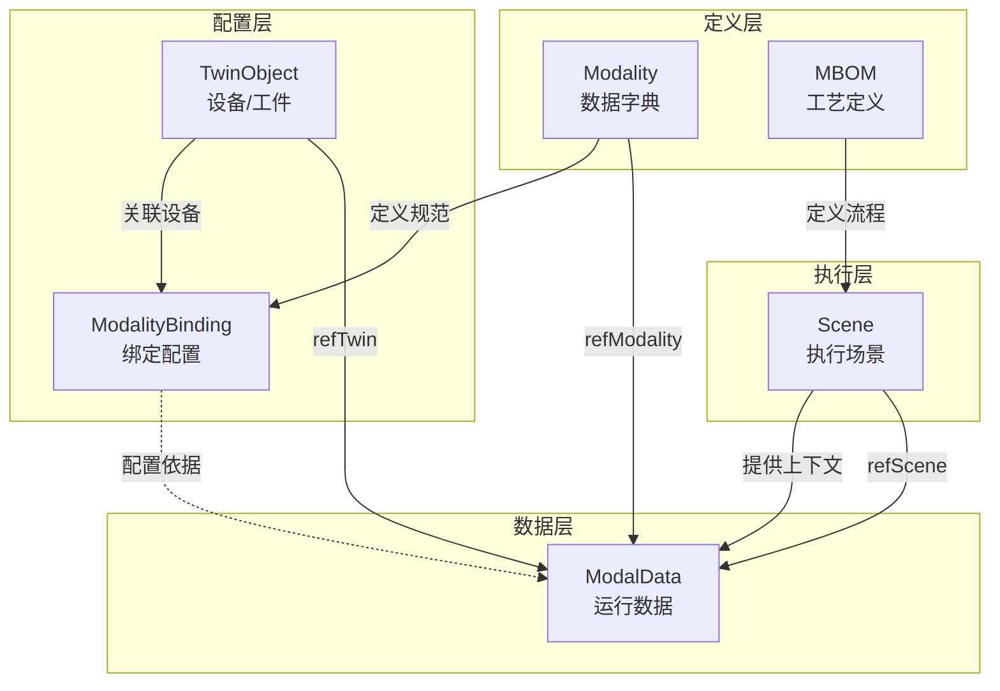

# ModalData实体数据契约

**Entity Data Contract - ModalData**

---

## 契约元信息

| 项目 | 内容 |
|-----|------|
| **契约版本** | v1.0.0 |
| **所属总契约** | 00_总契约.md v1.0.0 |
| **生效日期** | 2025-11-10 |
| **实体类型** | ModalData (模态数据/运行数据) |
| **所属层级** | 运行数据层 (Runtime Data Layer) |
| **契约状态** | 🟢 生效中 |

---

## 1. 实体概述

### 1.1 实体定义

**ModalData** (模态数据) 是数字孪生系统的运行时数据层,代表一条具体的数据记录或测量值,承载系统的实际运行数据。

**核心作用**:
- **数据载体**: 存储实际的传感器测量值、质量数据、状态数据等
- **三锚点定位**: 通过(refTwin, refScene, refModality)三元组精确定位数据
- **质量标注**: 通过qualityTag和qualityScore标注数据质量
- **溯源信息**: 通过provenance记录数据来源和处理流程

**设计理念**: 
```
ModalData = 数据值 (value) 
          + 三锚点定位 (refTwin × refScene × refModality)
          + 时间戳 (observedAt)
          + 质量标注 (qualityTag, qualityScore)
          + 溯源信息 (provenance)
```

### 1.2 三锚点定位机制

**三锚点** (Three-Anchor Model) 是ModalData的核心特征:

| 锚点 | 字段名 | 定位维度 | 说明 |
|-----|-------|---------|------|
| **锚点1** | refTwin | 谁/什么 | 数据来自哪个TwinObject或关于哪个对象 |
| **锚点2** | refScene | 何时/何地 | 数据在哪个业务场景中产生 |
| **锚点3** | refModality | 什么类型 | 数据的语义类型和规范 |

**三锚点的意义**:
```
示例: 焊接电流数据点

refTwin = urn:ngsi-ld:TwinObject:AutoEquipment:361-01173
  → 告诉我们: 这是361-01173号焊接机器人的数据

refScene = urn:ngsi-ld:Scene:Process:M670-SN001:T01:P0010:20251028090000
  → 告诉我们: 这是M670-SN001工件在T01节拍P0010工序执行时产生的数据

refModality = urn:ngsi-ld:Modality:WeldingCurrent_Auto
  → 告诉我们: 这是"焊接电流(自动采集)"类型的数据,单位是A,正常范围是[180,200]
```

### 1.3 实例数量

**当前系统**: 1,971个ModalData实例

**数据分布** (按Modality类型):
- 工艺参数类: ~800个
- 质量特性类: ~400个
- 几何参数类: ~500个
- 环境参数类: ~200个
- 其他: ~71个

### 1.4 典型URN示例

```
urn:ngsi-ld:ModalData:WeldingCurrent.M670-SN001_T01_P0010.0001
urn:ngsi-ld:ModalData:RobotLinearSpeed.M670-SN001_T08_P0020.0012
urn:ngsi-ld:ModalData:DimensionMeasurement.M803-SN001_QualityCheck.0001
```

---

## 2. 核心字段契约

### 2.1 必填字段

| 字段名 | NGSI-LD类型 | 数据类型 | 约束 | 说明 | 示例 |
|-------|------------|---------|------|------|------|
| **id** | - | URN | 必填,唯一 | 全局唯一标识符 | `urn:ngsi-ld:ModalData:WeldingCurrent.FrontWelding_20250808.0001` |
| **type** | - | String | 必填,固定值 | 固定为"ModalData" | `"ModalData"` |
| **@context** | - | Array | 必填 | NGSI-LD上下文 | `["https://uri.etsi.org/ngsi-ld/v1/ngsi-ld-core-context.jsonld"]` |
| **refTwin** | Relationship | URN | 必填 | 引用TwinObject (锚点1) | `urn:ngsi-ld:TwinObject:AutoEquipment:361-01173` |
| **refScene** | Relationship | URN | 必填 | 引用Scene (锚点2) | `urn:ngsi-ld:Scene:Process:M670-SN001:T01:P0010:20251028090000` |
| **refModality** | Relationship | URN | 必填 | 引用Modality (锚点3) | `urn:ngsi-ld:Modality:WeldingCurrent_Auto` |
| **value** | Property | Any | 必填 | 数据值 | `185.3` (类型由Modality.valueType决定) |
| **observedAt** | - | DateTime | 必填 | 观测时间戳 (ISO 8601) | `"2025-10-28T09:00:00.123Z"` |
| **qualityTag** | Property | String | 必填,枚举 | 质量标签 | `"OK"`, `"Warning"`, `"Error"`, `"Unknown"` |
| **provenance** | Property | Object | 必填 | 数据溯源信息 | `{sourceTwinId, method, pipelineStage}` |

### 2.2 推荐字段

| 字段名 | NGSI-LD类型 | 数据类型 | 约束 | 说明 | 示例 |
|-------|------------|---------|------|------|------|
| **qualityScore** | Property | Number | 推荐,0-1 | 质量得分 | `0.98` |
| **sequenceNumber** | Property | Integer | 推荐,>=1 | 序列号 | `1`, `2`, `3` |

### 2.3 可选字段

| 字段名 | NGSI-LD类型 | 数据类型 | 说明 | 示例 |
|-------|------------|---------|------|------|
| **isDerived** | Property | Boolean | 是否为衍生数据 | `true`, `false` |
| **derivedFrom** | Relationship[] | URN[] | 衍生来源ModalData列表 | `[<ModalData URN>]` |
| **computationRule** | Property | String | 计算规则 | `"max over time window"` |
| **metadata** | Property | Object | 扩展元数据 | `{任意键值对}` |

---

## 3. 详细字段定义

### 3.1 三锚点字段

#### 3.1.1 refTwin (引用TwinObject) - 锚点1

**类型**: Relationship  
**目标实体**: TwinObject (任意subType)  
**基数**: N:1  
**必填**: ✓  

**说明**: 该数据由哪个TwinObject产生,或关于哪个对象

**典型场景**:
- **设备数据**: refTwin指向产生数据的设备 (如焊机、机器人)
- **工件数据**: refTwin指向被测量的工件 (如质量检测数据)
- **环境数据**: refTwin指向环境传感器或区域

**示例**:
```json
{
  "type": "Relationship",
  "object": "urn:ngsi-ld:TwinObject:AutoEquipment:361-01173"
}
```

#### 3.1.2 refScene (引用Scene) - 锚点2

**类型**: Relationship  
**目标实体**: Scene  
**基数**: N:1  
**必填**: ✓  

**说明**: 该数据在哪个业务场景中产生,提供业务上下文

**业务价值**:
- 将数据关联到具体的工件、工序、时间段
- 支持按场景查询数据
- 支持场景级数据聚合和分析

**示例**:
```json
{
  "type": "Relationship",
  "object": "urn:ngsi-ld:Scene:Process:M670-SN001:T01:P0010:20251028090000"
}
```

#### 3.1.3 refModality (引用Modality) - 锚点3

**类型**: Relationship  
**目标实体**: Modality  
**基数**: N:1  
**必填**: ✓  

**说明**: 该数据的类型(Modality),定义数据的语义和规范

**业务价值**:
- 定义数据的含义 (焊接电流、温度、尺寸等)
- 提供值类型、单位、正常范围等规范
- 支持按数据类型查询和聚合

**示例**:
```json
{
  "type": "Relationship",
  "object": "urn:ngsi-ld:Modality:WeldingCurrent_Auto"
}
```

---

### 3.2 数据值字段

#### 3.2.1 value (数据值)

**类型**: Property  
**值类型**: Any (由Modality.valueType决定)  
**必填**: ✓  

**值类型映射**:

| Modality.valueType | value类型 | 示例 |
|-------------------|----------|------|
| Number | Number (浮点数) | `185.3`, `2750.24` |
| Integer | Integer | `100`, `5000` |
| Boolean | Boolean | `true`, `false` |
| Text | String | `"OK"`, `"Alarm"` |
| Object | Object | `{"X": 1234.56, "Y": 789.01, "Z": 234.56}` |
| Array | Array | `[100.1, 100.2, 100.3, 100.4]` |
| Timestamp | String (ISO 8601) | `"2025-10-28T09:00:00Z"` |

**结构定义**:
```json
{
  "type": "Property",
  "value": 185.3,
  "unitCode": "A"  // 可选,通常继承自Modality或ModalityBinding
}
```

**验证规则**:
- ✅ value的类型必须与Modality.valueType一致
- ✅ 如果Modality定义了allowedRange,value应在范围内(可以超出但应告警)
- ✅ unitCode如果存在,应与Modality或ModalityBinding定义的单位一致

**示例**:

**标量值**:
```json
{
  "type": "Property",
  "value": 185.3,
  "unitCode": "A"
}
```

**对象值** (如坐标):
```json
{
  "type": "Property",
  "value": {
    "X": 1234.56,
    "Y": 789.01,
    "Z": 234.56
  },
  "unitCode": "mm"
}
```

**数组值** (如时间序列):
```json
{
  "type": "Property",
  "value": [185.1, 185.3, 185.5, 185.2, 185.4],
  "unitCode": "A"
}
```

#### 3.2.2 observedAt (观测时间戳)

**类型**: String (ISO 8601 DateTime)  
**必填**: ✓  

**说明**: 数据的实际观测时间(采集时间、测量时间)

**格式**: `YYYY-MM-DDTHH:MM:SS.sssZ` 或 `YYYY-MM-DDTHH:MM:SS.sss+HH:MM`

**验证规则**:
- ✅ 必须为有效的ISO 8601时间格式
- ✅ 推荐包含毫秒精度
- ✅ 必须包含时区信息
- ✅ observedAt应在Scene.timeFrame的start和end之间

**示例**:
```json
"observedAt": "2025-10-28T09:00:00.123Z"
```

---

### 3.3 质量标注字段

#### 3.3.1 qualityTag (质量标签)

**类型**: Property  
**值类型**: String  
**必填**: ✓  
**枚举值**:

```
OK       - 正常数据
Warning  - 警告 (值接近异常范围或存在轻微问题)
Error    - 错误 (值超出正常范围或存在严重问题)
Unknown  - 未知 (无法判断质量)
Invalid  - 无效 (数据格式错误或采集失败)
```

**判定规则** (建议):
- `OK`: value在Modality.allowedRange内
- `Warning`: value接近allowedRange边界 (如在90%-100%或0%-10%范围)
- `Error`: value超出allowedRange
- `Unknown`: 未进行质量检查
- `Invalid`: 数据采集失败或格式错误

**示例**:
```json
{
  "type": "Property",
  "value": "OK"
}
```

#### 3.3.2 qualityScore (质量得分)

**类型**: Property  
**值类型**: Number  
**范围**: [0, 1]  
**推荐**: ✓  

**说明**: 数据质量的量化评分,0表示最差,1表示最好

**评分方法** (建议):
- 基于与allowedRange的偏离程度
- 基于传感器信噪比
- 基于数据完整性
- 基于多源数据一致性

**示例**:
```json
{
  "type": "Property",
  "value": 0.98
}
```

---

### 3.4 溯源信息字段

#### 3.4.1 provenance (数据溯源信息)

**类型**: Property  
**值类型**: Object  
**必填**: ✓  

**结构定义**:
```json
{
  "type": "Property",
  "value": {
    "sourceTwinId": "<TwinObject URN>",        // 必填: 数据源设备
    "method": "<采集方法>",                     // 必填: 采集方式
    "swVersion": "<软件版本>",                  // 可选: 采集软件版本
    "pipelineStage": "<处理阶段>",             // 必填: 数据处理阶段
    "transformations": [<转换列表>],           // 可选: 数据转换记录
    "collectTimestamp": "<采集时间戳>"         // 可选: 原始采集时间
  }
}
```

**字段说明**:

| 字段名 | 必填 | 类型 | 枚举值/说明 | 示例 |
|-------|-----|------|-----------|------|
| sourceTwinId | ✓ | URN | 数据源TwinObject | `urn:ngsi-ld:TwinObject:AutoEquipment:361-01173` |
| method | ✓ | String | `Sensor`, `OPC-UA`, `Manual`, `Calculated`, `Simulated`, `Inferred` | `"OPC-UA"` |
| swVersion | - | String | 采集软件版本 | `"1.4.0"` |
| pipelineStage | ✓ | String | `ingest`, `validated`, `aggregated`, `derived` | `"ingest"` |
| transformations | - | Array | 数据转换记录 | `["unit_conversion", "outlier_removal"]` |
| collectTimestamp | - | DateTime | 原始采集时间 | `"2025-10-28T09:00:00.000Z"` |

**pipelineStage枚举说明**:
```
ingest     - 原始采集阶段,未经处理
validated  - 已验证阶段,通过了质量检查
aggregated - 聚合阶段,由多个原始数据聚合而来
derived    - 衍生阶段,由其他数据计算得出
```

**示例**:
```json
{
  "type": "Property",
  "value": {
    "sourceTwinId": "urn:ngsi-ld:TwinObject:AutoEquipment:361-01173",
    "method": "OPC-UA",
    "swVersion": "1.4.0",
    "pipelineStage": "ingest"
  }
}
```

---

### 3.5 衍生数据字段

#### 3.5.1 isDerived (是否为衍生数据)

**类型**: Property  
**值类型**: Boolean  
**默认值**: false  

**说明**: 标识该数据是否由其他ModalData计算/聚合得出

**示例**:
```json
{
  "type": "Property",
  "value": true
}
```

#### 3.5.2 derivedFrom (衍生来源)

**类型**: Relationship[]  
**目标实体**: ModalData[]  
**基数**: N:M  

**说明**: 当isDerived=true时,指向源数据的ModalData列表

**示例**:
```json
[
  {
    "type": "Relationship",
    "object": "urn:ngsi-ld:ModalData:WeldingCurrent.M670-SN001_T01_P0010.0001"
  },
  {
    "type": "Relationship",
    "object": "urn:ngsi-ld:ModalData:WeldingCurrent.M670-SN001_T01_P0010.0002"
  }
]
```

#### 3.5.3 computationRule (计算规则)

**类型**: Property  
**值类型**: String  

**说明**: 描述数据的计算/聚合规则

**常用规则**:
- `"max over time window"` - 时间窗口内的最大值
- `"min over time window"` - 时间窗口内的最小值
- `"mean over time window"` - 时间窗口内的平均值
- `"sum over time window"` - 时间窗口内的总和
- `"deviation = measured - target"` - 偏差计算

**示例**:
```json
{
  "type": "Property",
  "value": "max over scene duration"
}
```

---

### 3.6 其他字段

#### 3.6.1 sequenceNumber (序列号)

**类型**: Property  
**值类型**: Integer  
**范围**: >= 1  

**说明**: 同一Scene内,同一Modality的数据序列号,用于排序和去重

**示例**:
```json
{
  "type": "Property",
  "value": 1
}
```

---

## 4. URN命名规范

### 4.1 URN格式定义

**标准格式**:
```
urn:ngsi-ld:ModalData:{ModalityName}.{SceneIdentifier}.{Sequence}
```

**命名约束**:
- ✅ ModalityName: Modality的简短名称 (如 `WeldingCurrent`, `DriveTemp`)
- ✅ SceneIdentifier: Scene的简化标识 (如 `M670-SN001_T01_P0010`, `FrontWelding_20250808`)
- ✅ Sequence: 序列号,4位补零 (如 `0001`, `0012`, `0123`)

### 4.2 URN示例

```
urn:ngsi-ld:ModalData:WeldingCurrent.M670-SN001_T01_P0010.0001
urn:ngsi-ld:ModalData:RobotLinearSpeed.M670-SN001_T08_P0020.0012
urn:ngsi-ld:ModalData:DriveTemp.CNCMilling_20250808_001.0001
urn:ngsi-ld:ModalData:DimensionMeasurement.M803-SN001_QualityCheck.0001
```

---

## 5. 典型ModalData示例

### 5.1 原始传感器数据: 焊接电流

```json
{
  "@context": [
    "https://uri.etsi.org/ngsi-ld/v1/ngsi-ld-core-context.jsonld"
  ],
  "id": "urn:ngsi-ld:ModalData:WeldingCurrent.M670-SN001_T01_P0010.0001",
  "type": "ModalData",
  "refScene": {
    "type": "Relationship",
    "object": "urn:ngsi-ld:Scene:Process:M670-SN001:T01:P0010:20251028090000"
  },
  "refTwin": {
    "type": "Relationship",
    "object": "urn:ngsi-ld:TwinObject:AutoEquipment:361-01173"
  },
  "refModality": {
    "type": "Relationship",
    "object": "urn:ngsi-ld:Modality:WeldingCurrent_Auto"
  },
  "value": {
    "type": "Property",
    "value": 185.3,
    "unitCode": "A"
  },
  "observedAt": "2025-10-28T09:00:00.123Z",
  "qualityTag": {
    "type": "Property",
    "value": "OK"
  },
  "qualityScore": {
    "type": "Property",
    "value": 0.98
  },
  "provenance": {
    "type": "Property",
    "value": {
      "sourceTwinId": "urn:ngsi-ld:TwinObject:AutoEquipment:361-01173",
      "method": "OPC-UA",
      "swVersion": "1.4.0",
      "pipelineStage": "ingest"
    }
  },
  "sequenceNumber": {
    "type": "Property",
    "value": 1
  }
}
```

### 5.2 质量检测数据: 尺寸测量

```json
{
  "@context": [
    "https://uri.etsi.org/ngsi-ld/v1/ngsi-ld-core-context.jsonld"
  ],
  "id": "urn:ngsi-ld:ModalData:DimensionMeasurement.M670-SN001_QC.0001",
  "type": "ModalData",
  "refScene": {
    "type": "Relationship",
    "object": "urn:ngsi-ld:Scene:Process:M670-SN001:T15:QualityCheck:20251028180000"
  },
  "refTwin": {
    "type": "Relationship",
    "object": "urn:ngsi-ld:TwinObject:Workpiece:M670-SN001-Output"
  },
  "refModality": {
    "type": "Relationship",
    "object": "urn:ngsi-ld:Modality:DimensionMeasurement_Auto"
  },
  "value": {
    "type": "Property",
    "value": 2750.24,
    "unitCode": "mm"
  },
  "observedAt": "2025-10-28T18:00:00.456Z",
  "qualityTag": {
    "type": "Property",
    "value": "OK"
  },
  "qualityScore": {
    "type": "Property",
    "value": 1.0
  },
  "provenance": {
    "type": "Property",
    "value": {
      "sourceTwinId": "urn:ngsi-ld:TwinObject:AutoEquipment:MeasurementDevice-01",
      "method": "Sensor",
      "swVersion": "2.1.0",
      "pipelineStage": "validated"
    }
  }
}
```

### 5.3 衍生数据: 统计聚合值

```json
{
  "@context": [
    "https://uri.etsi.org/ngsi-ld/v1/ngsi-ld-core-context.jsonld"
  ],
  "id": "urn:ngsi-ld:ModalData:WeldingCurrent_Stat.M670-SN001_T01_P0010.Max",
  "type": "ModalData",
  "refScene": {
    "type": "Relationship",
    "object": "urn:ngsi-ld:Scene:Process:M670-SN001:T01:P0010:20251028090000"
  },
  "refTwin": {
    "type": "Relationship",
    "object": "urn:ngsi-ld:TwinObject:AutoEquipment:361-01173"
  },
  "refModality": {
    "type": "Relationship",
    "object": "urn:ngsi-ld:Modality:WeldingCurrent_Stat"
  },
  "value": {
    "type": "Property",
    "value": 198.5,
    "unitCode": "A"
  },
  "observedAt": "2025-10-28T10:00:00.000Z",
  "qualityTag": {
    "type": "Property",
    "value": "OK"
  },
  "provenance": {
    "type": "Property",
    "value": {
      "sourceTwinId": "urn:ngsi-ld:TwinObject:AutoEquipment:361-01173",
      "method": "Calculated",
      "pipelineStage": "aggregated"
    }
  },
  "isDerived": {
    "type": "Property",
    "value": true
  },
  "derivedFrom": [
    {
      "type": "Relationship",
      "object": "urn:ngsi-ld:ModalData:WeldingCurrent.M670-SN001_T01_P0010.0001"
    },
    {
      "type": "Relationship",
      "object": "urn:ngsi-ld:ModalData:WeldingCurrent.M670-SN001_T01_P0010.0002"
    }
  ],
  "computationRule": {
    "type": "Property",
    "value": "max over scene duration"
  }
}
```

### 5.4 复杂数据类型: 机器人TCP姿态

```json
{
  "@context": [
    "https://uri.etsi.org/ngsi-ld/v1/ngsi-ld-core-context.jsonld"
  ],
  "id": "urn:ngsi-ld:ModalData:RobotTCPPose.M670-SN001_T08_P0020.0001",
  "type": "ModalData",
  "refScene": {
    "type": "Relationship",
    "object": "urn:ngsi-ld:Scene:Process:M670-SN001:T08:P0020:20251104110000"
  },
  "refTwin": {
    "type": "Relationship",
    "object": "urn:ngsi-ld:TwinObject:AutoEquipment:269-00066"
  },
  "refModality": {
    "type": "Relationship",
    "object": "urn:ngsi-ld:Modality:RobotTCPPose"
  },
  "value": {
    "type": "Property",
    "value": {
      "X": 1234.56,
      "Y": 789.01,
      "Z": 234.56,
      "RX": 45.23,
      "RY": -12.34,
      "RZ": 90.00
    },
    "unitCode": "mm,deg"
  },
  "observedAt": "2025-11-04T11:00:00.123Z",
  "qualityTag": {
    "type": "Property",
    "value": "OK"
  },
  "provenance": {
    "type": "Property",
    "value": {
      "sourceTwinId": "urn:ngsi-ld:TwinObject:AutoEquipment:269-00066",
      "method": "OPC-UA",
      "pipelineStage": "ingest"
    }
  }
}
```

---

## 6. 典型使用场景

### 6.1 创建ModalData

**场景**: 传感器采集到新数据,写入系统

**步骤**:
1. 确定三锚点 (refTwin, refScene, refModality)
2. 设置数据值 (value)
3. 设置时间戳 (observedAt)
4. 进行质量判定 (qualityTag)
5. 填写溯源信息 (provenance)
6. 创建ModalData实体

**伪代码**:
```python
# 1. 采集数据
raw_value = read_sensor("ns=2;s=361-01173.WeldingCurrent")

# 2. 确定三锚点
twin_id = "urn:ngsi-ld:TwinObject:AutoEquipment:361-01173"
scene_id = get_current_scene(twin_id)  # 查询当前正在执行的Scene
modality_id = "urn:ngsi-ld:Modality:WeldingCurrent_Auto"

# 3. 获取Modality定义
modality = get_entity(modality_id)
allowed_min, allowed_max = modality.allowedRange.value

# 4. 质量判定
if allowed_min <= raw_value <= allowed_max:
    quality_tag = "OK"
    quality_score = 0.98
else:
    quality_tag = "Error"
    quality_score = 0.3

# 5. 创建ModalData
modaldata = create_entity({
    "id": f"urn:ngsi-ld:ModalData:WeldingCurrent.{scene_name}.{seq}",
    "type": "ModalData",
    "refTwin": twin_id,
    "refScene": scene_id,
    "refModality": modality_id,
    "value": {
        "type": "Property",
        "value": raw_value,
        "unitCode": "A"
    },
    "observedAt": datetime.now().isoformat(),
    "qualityTag": quality_tag,
    "qualityScore": quality_score,
    "provenance": {
        "sourceTwinId": twin_id,
        "method": "OPC-UA",
        "pipelineStage": "ingest"
    }
})
```

### 6.2 查询Scene的所有数据

**场景**: 给定Scene,查询其产生的所有ModalData

**伪代码**:
```python
scene_id = "urn:ngsi-ld:Scene:Process:M670-SN001:T01:P0010:20251028090000"

modaldata_list = query(
    "type = 'ModalData'",
    f"refScene.object = '{scene_id}'"
)

# 按Modality分组
data_by_modality = {}
for data in modaldata_list:
    modality_id = data.refModality.object
    if modality_id not in data_by_modality:
        data_by_modality[modality_id] = []
    data_by_modality[modality_id].append(data)

# 输出统计
for modality_id, data_list in data_by_modality.items():
    modality = get_entity(modality_id)
    print(f"{modality.name.value}: {len(data_list)} 条数据")
```

### 6.3 查询设备的历史数据

**场景**: 给定设备和时间范围,查询某个Modality的历史数据

**伪代码**:
```python
twin_id = "urn:ngsi-ld:TwinObject:AutoEquipment:361-01173"
modality_id = "urn:ngsi-ld:Modality:WeldingCurrent_Auto"
start_time = "2025-10-28T00:00:00Z"
end_time = "2025-10-28T23:59:59Z"

modaldata_list = query(
    "type = 'ModalData'",
    f"refTwin.object = '{twin_id}'",
    f"refModality.object = '{modality_id}'",
    f"observedAt >= '{start_time}'",
    f"observedAt <= '{end_time}'"
)

# 绘制时间序列图
timestamps = [data.observedAt for data in modaldata_list]
values = [data.value.value for data in modaldata_list]
plot_timeseries(timestamps, values)
```

### 6.4 质量异常检测

**场景**: 查询所有质量异常的数据

**伪代码**:
```python
error_data = query(
    "type = 'ModalData'",
    "qualityTag.value = 'Error'"
)

# 按设备分组
errors_by_device = {}
for data in error_data:
    twin_id = data.refTwin.object
    if twin_id not in errors_by_device:
        errors_by_device[twin_id] = []
    errors_by_device[twin_id].append(data)

# 生成报告
for twin_id, error_list in errors_by_device.items():
    twin = get_entity(twin_id)
    print(f"设备 {twin.name.value}: {len(error_list)} 条异常数据")
    for data in error_list:
        modality = get_entity(data.refModality.object)
        print(f"  - {modality.name.value}: {data.value.value} @ {data.observedAt}")
```

### 6.5 计算衍生数据

**场景**: 计算Scene的统计聚合值

**伪代码**:
```python
scene_id = "urn:ngsi-ld:Scene:Process:M670-SN001:T01:P0010:20251028090000"
modality_id = "urn:ngsi-ld:Modality:WeldingCurrent_Auto"

# 1. 查询原始数据
raw_data = query(
    "type = 'ModalData'",
    f"refScene.object = '{scene_id}'",
    f"refModality.object = '{modality_id}'"
)

# 2. 计算统计值
values = [data.value.value for data in raw_data]
max_value = max(values)
min_value = min(values)
avg_value = sum(values) / len(values)

# 3. 创建衍生ModalData
derived_modality_id = "urn:ngsi-ld:Modality:WeldingCurrent_Stat"

create_entity({
    "id": f"urn:ngsi-ld:ModalData:WeldingCurrent_Stat.{scene_name}.Max",
    "type": "ModalData",
    "refScene": scene_id,
    "refTwin": raw_data[0].refTwin.object,
    "refModality": derived_modality_id,
    "value": max_value,
    "observedAt": raw_data[-1].observedAt,
    "qualityTag": "OK",
    "provenance": {
        "method": "Calculated",
        "pipelineStage": "aggregated"
    },
    "isDerived": True,
    "derivedFrom": [data.id for data in raw_data],
    "computationRule": "max over scene duration"
})
```

---

## 7. 数据质量约束

### 7.1 必填字段完整性检查

**验证规则**:
- ✅ 所有必填字段必须存在且非空
- ✅ URN格式必须符合命名规范
- ✅ 枚举字段的值必须在允许的枚举值范围内

### 7.2 三锚点完整性检查

**验证规则**:
- ✅ refTwin必须指向有效的TwinObject实体
- ✅ refScene必须指向有效的Scene实体
- ✅ refModality必须指向有效的Modality实体
- ❌ 不允许悬空引用

### 7.3 值类型一致性检查

**验证规则**:
- ✅ value的类型必须与Modality.valueType一致
- ✅ 如果unitCode存在,应与Modality或ModalityBinding定义的单位一致
- ⚠️ 如果value超出Modality.allowedRange,应设置qualityTag为Warning或Error

### 7.4 时间逻辑检查

**验证规则**:
- ✅ observedAt必须为有效的ISO 8601时间
- ✅ observedAt应在Scene.timeFrame的start和end之间
- ✅ 如果provenance.collectTimestamp存在,应 <= observedAt

### 7.5 衍生数据完整性检查

**验证规则**:
- ✅ 如果isDerived=true,则derivedFrom和computationRule应该存在
- ✅ derivedFrom中的所有URN必须指向有效的ModalData实体
- ✅ provenance.pipelineStage应为 `aggregated` 或 `derived`

---

## 8. 与其他实体的关系

### 8.1 数据流向图



### 8.2 三锚点关系图

```mermaid
graph TB
    ModalData[ModalData<br/>185.3A @ 09:00]
    
    Twin[TwinObject<br/>焊机 361-01173]
    Scene[Scene<br/>M670-SN001工件<br/>T01节拍P0010工序]
    Modality[Modality<br/>焊接电流(自动)]
    
    ModalData -->|refTwin<br/>锚点1: 谁| Twin
    ModalData -->|refScene<br/>锚点2: 何时何地| Scene
    ModalData -->|refModality<br/>锚点3: 什么类型| Modality
    
    Scene -->|workpieceId| Workpiece[Workpiece<br/>M670-SN001]
    Scene -->|taktRef| Takt[MBOM Takt<br/>T01]
```

---

## 9. 高级特性

### 9.1 数据压缩存储

**场景**: 高频采样数据(如100ms一次)会产生海量数据,需要压缩存储

**方案1**: 时间序列数组存储
```json
{
  "value": {
    "type": "Property",
    "value": [185.1, 185.3, 185.5, 185.2, 185.4],  // 数组
    "unitCode": "A"
  },
  "observedAt": "2025-10-28T09:00:00.000Z",  // 起始时间
  "metadata": {
    "sampleInterval": 100,  // 100ms间隔
    "sampleCount": 5
  }
}
```

**方案2**: 分级存储
- 原始数据: 保留7天
- 1分钟聚合: 保留30天
- 1小时聚合: 保留1年
- 1天聚合: 永久保留

### 9.2 实时数据流

**场景**: 支持实时数据订阅和推送

```python
# 订阅设备的实时数据流
subscribe_modaldata(
    twin_id="urn:ngsi-ld:TwinObject:AutoEquipment:361-01173",
    modality_id="urn:ngsi-ld:Modality:WeldingCurrent_Auto",
    callback=on_new_data
)

def on_new_data(modaldata):
    print(f"新数据: {modaldata.value.value} {modaldata.value.unitCode}")
    
    # 实时质量监控
    if modaldata.qualityTag.value == "Error":
        send_alert(f"设备 {modaldata.refTwin.object} 数据异常!")
```

### 9.3 数据版本演进

**场景**: Modality定义升级后,历史数据如何处理

**方案**: 在ModalData中记录使用的Modality版本
```json
{
  "refModality": {
    "type": "Relationship",
    "object": "urn:ngsi-ld:Modality:WeldingCurrent_Auto"
  },
  "metadata": {
    "modalityVersion": "1.0.0"  // 记录使用的版本
  }
}
```

---

## 10. 变更历史

### v1.0.0 (2025-11-10)

**变更类型**: 初始版本

**变更内容**:
- 创建ModalData实体契约
- 定义三锚点定位机制 (refTwin × refScene × refModality)
- 制定完整的字段契约和质量标注规范
- 定义provenance溯源信息结构
- 定义衍生数据机制
- 提供4个典型ModalData示例

**影响范围**:
- 任务1(平台): 需实现ModalData实体的CRUD和验证
- 任务2(地图): 需基于ModalData显示实时数据和历史趋势
- 任务3(应用): 需基于ModalData进行数据分析和质量监控
- 任务4(仿真): 需生成符合契约的ModalData实例

---

**文档结束**

---

**契约维护记录**

| 版本 | 日期 | 修订人 | 修订内容 |
|-----|------|-------|---------|
| v1.0.0 | 2025-11-10 | 数字孪生项目组 | 初始版本 |
