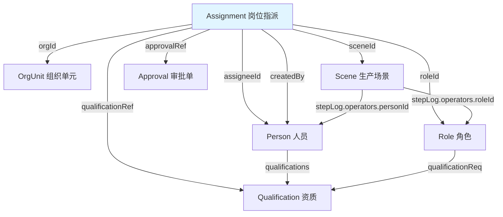
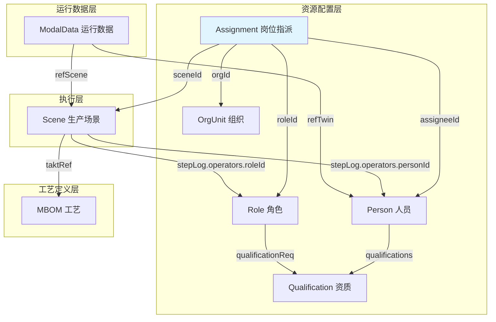
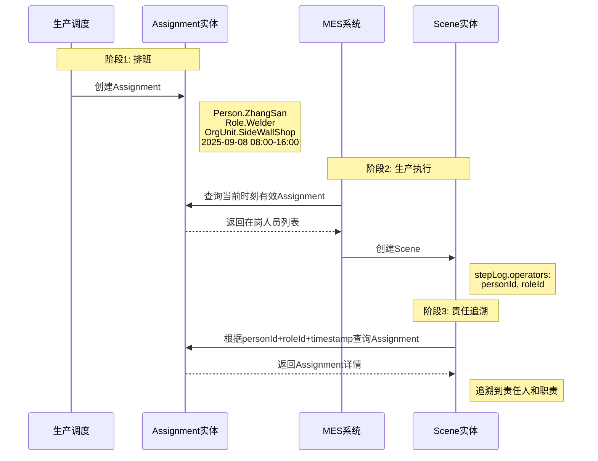

# Assignment实体数据契约

**Entity Data Contract - Assignment**

---

## 契约元信息

| 项目 | 内容 |
|-----|------|
| **契约版本** | v1.0.0 |
| **所属总契约** | 00_总契约.md v1.0.0 |
| **生效日期** | 2025-11-10 |
| **实体类型** | Assignment (岗位指派) |
| **所属层级** | 资源配置层 (Resource Configuration Layer) |
| **契约状态** | 🟢 生效中 |

---

## 1. 实体概述

### 1.1 实体定义

**Assignment** (岗位指派) 是资源配置层的时态化人岗绑定实体,实现"谁在什么时间、什么组织、担任什么角色"的动态履职管理。它是数字孪生责任流的核心组成部分,连接人员(Person)、角色(Role)、组织(OrgUnit)和执行场景(Scene)。

**核心特征**:
- **时态性**: 具有明确的生效时间(validFrom)和失效时间(validTo)
- **三元绑定**: 建立Person × Role × OrgUnit的三维关系
- **状态管理**: 支持Active、Suspended、Revoked、Expired等生命周期状态
- **可追溯**: 支持审批流程追溯(approvalRef)和创建者追溯(createdBy)

### 1.2 实体用途

| 用途类别 | 具体应用 |
|---------|---------|
| 排班管理 | 记录人员的班次、岗位指派 |
| 权限授予 | 通过角色向人员授予系统操作权限 |
| 责任追溯 | 从生产事件追溯到责任人和职责 |
| 人岗匹配 | 验证人员资质是否满足岗位要求 |
| 临时调配 | 支持临时任务指派(通过sceneId) |
| 履职审计 | 追踪人员履职历史和状态变更 |

### 1.3 与相关实体的关系



### 1.4 典型URN示例

```
# 正常排班指派
urn:ngsi-ld:Assignment:Person.ZhangSan:Welder:SideWallShop:20250908-EarlyShift

# 长期岗位任命
urn:ngsi-ld:Assignment:Person.LiSi:QualitySupervisor:SideWallShop:Permanent

# 临时任务指派
urn:ngsi-ld:Assignment:Person.WangWu:WaterSpider:A-Line:PO123

# 跨组织支援
urn:ngsi-ld:Assignment:Person.ZhaoLiu:IEEngineer:B-Line:TempSupport-20250910
```

---

## 2. 核心字段契约

### 2.1 必填字段

| 字段名 | NGSI-LD类型 | 数据类型 | 约束 | 说明 | 示例 |
|-------|------------|---------|------|------|------|
| **id** | - | URN | 必填,唯一 | Assignment实体的全局唯一标识符 | `urn:ngsi-ld:Assignment:Person.ZhangSan:Welder:SideWallShop:20250908-EarlyShift` |
| **type** | - | String | 必填,固定值 | 固定为"Assignment" | `"Assignment"` |
| **@context** | - | Array | 必填 | NGSI-LD上下文定义 | `["https://uri.etsi.org/ngsi-ld/v1/ngsi-ld-core-context.jsonld", ...]` |
| **assigneeId** | Relationship | URN | 必填 | 被指派的人员(Person) | `urn:ngsi-ld:TwinObject:Person.ZhangSan` |
| **roleId** | Relationship | URN | 必填 | 指派的角色(Role) | `urn:ngsi-ld:Role:Welder` |
| **orgId** | Relationship | URN | 必填 | 所属组织单元(OrgUnit) | `urn:ngsi-ld:OrgUnit:SideWallShop` |
| **validFrom** | Property | DateTime | 必填 | 指派生效起始时间 | `2025-09-08T08:00:00Z` |
| **validTo** | Property | DateTime | 必填 | 指派失效结束时间 | `2025-09-08T16:00:00Z` |
| **assignmentStatus** | Property | String | 必填,枚举 | 当前指派状态 | `Active`, `Suspended`, `Revoked`, `Expired` |

**URN命名规范**:
```
格式: urn:ngsi-ld:Assignment:{PersonCode}:{RoleCode}:{OrgCode}:{TimestampOrIdentifier}

组成部分:
- PersonCode: Person实体id的最后一段(如Person.ZhangSan)
- RoleCode: Role实体id的最后一段(如Welder)
- OrgCode: OrgUnit的简称(如SideWallShop)
- TimestampOrIdentifier: 时间标识或任务标识(如20250908-EarlyShift, PO123, Permanent)

约束:
- 必须保证全局唯一性
- 推荐包含足够语义信息以便人工理解
- 对于同一人同一角色同一组织的多次指派,通过最后一段区分
```

### 2.2 推荐字段

| 字段名 | NGSI-LD类型 | 数据类型 | 说明 | 示例 |
|-------|------------|---------|------|------|
| **shiftId** | Property | String | 班次标识(早班/中班/晚班等) | `EarlyShift`, `NightShift`, `A`, `B` |
| **qualificationRef** | Relationship[] | URN[] | 人员资质引用列表 | `[{type: "Relationship", object: "urn:ngsi-ld:Qualification:SeniorWelderCert"}]` |
| **approvalRef** | Relationship | URN | 指派审批记录引用 | `{type: "Relationship", object: "urn:ngsi-ld:Approval:HR-2024-12-20-QS-Appointment"}` |
| **createdBy** | Relationship | URN | 创建该指派的操作者 | `{type: "Relationship", object: "urn:ngsi-ld:TwinObject:Person.Scheduler001"}` |
| **notes** | Property | String | 备注信息(最大500字符) | `"正常排班,早班焊接岗位"` |

### 2.3 可选字段

| 字段名 | NGSI-LD类型 | 数据类型 | 说明 | 示例 |
|-------|------------|---------|------|------|
| **sceneId** | Relationship | URN | 限定指派适用的特定场景(临时任务) | `{type: "Relationship", object: "urn:ngsi-ld:Scene:PO123:FrontWelding_001"}` |
| **createdAt** | - | DateTime | NGSI-LD标准元数据:实体创建时间 | `2025-09-08T00:00:00Z` |
| **modifiedAt** | - | DateTime | NGSI-LD标准元数据:实体最后修改时间 | `2025-09-08T07:30:00Z` |

---

## 3. 字段详细规范

### 3.1 assigneeId (被指派人员)

**字段结构**:
```json
{
  "assigneeId": {
    "type": "Relationship",
    "object": "urn:ngsi-ld:TwinObject:Person.ZhangSan"
  }
}
```

**约束规则**:
- ✅ 必须引用有效的Person类型TwinObject实体
- ✅ URN格式: `urn:ngsi-ld:TwinObject:Person.{PersonCode}`
- ❌ 不允许引用不存在的Person实体

**验证逻辑**:
```python
def validate_assignee(assignment, context):
    person_id = assignment['assigneeId']['object']
    if not person_id.startswith('urn:ngsi-ld:TwinObject:Person.'):
        raise ValidationError(f"assigneeId必须指向Person类型: {person_id}")
    if person_id not in context['person_ids']:
        raise ValidationError(f"assigneeId引用的Person不存在: {person_id}")
```

---

### 3.2 roleId (指派角色)

**字段结构**:
```json
{
  "roleId": {
    "type": "Relationship",
    "object": "urn:ngsi-ld:Role:Welder"
  }
}
```

**约束规则**:
- ✅ 必须引用有效的Role实体
- ✅ URN格式: `urn:ngsi-ld:Role:{RoleCode}`
- ✅ 引用的Role必须在指派时间内有效(Role.effectiveFrom <= validFrom, Role.effectiveTo >= validFrom)

**验证逻辑**:
```python
def validate_role(assignment, context):
    role_id = assignment['roleId']['object']
    if role_id not in context['role_ids']:
        raise ValidationError(f"roleId引用的Role不存在: {role_id}")
    
    role = context['roles'][role_id]
    valid_from = parse_datetime(assignment['validFrom']['value'])
    
    # 检查Role有效期
    if role.get('effectiveFrom'):
        role_eff_from = parse_datetime(role['effectiveFrom']['value'])
        if valid_from < role_eff_from:
            raise ValidationError(
                f"指派时间({valid_from})早于角色生效时间({role_eff_from})"
            )
    
    if role.get('effectiveTo'):
        role_eff_to = parse_datetime(role['effectiveTo']['value'])
        if valid_from > role_eff_to:
            raise ValidationError(
                f"指派时间({valid_from})晚于角色失效时间({role_eff_to})"
            )
```

---

### 3.3 orgId (所属组织)

**字段结构**:
```json
{
  "orgId": {
    "type": "Relationship",
    "object": "urn:ngsi-ld:OrgUnit:SideWallShop"
  }
}
```

**约束规则**:
- ✅ 必须引用有效的OrgUnit实体
- ✅ URN格式: `urn:ngsi-ld:OrgUnit:{OrgCode}`
- ✅ 组织必须处于Active状态(OrgUnit.orgStatus = "Active")

**语义说明**:
- orgId限定了指派的组织范围
- 同一人员可在不同组织担任不同角色(通过多个Assignment)
- orgId与Role.orgScope应保持一致性(如果Role定义了orgScope)

---

### 3.4 validFrom / validTo (时间有效性)

**字段结构**:
```json
{
  "validFrom": {
    "type": "Property",
    "value": "2025-09-08T08:00:00Z"
  },
  "validTo": {
    "type": "Property",
    "value": "2025-09-08T16:00:00Z"
  }
}
```

**约束规则**:
- ✅ validFrom < validTo (起始时间必须早于结束时间)
- ✅ 使用ISO 8601格式的UTC时间戳
- ✅ 对于长期指派,validTo可设置为较远未来时间(如2030-12-31T23:59:59Z)
- ✅ 对于临时指派,validTo应与任务预计结束时间对齐

**时间粒度建议**:
- 班次指派: 精确到小时 (如08:00:00 - 16:00:00)
- 日指派: 精确到日 (如00:00:00 - 23:59:59)
- 长期指派: 精确到日或月

**验证逻辑**:
```python
def validate_time_range(assignment):
    valid_from = parse_datetime(assignment['validFrom']['value'])
    valid_to = parse_datetime(assignment['validTo']['value'])
    
    if valid_from >= valid_to:
        raise ValidationError(
            f"validFrom({valid_from})必须早于validTo({valid_to})"
        )
    
    # 检查是否与同一人同一角色的其他Assignment时间重叠
    conflicts = find_overlapping_assignments(
        assignment['assigneeId']['object'],
        assignment['roleId']['object'],
        valid_from,
        valid_to
    )
    if conflicts:
        raise ValidationError(
            f"时间范围与已有指派冲突: {conflicts}"
        )
```

---

### 3.5 assignmentStatus (指派状态)

**字段结构**:
```json
{
  "assignmentStatus": {
    "type": "Property",
    "value": "Active"
  }
}
```

**枚举值定义**:

| 状态值 | 中文名称 | 说明 | 适用场景 |
|-------|---------|------|---------|
| **Active** | 生效中 | 指派当前有效,人员正常履职 | 正常排班、长期任命 |
| **Suspended** | 暂停 | 指派被临时暂停,但未撤销 | 人员请假、临时调离 |
| **Revoked** | 已撤销 | 指派被提前撤销 | 组织调整、人员离职 |
| **Expired** | 已过期 | 指派时间已到期自然失效 | validTo时间已过 |

**状态转换规则**:
```
Active → Suspended: 临时暂停(如请假)
Active → Revoked: 提前撤销(如离职)
Active → Expired: 时间到期自动转换

Suspended → Active: 恢复履职
Suspended → Revoked: 暂停后撤销

Revoked, Expired: 终态,不再转换
```

**自动状态更新**:
```python
def update_assignment_status(assignment):
    """根据当前时间自动更新Assignment状态"""
    now = datetime.now(timezone.utc)
    valid_to = parse_datetime(assignment['validTo']['value'])
    current_status = assignment['assignmentStatus']['value']
    
    if current_status in ['Active', 'Suspended'] and now > valid_to:
        assignment['assignmentStatus']['value'] = 'Expired'
        assignment['modifiedAt'] = now.isoformat()
        db.update(assignment)
```

---

### 3.6 shiftId (班次标识)

**字段结构**:
```json
{
  "shiftId": {
    "type": "Property",
    "value": "EarlyShift"
  }
}
```

**常见班次标识**:
| shiftId值 | 中文名称 | 典型时间段 |
|----------|---------|-----------|
| `EarlyShift` | 早班 | 08:00-16:00 |
| `MiddleShift` | 中班 | 16:00-24:00 |
| `NightShift` | 晚班 | 00:00-08:00 |
| `A` | A班 | 企业自定义 |
| `B` | B班 | 企业自定义 |
| `C` | C班 | 企业自定义 |
| `D` | D班 | 企业自定义 |
| `DayShift` | 白班 | 08:00-20:00 |

**使用指南**:
- shiftId与validFrom/validTo应保持一致
- 用于轮班制度的管理和统计
- 可选字段,但对于班次制企业强烈推荐填写

---

### 3.7 qualificationRef (资质引用)

**字段结构**:
```json
{
  "qualificationRef": [
    {
      "type": "Relationship",
      "object": "urn:ngsi-ld:Qualification:SeniorWelderCert"
    },
    {
      "type": "Relationship",
      "object": "urn:ngsi-ld:Qualification:ISO9001Auditor"
    }
  ]
}
```

**用途**:
- 列出该指派要求或已验证的人员资质
- 用于人岗匹配的合规性验证
- 支持资质到期提醒和复审管理

**验证逻辑**:
```python
def validate_qualifications(assignment, context):
    """验证人员资质是否满足角色要求"""
    person_id = assignment['assigneeId']['object']
    role_id = assignment['roleId']['object']
    
    person = context['persons'][person_id]
    role = context['roles'][role_id]
    
    # 获取人员持有的资质
    person_quals = set(q['object'] for q in person.get('qualifications', []))
    
    # 获取角色要求的资质
    required_quals = set(q['object'] for q in role.get('qualificationReq', []))
    
    # 验证是否满足要求
    if not required_quals.issubset(person_quals):
        missing = required_quals - person_quals
        raise ValidationError(
            f"人员{person_id}缺少必需资质: {missing}"
        )
    
    # 如果Assignment指定了qualificationRef,应与Role要求一致
    if 'qualificationRef' in assignment:
        assignment_quals = set(
            q['object'] for q in assignment['qualificationRef']
        )
        if assignment_quals != required_quals:
            warnings.append(
                f"Assignment.qualificationRef与Role.qualificationReq不一致"
            )
```

---

### 3.8 sceneId (场景限定)

**字段结构**:
```json
{
  "sceneId": {
    "type": "Relationship",
    "object": "urn:ngsi-ld:Scene:PO123:FrontWelding_001"
  }
}
```

**用途**:
- 用于临时任务指派,指派仅在该场景执行期间有效
- 场景结束后,Assignment自动失效或转为Expired状态
- 支持项目制、订单制生产的临时人员调配

**使用场景**:
1. **紧急订单支援**: 从其他产线临时调配人员
2. **项目制任务**: 为特定项目组建临时团队
3. **设备维修**: 临时指派维修人员到特定设备
4. **质量问题处理**: 组建临时质量攻关小组

**示例**:
```json
{
  "id": "urn:ngsi-ld:Assignment:Person.LiSi:WaterSpider:A-Line:PO123",
  "type": "Assignment",
  "assigneeId": {
    "type": "Relationship",
    "object": "urn:ngsi-ld:TwinObject:Person.LiSi"
  },
  "roleId": {
    "type": "Relationship",
    "object": "urn:ngsi-ld:Role:WaterSpider"
  },
  "orgId": {
    "type": "Relationship",
    "object": "urn:ngsi-ld:OrgUnit:SideWallShop:A-Line"
  },
  "sceneId": {
    "type": "Relationship",
    "object": "urn:ngsi-ld:Scene:PO123:MaterialSupport"
  },
  "validFrom": {"type": "Property", "value": "2025-09-10T08:00:00Z"},
  "validTo": {"type": "Property", "value": "2025-09-10T20:00:00Z"},
  "assignmentStatus": {"type": "Property", "value": "Active"},
  "notes": {
    "type": "Property",
    "value": "临时调配支援PO123订单生产,场景结束后自动失效"
  }
}
```

---

### 3.9 approvalRef (审批追溯)

**字段结构**:
```json
{
  "approvalRef": {
    "type": "Relationship",
    "object": "urn:ngsi-ld:Approval:HR-2024-12-20-QS-Appointment"
  }
}
```

**用途**:
- 追溯该指派经过的审批流程
- 确保指派决策的合规性和可追溯性
- 支持审计和问责

**适用场景**:
- 长期岗位任命(如主管、班组长)
- 关键岗位指派(如质量负责人)
- 跨组织调配
- 特殊技能岗位

---

### 3.10 createdBy (创建者)

**字段结构**:
```json
{
  "createdBy": {
    "type": "Relationship",
    "object": "urn:ngsi-ld:TwinObject:Person.Scheduler001"
  }
}
```

**用途**:
- 记录创建该指派的操作者
- 可以是人员TwinObject或另一个Assignment(如调度员的指派身份)
- 支持操作审计和责任追溯

**示例**:
```python
# 创建Assignment时自动记录创建者
def create_assignment(data, operator_id):
    assignment = {
        ...data,
        'createdBy': {
            'type': 'Relationship',
            'object': operator_id
        },
        'createdAt': datetime.now(timezone.utc).isoformat()
    }
    return assignment
```

---

## 4. 实体示例

### 4.1 示例1: 正常排班指派

```json
{
  "@context": [
    "https://uri.etsi.org/ngsi-ld/v1/ngsi-ld-core-context.jsonld",
    "https://factory.example.com/context/assignment-context.jsonld"
  ],
  "id": "urn:ngsi-ld:Assignment:Person.ZhangSan:Welder:SideWallShop:20250908-EarlyShift",
  "type": "Assignment",
  "assigneeId": {
    "type": "Relationship",
    "object": "urn:ngsi-ld:TwinObject:Person.ZhangSan"
  },
  "roleId": {
    "type": "Relationship",
    "object": "urn:ngsi-ld:Role:Welder"
  },
  "orgId": {
    "type": "Relationship",
    "object": "urn:ngsi-ld:OrgUnit:SideWallShop"
  },
  "validFrom": {
    "type": "Property",
    "value": "2025-09-08T08:00:00Z"
  },
  "validTo": {
    "type": "Property",
    "value": "2025-09-08T16:00:00Z"
  },
  "shiftId": {
    "type": "Property",
    "value": "EarlyShift"
  },
  "qualificationRef": [
    {
      "type": "Relationship",
      "object": "urn:ngsi-ld:Qualification:SeniorWelderCert"
    }
  ],
  "assignmentStatus": {
    "type": "Property",
    "value": "Active"
  },
  "notes": {
    "type": "Property",
    "value": "正常排班,早班焊接岗位"
  },
  "createdBy": {
    "type": "Relationship",
    "object": "urn:ngsi-ld:TwinObject:Person.Scheduler001"
  },
  "createdAt": "2025-09-07T18:00:00Z"
}
```

---

### 4.2 示例2: 长期岗位任命

```json
{
  "@context": [
    "https://uri.etsi.org/ngsi-ld/v1/ngsi-ld-core-context.jsonld",
    "https://factory.example.com/context/assignment-context.jsonld"
  ],
  "id": "urn:ngsi-ld:Assignment:Person.WangWu:QualitySupervisor:SideWallShop:Permanent",
  "type": "Assignment",
  "assigneeId": {
    "type": "Relationship",
    "object": "urn:ngsi-ld:TwinObject:Person.WangWu"
  },
  "roleId": {
    "type": "Relationship",
    "object": "urn:ngsi-ld:Role:QualitySupervisor"
  },
  "orgId": {
    "type": "Relationship",
    "object": "urn:ngsi-ld:OrgUnit:SideWallShop"
  },
  "validFrom": {
    "type": "Property",
    "value": "2025-01-01T00:00:00Z"
  },
  "validTo": {
    "type": "Property",
    "value": "2030-12-31T23:59:59Z"
  },
  "qualificationRef": [
    {
      "type": "Relationship",
      "object": "urn:ngsi-ld:Qualification:QualitySupervisorCert"
    },
    {
      "type": "Relationship",
      "object": "urn:ngsi-ld:Qualification:ISO9001Auditor"
    }
  ],
  "assignmentStatus": {
    "type": "Property",
    "value": "Active"
  },
  "approvalRef": {
    "type": "Relationship",
    "object": "urn:ngsi-ld:Approval:HR-2024-12-20-QS-Appointment"
  },
  "notes": {
    "type": "Property",
    "value": "长期岗位任命,经过HR审批流程"
  },
  "createdBy": {
    "type": "Relationship",
    "object": "urn:ngsi-ld:TwinObject:Person.HRManager"
  },
  "createdAt": "2024-12-20T10:00:00Z"
}
```

---

### 4.3 示例3: 临时任务指派(含sceneId)

```json
{
  "@context": [
    "https://uri.etsi.org/ngsi-ld/v1/ngsi-ld-core-context.jsonld",
    "https://factory.example.com/context/assignment-context.jsonld"
  ],
  "id": "urn:ngsi-ld:Assignment:Person.LiSi:WaterSpider:A-Line:PO123",
  "type": "Assignment",
  "assigneeId": {
    "type": "Relationship",
    "object": "urn:ngsi-ld:TwinObject:Person.LiSi"
  },
  "roleId": {
    "type": "Relationship",
    "object": "urn:ngsi-ld:Role:WaterSpider"
  },
  "orgId": {
    "type": "Relationship",
    "object": "urn:ngsi-ld:OrgUnit:SideWallShop:A-Line"
  },
  "sceneId": {
    "type": "Relationship",
    "object": "urn:ngsi-ld:Scene:PO123:MaterialSupport"
  },
  "validFrom": {
    "type": "Property",
    "value": "2025-09-10T08:00:00Z"
  },
  "validTo": {
    "type": "Property",
    "value": "2025-09-10T20:00:00Z"
  },
  "shiftId": {
    "type": "Property",
    "value": "DayShift"
  },
  "assignmentStatus": {
    "type": "Property",
    "value": "Active"
  },
  "notes": {
    "type": "Property",
    "value": "临时调配支援PO123订单生产,场景结束后自动失效"
  },
  "createdBy": {
    "type": "Relationship",
    "object": "urn:ngsi-ld:TwinObject:Person.ProductionManager"
  },
  "createdAt": "2025-09-09T16:00:00Z"
}
```

---

### 4.4 示例4: 暂停状态的指派

```json
{
  "@context": [
    "https://uri.etsi.org/ngsi-ld/v1/ngsi-ld-core-context.jsonld",
    "https://factory.example.com/context/assignment-context.jsonld"
  ],
  "id": "urn:ngsi-ld:Assignment:Person.ZhaoLiu:Welder:SideWallShop:20250911-EarlyShift",
  "type": "Assignment",
  "assigneeId": {
    "type": "Relationship",
    "object": "urn:ngsi-ld:TwinObject:Person.ZhaoLiu"
  },
  "roleId": {
    "type": "Relationship",
    "object": "urn:ngsi-ld:Role:Welder"
  },
  "orgId": {
    "type": "Relationship",
    "object": "urn:ngsi-ld:OrgUnit:SideWallShop"
  },
  "validFrom": {
    "type": "Property",
    "value": "2025-09-11T08:00:00Z"
  },
  "validTo": {
    "type": "Property",
    "value": "2025-09-11T16:00:00Z"
  },
  "shiftId": {
    "type": "Property",
    "value": "EarlyShift"
  },
  "assignmentStatus": {
    "type": "Property",
    "value": "Suspended"
  },
  "notes": {
    "type": "Property",
    "value": "人员临时请假,指派暂停"
  },
  "createdBy": {
    "type": "Relationship",
    "object": "urn:ngsi-ld:TwinObject:Person.Scheduler001"
  },
  "createdAt": "2025-09-10T18:00:00Z",
  "modifiedAt": "2025-09-11T07:00:00Z"
}
```

---

## 5. 关系图谱

### 5.1 Assignment在责任流中的位置



### 5.2 核心关系清单

| 关系名 | 源实体 | 目标实体 | 基数 | 必填 | 说明 |
|-------|-------|---------|------|-----|------|
| assigneeId | Assignment | Person | N:1 | ✓ | 被指派的人员 |
| roleId | Assignment | Role | N:1 | ✓ | 指派的角色 |
| orgId | Assignment | OrgUnit | N:1 | ✓ | 所属组织单元 |
| sceneId | Assignment | Scene | N:1 | - | 限定的场景(临时任务) |
| qualificationRef | Assignment | Qualification | N:M | - | 人员资质引用 |
| approvalRef | Assignment | Approval | N:1 | - | 审批记录引用 |
| createdBy | Assignment | Person/Assignment | N:1 | - | 创建者 |

---

## 6. 数据验证规则

### 6.1 结构验证

```python
def validate_assignment_structure(assignment):
    """Assignment实体结构验证"""
    errors = []
    
    # 必填字段检查
    required_fields = [
        'id', 'type', 'assigneeId', 'roleId', 'orgId',
        'validFrom', 'validTo', 'assignmentStatus'
    ]
    for field in required_fields:
        if field not in assignment:
            errors.append(f"缺少必填字段: {field}")
    
    # type值验证
    if assignment.get('type') != 'Assignment':
        errors.append("type字段必须为'Assignment'")
    
    # URN格式验证
    urn_pattern = r'^urn:ngsi-ld:Assignment:[A-Za-z0-9._:-]+$'
    if not re.match(urn_pattern, assignment.get('id', '')):
        errors.append("id不符合URN格式规范")
    
    # assignmentStatus枚举值验证
    valid_statuses = ['Active', 'Suspended', 'Revoked', 'Expired']
    status = assignment.get('assignmentStatus', {}).get('value')
    if status not in valid_statuses:
        errors.append(f"assignmentStatus必须为以下值之一: {valid_statuses}")
    
    # 时间范围验证
    try:
        valid_from = parse_datetime(assignment['validFrom']['value'])
        valid_to = parse_datetime(assignment['validTo']['value'])
        if valid_from >= valid_to:
            errors.append("validFrom必须早于validTo")
    except Exception as e:
        errors.append(f"时间字段格式错误: {e}")
    
    return errors
```

### 6.2 语义验证

```python
def validate_assignment_semantics(assignment, context):
    """Assignment实体语义验证"""
    warnings = []
    
    # 引用完整性检查
    person_id = assignment['assigneeId']['object']
    if person_id not in context['person_ids']:
        warnings.append(f"assigneeId引用的Person不存在: {person_id}")
    
    role_id = assignment['roleId']['object']
    if role_id not in context['role_ids']:
        warnings.append(f"roleId引用的Role不存在: {role_id}")
    
    org_id = assignment['orgId']['object']
    if org_id not in context['orgunit_ids']:
        warnings.append(f"orgId引用的OrgUnit不存在: {org_id}")
    
    # 资质匹配验证
    person = context['persons'].get(person_id, {})
    role = context['roles'].get(role_id, {})
    
    person_quals = set(q['object'] for q in person.get('qualifications', []))
    required_quals = set(q['object'] for q in role.get('qualificationReq', []))
    
    if not required_quals.issubset(person_quals):
        missing = required_quals - person_quals
        warnings.append(
            f"人员{person_id}缺少角色{role_id}要求的资质: {missing}"
        )
    
    # 时间冲突检查
    conflicts = find_overlapping_assignments(
        person_id,
        role_id,
        assignment['validFrom']['value'],
        assignment['validTo']['value'],
        exclude_id=assignment['id']
    )
    if conflicts:
        warnings.append(
            f"与已有指派时间冲突: {[c['id'] for c in conflicts]}"
        )
    
    # Scene引用检查(如果有sceneId)
    if 'sceneId' in assignment:
        scene_id = assignment['sceneId']['object']
        if scene_id not in context['scene_ids']:
            warnings.append(f"sceneId引用的Scene不存在: {scene_id}")
    
    return warnings
```

### 6.3 业务规则验证

```python
def validate_assignment_business_rules(assignment, context):
    """Assignment业务规则验证"""
    errors = []
    
    # 规则1: 组织状态检查
    org_id = assignment['orgId']['object']
    org = context['orgunits'].get(org_id, {})
    if org.get('orgStatus', {}).get('value') != 'Active':
        errors.append(f"组织{org_id}不处于Active状态,不能创建指派")
    
    # 规则2: 角色有效期检查
    role_id = assignment['roleId']['object']
    role = context['roles'].get(role_id, {})
    valid_from = parse_datetime(assignment['validFrom']['value'])
    
    if role.get('effectiveFrom'):
        role_eff_from = parse_datetime(role['effectiveFrom']['value'])
        if valid_from < role_eff_from:
            errors.append(
                f"指派时间早于角色生效时间"
            )
    
    if role.get('effectiveTo'):
        role_eff_to = parse_datetime(role['effectiveTo']['value'])
        if valid_from > role_eff_to:
            errors.append(
                f"指派时间晚于角色失效时间"
            )
    
    # 规则3: 同一人同一时间同一组织不能担任多个角色
    person_id = assignment['assigneeId']['object']
    org_id = assignment['orgId']['object']
    valid_from = assignment['validFrom']['value']
    valid_to = assignment['validTo']['value']
    
    overlapping = find_person_assignments_in_org(
        person_id, org_id, valid_from, valid_to,
        exclude_id=assignment['id']
    )
    if overlapping:
        errors.append(
            f"人员在同一时间段同一组织已有其他角色指派: {overlapping}"
        )
    
    return errors
```

### 6.4 JSON Schema验证

**引用Schema文件**: `/mnt/project/Assignment_schema.json`

**验证命令**:
```bash
python validators/validate_assignment.py \
    --file assignment_instances.json \
    --schema Assignment_schema.json \
    --context-data context.json
```

---

## 7. 四项任务使用指南

### 7.1 任务1: 数字孪生管理平台

**职责**:
- ✅ Assignment实体的CRUD操作
- ✅ 排班管理功能
- ✅ 人岗匹配验证
- ✅ 状态自动更新(Expired)
- ✅ 契约验证集成

**关键API**:

**创建Assignment**:
```http
POST /ngsi-ld/v1/entities
Content-Type: application/ld+json

{
  "@context": [...],
  "id": "urn:ngsi-ld:Assignment:Person.ZhangSan:Welder:SideWallShop:20250908-EarlyShift",
  "type": "Assignment",
  "assigneeId": {...},
  "roleId": {...},
  "orgId": {...},
  "validFrom": {...},
  "validTo": {...},
  "assignmentStatus": {"type": "Property", "value": "Active"}
}
```

**查询某人的当前有效指派**:
```http
GET /ngsi-ld/v1/entities?type=Assignment&q=assigneeId=={person_id};assignmentStatus==Active

Filter: validFrom <= now <= validTo
```

**更新Assignment状态**:
```http
PATCH /ngsi-ld/v1/entities/{assignment_id}/attrs/assignmentStatus
Content-Type: application/json

{
  "value": "Suspended"
}
```

**定时任务: 自动更新过期Assignment**:
```python
def auto_expire_assignments():
    """定时任务:将validTo已过期的Active/Suspended状态Assignment标记为Expired"""
    now = datetime.now(timezone.utc)
    assignments = query_assignments(
        q="assignmentStatus==Active;validTo<{now}"
    )
    for assignment in assignments:
        assignment['assignmentStatus']['value'] = 'Expired'
        assignment['modifiedAt'] = now.isoformat()
        db.update(assignment)
```

---

### 7.2 任务2: 产线2D地图

**使用场景**:
- 显示工位当前在岗人员及其角色
- 可视化人员分布和角色配置
- 实时更新人员状态

**查询逻辑**:
```python
def get_station_operators(station_id, timestamp=None):
    """查询某工位在指定时间的在岗人员"""
    if timestamp is None:
        timestamp = datetime.now(timezone.utc)
    
    # 查询该工位所属组织
    station = get_station(station_id)
    org_id = station['stationLocation']['object']
    
    # 查询在该时间有效的Assignment
    assignments = query_assignments(
        q=f"orgId=={org_id};assignmentStatus==Active;validFrom<={timestamp};validTo>={timestamp}"
    )
    
    # 获取人员和角色信息
    operators = []
    for assignment in assignments:
        person = get_person(assignment['assigneeId']['object'])
        role = get_role(assignment['roleId']['object'])
        operators.append({
            'personName': person['name']['value'],
            'roleName': role['name']['value'],
            'shiftId': assignment.get('shiftId', {}).get('value', ''),
            'assignmentId': assignment['id']
        })
    
    return operators
```

**地图显示**:
```
工位: 前围焊接
在岗人员:
- 张三 (焊接班组长, 早班)
- 李四 (焊工, 早班)
- 王五 (质量检查员, 早班)
```

---

### 7.3 任务3: 业务优化智能应用

**场景1: 生产计划可行性验证**

验证某生产计划是否有足够的合格人员:

```python
def validate_production_plan_feasibility(plan):
    """验证生产计划的人员可行性"""
    # 1. 解析计划中的工艺要求
    takt_list = parse_takts_from_plan(plan)
    
    # 2. 对每个节拍,查询需要的角色
    for takt in takt_list:
        required_roles = get_required_roles_for_takt(takt)
        
        # 3. 检查计划时间段内是否有足够的人员指派
        for role_id in required_roles:
            assignments = query_assignments(
                q=f"roleId=={role_id};validFrom<={plan.end_time};validTo>={plan.start_time};assignmentStatus==Active"
            )
            
            if len(assignments) < takt.required_count:
                return False, f"节拍{takt.id}缺少角色{role_id}的人员指派"
    
    return True, "人员配置满足计划要求"
```

**场景2: 质量责任追溯**

从NG工件追溯到责任人和职责:

```python
def trace_quality_responsibility(ng_workpiece_id):
    """追溯质量问题的完整责任链"""
    # 1. 查询工件的生产场景
    scenes = query_scenes(q=f"workpieceId=={ng_workpiece_id}")
    
    responsibility_chain = []
    for scene in scenes:
        # 2. 遍历场景的stepLog
        for step_log in scene['stepLog']:
            # 3. 获取操作者信息
            for operator in step_log.get('operators', []):
                person_id = operator['personId']
                role_id = operator['roleId']
                timestamp = step_log['timestamp']
                
                # 4. 查询该时刻的Assignment
                assignment = query_assignment(
                    person_id=person_id,
                    role_id=role_id,
                    timestamp=timestamp
                )
                
                # 5. 获取角色职责
                role = get_role(role_id)
                person = get_person(person_id)
                
                # 6. 构建责任链条
                responsibility_chain.append({
                    'scene': scene['id'],
                    'step': step_log['stepRef'],
                    'timestamp': timestamp,
                    'person': {
                        'id': person_id,
                        'name': person['name']['value']
                    },
                    'role': {
                        'id': role_id,
                        'name': role['name']['value'],
                        'responsibilities': role['responsibilities']['value']
                    },
                    'assignment': assignment['id'],
                    'qualifications': assignment.get('qualificationRef', [])
                })
    
    return responsibility_chain
```

**场景3: 人员利用率分析**

分析人员的Assignment覆盖率:

```python
def analyze_person_utilization(person_id, time_range):
    """分析人员在时间段内的利用率"""
    start_time, end_time = time_range
    total_hours = (end_time - start_time).total_seconds() / 3600
    
    # 查询该人员在时间段内的所有Assignment
    assignments = query_assignments(
        q=f"assigneeId=={person_id};validFrom<={end_time};validTo>={start_time}"
    )
    
    # 计算有效工作时间
    work_hours = 0
    for assignment in assignments:
        if assignment['assignmentStatus']['value'] in ['Active', 'Suspended']:
            assign_start = max(
                parse_datetime(assignment['validFrom']['value']),
                start_time
            )
            assign_end = min(
                parse_datetime(assignment['validTo']['value']),
                end_time
            )
            work_hours += (assign_end - assign_start).total_seconds() / 3600
    
    utilization_rate = (work_hours / total_hours) * 100
    
    return {
        'person_id': person_id,
        'total_hours': total_hours,
        'work_hours': work_hours,
        'utilization_rate': utilization_rate,
        'assignment_count': len(assignments)
    }
```

---

### 7.4 任务4: 生产系统仿真

**使用场景**:
- 读取Assignment理解人员配置
- 模拟不同排班方案下的生产效率
- 生成符合Assignment约束的Scene.stepLog

**仿真排班方案**:
```python
def simulate_shift_schedule(date, shift_pattern):
    """仿真排班方案"""
    # shift_pattern示例: {'EarlyShift': ['Person.ZhangSan', 'Person.LiSi'], ...}
    
    simulated_assignments = []
    for shift_id, person_ids in shift_pattern.items():
        # 获取班次时间范围
        shift_time = get_shift_time_range(date, shift_id)
        
        # 为每个人员创建模拟Assignment
        for person_id in person_ids:
            # 选择合适的角色
            role_id = select_role_for_person(person_id)
            
            assignment = {
                'id': f"urn:ngsi-ld:Assignment:{person_id}:{role_id}:SIM-{date}-{shift_id}",
                'type': 'Assignment',
                'assigneeId': {'type': 'Relationship', 'object': person_id},
                'roleId': {'type': 'Relationship', 'object': role_id},
                'orgId': {'type': 'Relationship', 'object': 'urn:ngsi-ld:OrgUnit:SideWallShop'},
                'validFrom': {'type': 'Property', 'value': shift_time['start']},
                'validTo': {'type': 'Property', 'value': shift_time['end']},
                'shiftId': {'type': 'Property', 'value': shift_id},
                'assignmentStatus': {'type': 'Property', 'value': 'Active'},
                'provenance': {'method': 'Simulated'}
            }
            simulated_assignments.append(assignment)
    
    return simulated_assignments
```

**仿真场景生成时使用Assignment**:
```python
def simulate_scene_with_assignments(takt, workpiece, simulation_time):
    """生成仿真场景,基于Assignment选择操作者"""
    # 查询模拟时间点的有效Assignment
    assignments = query_assignments(
        q=f"validFrom<={simulation_time};validTo>={simulation_time};assignmentStatus==Active"
    )
    
    # 为节拍所需的角色分配人员
    required_roles = get_required_roles_for_takt(takt)
    assigned_operators = []
    
    for role_id in required_roles:
        # 从Assignment中找到担任该角色的人员
        matching_assignments = [
            a for a in assignments
            if a['roleId']['object'] == role_id
        ]
        if matching_assignments:
            assignment = random.choice(matching_assignments)
            assigned_operators.append({
                'personId': assignment['assigneeId']['object'],
                'roleId': role_id,
                'assignmentRef': assignment['id']
            })
    
    # 生成Scene
    scene = {
        'id': generate_scene_id(),
        'type': 'Scene',
        'workpieceId': {'type': 'Relationship', 'object': workpiece['id']},
        'taktRef': {'type': 'Relationship', 'object': takt['id']},
        'stepLog': generate_step_log(takt, assigned_operators),
        'provenance': {'method': 'Simulated'}
    }
    
    return scene
```

**注意事项**:
- ⚠️ 仿真Assignment应标注provenance.method = "Simulated"
- ⚠️ 仿真应遵守Role.qualificationReq约束
- ⚠️ 仿真数据与真实数据分开存储或明确标识

---

## 8. 与Scene的协同

### 8.1 Assignment → Scene的信息流



### 8.2 Scene.stepLog中的Assignment信息

**Scene.stepLog结构**:
```json
{
  "stepLog": [
    {
      "stepRef": "urn:ngsi-ld:MBOM:M000004670327:T01:P0010:S01",
      "timestamp": "2025-09-08T09:15:30Z",
      "operators": [
        {
          "personId": "urn:ngsi-ld:TwinObject:Person.ZhangSan",
          "roleId": "urn:ngsi-ld:Role:Welder"
        }
      ],
      "duration": 120,
      "status": "Completed"
    }
  ]
}
```

**从Scene追溯Assignment**:
```python
def get_assignment_from_scene_log(step_log_entry):
    """从Scene的stepLog条目追溯Assignment"""
    person_id = step_log_entry['operators'][0]['personId']
    role_id = step_log_entry['operators'][0]['roleId']
    timestamp = step_log_entry['timestamp']
    
    # 查询该时刻该人员该角色的Assignment
    assignment = query_assignment(
        q=f"assigneeId=={person_id};roleId=={role_id};validFrom<={timestamp};validTo>={timestamp}"
    )
    
    if not assignment:
        raise DataIntegrityError(
            f"Scene记录的操作者在该时刻没有有效Assignment: "
            f"Person={person_id}, Role={role_id}, Time={timestamp}"
        )
    
    return assignment
```

### 8.3 数据一致性约束

**约束1: Scene.stepLog中的personId+roleId必须有对应的Assignment**

```python
def validate_scene_assignment_consistency(scene):
    """验证Scene中的操作者记录与Assignment一致"""
    errors = []
    
    for step_log in scene['stepLog']:
        timestamp = parse_datetime(step_log['timestamp'])
        
        for operator in step_log.get('operators', []):
            person_id = operator['personId']
            role_id = operator['roleId']
            
            # 查询该时刻的Assignment
            assignment = query_assignment(
                person_id=person_id,
                role_id=role_id,
                timestamp=timestamp
            )
            
            if not assignment:
                errors.append(
                    f"Scene {scene['id']} stepLog记录的操作者缺少Assignment: "
                    f"Person={person_id}, Role={role_id}, Time={timestamp}"
                )
            elif assignment['assignmentStatus']['value'] != 'Active':
                errors.append(
                    f"Scene {scene['id']} stepLog记录的操作者的Assignment不是Active状态: "
                    f"Assignment={assignment['id']}, Status={assignment['assignmentStatus']['value']}"
                )
    
    return errors
```

---

## 9. 高级查询模式

### 9.1 查询某人在某时间段的所有指派

```python
def get_person_assignments(person_id, start_time, end_time):
    """查询某人在时间段内的所有Assignment"""
    query = f"""
        type==Assignment;
        assigneeId=={person_id};
        validFrom<={end_time};
        validTo>={start_time}
    """
    assignments = query_entities(query)
    return sorted(assignments, key=lambda a: a['validFrom']['value'])
```

### 9.2 查询某角色在某时刻的所有在岗人员

```python
def get_role_assignees(role_id, timestamp):
    """查询某角色在指定时刻的所有在岗人员"""
    query = f"""
        type==Assignment;
        roleId=={role_id};
        validFrom<={timestamp};
        validTo>={timestamp};
        assignmentStatus==Active
    """
    assignments = query_entities(query)
    
    persons = []
    for assignment in assignments:
        person = get_person(assignment['assigneeId']['object'])
        persons.append({
            'person_id': person['id'],
            'person_name': person['name']['value'],
            'org_id': assignment['orgId']['object'],
            'shift_id': assignment.get('shiftId', {}).get('value', '')
        })
    
    return persons
```

### 9.3 查询某组织在某时刻的所有在岗人员

```python
def get_org_workforce(org_id, timestamp):
    """查询某组织在指定时刻的所有在岗人员"""
    query = f"""
        type==Assignment;
        orgId=={org_id};
        validFrom<={timestamp};
        validTo>={timestamp};
        assignmentStatus==Active
    """
    assignments = query_entities(query)
    
    workforce = []
    for assignment in assignments:
        person = get_person(assignment['assigneeId']['object'])
        role = get_role(assignment['roleId']['object'])
        workforce.append({
            'person_name': person['name']['value'],
            'role_name': role['name']['value'],
            'shift_id': assignment.get('shiftId', {}).get('value', ''),
            'assignment_id': assignment['id']
        })
    
    return workforce
```

### 9.4 检测Assignment时间冲突

```python
def find_overlapping_assignments(person_id, role_id, valid_from, valid_to, exclude_id=None):
    """检测时间范围是否与已有Assignment冲突"""
    query = f"""
        type==Assignment;
        assigneeId=={person_id};
        roleId=={role_id};
        validFrom<{valid_to};
        validTo>{valid_from}
    """
    assignments = query_entities(query)
    
    # 排除指定的Assignment (用于更新场景)
    if exclude_id:
        assignments = [a for a in assignments if a['id'] != exclude_id]
    
    # 只返回非终态的Assignment
    active_assignments = [
        a for a in assignments
        if a['assignmentStatus']['value'] in ['Active', 'Suspended']
    ]
    
    return active_assignments
```

---

## 10. JSON Schema定义

完整的JSON Schema定义参见: `/mnt/project/Assignment_schema.json`

**核心Schema片段**:
```json
{
  "$schema": "http://json-schema.org/draft-07/schema#",
  "title": "Assignment Entity Schema",
  "type": "object",
  "required": [
    "id", "type", "assigneeId", "roleId", "orgId",
    "validFrom", "validTo", "assignmentStatus"
  ],
  "properties": {
    "id": {
      "type": "string",
      "pattern": "^urn:ngsi-ld:Assignment:[A-Za-z0-9._:-]+$"
    },
    "type": {
      "type": "string",
      "const": "Assignment"
    },
    "assigneeId": {
      "type": "object",
      "required": ["type", "object"],
      "properties": {
        "type": {"const": "Relationship"},
        "object": {
          "type": "string",
          "pattern": "^urn:ngsi-ld:TwinObject:Person\\.[A-Za-z0-9._-]+$"
        }
      }
    },
    "assignmentStatus": {
      "type": "object",
      "required": ["type", "value"],
      "properties": {
        "type": {"const": "Property"},
        "value": {
          "enum": ["Active", "Suspended", "Revoked", "Expired"]
        }
      }
    }
  }
}
```

---

## 11. 变更历史

| 版本 | 日期 | 变更内容 | 影响范围 |
|-----|------|---------|---------|
| v1.0.0 | 2025-11-10 | 初始版本,定义Assignment实体完整契约 | 所有任务 |

---

## 12. 参考文档

- **00_总契约.md** - 实体数据契约总体规范
- **07_Role契约.md** - 角色实体契约
- **01_TwinObject契约.md** - Person/OrgUnit子类型定义
- **03_Scene契约.md** - stepLog中的personId/roleId引用
- **/mnt/project/Assignment_schema.json** - Assignment实体JSON Schema
- **NGSI-LD规范** - https://www.etsi.org/deliver/etsi_gs/CIM/001_099/009/

---

**契约维护**: 数字孪生项目组  
**联系方式**: digital-twin-team@example.com
