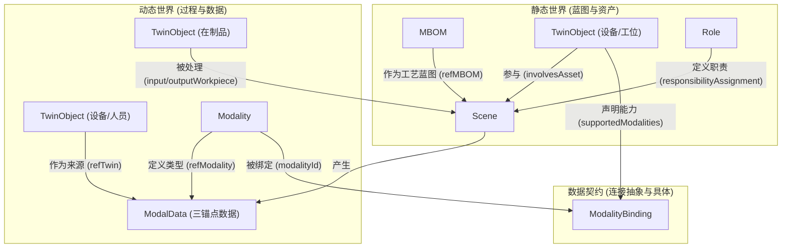

### **面向智能应用的数字孪生系统数据基础白皮书**

**版本**: 1.0 **致**: 未来所有智能应用的设计者（包括AI大模型） **主题**: 阐述您即将操作的数据基础的架构、能力与使用范式

#### **1. 概述：您面对的不是数据库，而是一个数字世界**

您即将设计的智能应用（如计划可行性验证、价值流分析、质量提升等），将构建在一个高度结构化、逻辑严密且上下文完整的数字孪生数据基础之上。请务必摒弃传统的数据表思维，您面对的不是孤立的数据，而是一个遵循**ETSI NGSI-LD**标准的、由互相关联的实体构成的**动态知识图谱**。

**核心理念**：您的所有设计，都应充分利用这套模型内建的**上下文关系**和**追溯能力**，将数据驱动的分析，从“发现相关性”提升到“构建因果链”。

#### **2. 世界观设定：“五元五流”的数字映射**

整个数据模型严格遵循“五元五流”的设计哲学，确保了对物理世界的全面数字化映射。这意味着：

- **每一个“事物”都被完整描述**：得益于**五元静态模型**，每一个`TwinObject`（设备、人员、在制品等）都从**功能(Function)**、**结构(Structure)**、**环境(Environment)**、**交互(Interface)**和**管理(Management)**五个维度进行了完整刻画。
- **每一个“过程”都有迹可循**：得益于**五流动态模型**，系统中的所有动态变化，都被抽象为**物理流(Physical)**、**信息流(Information)**、**控制流(Control)**、**行为流(Behavior)**和**责任流(Responsibility)**进行记录。

**这对您意味着**：您查询任何一个实体，都能获得其完整的静态属性；您分析任何一个过程，都能找到承载这五种流动的对应数据。

#### **3. 数据架构：六大核心实体构成的关系网络**

您操作的不是独立的表，而是一个由六类核心实体构成的网络。请务必理解它们之间的核心关系：

- **`TwinObject` (孪生体)**: 物理世界中**“事物”**的数字代理（设备、人员、在制品、工位等）。
- **`Scene` (场景)**: 生产过程中**“事件”**的动态记录（一次焊接、一次检验、一次转运）。
- **`MBOM` (制造蓝本)**: 静态的**“规则”**，定义了生产的标准流程和要求。
- **`Role` (角色)**: 组织中的**“岗位职责”**，定义了“谁该做什么”。
- **`Modality` (模态)**: 数据的**“语义字典”**，定义了“测量什么数据”。
- **`ModalData` (模态数据)**: 动态的**“数据点”**，是信息流的载体。

**核心关系网络图**:

Code snippet

**这对您意味着**：您的任何应用设计，都应该是一个**图遍历 (Graph Traversal)** 的过程。从一个节点出发，沿着这些已定义的关系去探索和收集证据。

#### **4. 您可使用的五大“超能力”**

请在设计应用时，充分利用以下已经为您构建好的核心能力：

1. **超能力一：万物皆有上下文 (The Three Anchors)**
   - **描述**: 每一条`ModalData`（如一个传感器读数）都通过**“三锚点”**，强制关联了`refTwin`（哪个设备产生的）、`refScene`（在哪个生产场景中产生的）和`refModality`（这是什么类型的数据）。
   - **应用**: 您的应用**永远不会**处理“孤立的数据”。对于任何一个数据点，您都可以立刻知道它的全部业务背景。
2. **超能力二：全过程可追溯 (Complete Traceability Chains)**
   - **描述**: 系统内建了三条强大的、相互关联的追溯链：
     - **在制品追溯链**: 通过`Workpiece`的`predecessorWorkpiece`和`successorWorkpiece`关系，您可以从最终成品一路回溯到它在每一个工序完成后的状态，直至最初的原材料。
     - **过程层级追溯链**: 通过`Scene`的`partOf`关系，您可以从一个底层的工步级`Scene`，向上追溯到它所属的工序`Scene`、节拍`Scene`，直至顶层的工艺路线`Scene`。
     - **数据因果追溯链**: 通过`Scene`的`result.derivedFrom`字段，任何一个分析结果（如“不合格”）都可以一键追溯到导致该结果的原始`ModalData`。
   - **应用**: 在设计如“质量问题根因分析”等应用时，您不需要猜测，只需要沿着这些已经铺好的“数字轨迹”进行回溯即可。
3. **超能力三：责任清晰可审计 (The Accountability Chain)**
   - **描述**: 通过`Scene`的`responsibilityAssignment`（定义了需要哪个`Role`）和`stepLog`（记录了具体哪个`Person`以哪个`Role`的身份执行），我们构建了完整的责任闭环。
   - **应用**: 在设计如“绩效分析”、“合规审计”等应用时，您可以精确地将每一个生产行为归因到具体的岗位和人员。
4. **超能力四：标准与现实的自动比对 (Blueprint vs. Reality)**
   - **描述**: `MBOM`定义了标准（如`requiredMeasurements`中规定了参数阈值），`Scene`在执行时记录了过程，`ModalData`记录了实际值。
   - **应用**: 在设计如“工艺符合性验证”等应用时，您可以轻松地将`ModalData`中的实际值与`Scene`关联的`MBOM`中的标准值进行比对，自动发现偏差。
5. **超能力五：内建的数据质量防火墙**
   - **描述**: 每一条`ModalData`都强制带有一个`qualityTag`（如"OK", "Error", "Outlier"）和`provenance`（溯源信息）。
   - **应用**: 您的应用在处理数据时，可以**首先过滤`qualityTag`不为"OK"的数据**，确保所有分析都是基于可信的数据，从源头上避免“垃圾进，垃圾出”。

#### **5. 如何使用这套数据基础：一个应用设计范式（以根因分析为例）**

在设计您的智能应用时，请遵循以下范式，像一位数字侦探一样破案：

1. **始于案发现场 (业务问题)**: "为什么产品`M670-SN001`的最终检验不合格？"
2. **找到受害者 (定位核心实体)**: 找到`Product`实例 `urn:ngsi-ld:TwinObject:Product:M670-SN001`。
3. **开始图遍历，逆向追溯**:
   - **第一跳（追溯物理状态）**: 读取其`originatingWorkpiece`字段，找到最后一个`Workpiece`状态。
   - **第二跳（回溯过程历史）**: 读取这个`Workpiece`的`predecessorWorkpiece`字段，沿着追溯链**逆向遍历**，检查每一个中间`Workpiece`的状态，直到发现异常。
   - **第三跳（定位问题场景）**: 假设发现`Workpiece:...-P0020-Output`（焊接后）的状态开始异常。读取其`createdByScene`字段，定位到导致这个异常状态的**`Scene`实例**。
   - **第四跳（搜集数据证据）**: 查询所有`refScene`指向该`Scene` ID的`ModalData`实例。
   - **第五跳（发现异常数据）**: 在这些`ModalData`中，过滤`qualityTag`不为"OK"的记录，或者`value`超出MBOM标准的记录。例如，发现一条`ModalData`（焊接电流）的值异常高。
   - **第六跳（锁定责任单元）**: 读取这条异常`ModalData`的`refTwin`，找到产生问题的设备（如`ROBOT-R01`）。同时，回到那个`Scene`实例，读取其`stepLog`，找到当时操作该设备的`personId`。
4. **形成结案报告 (结论与建议)**: 基于以上环环相扣的证据，您的应用可以自信地输出结论：“产品`M670-SN001`的不合格，很可能是由于在`P0020`焊接场景中，由员工`ZhangSan`操作的设备`ROBOT-R01`产生了异常的焊接电流所致。”

#### **6. 结论**

您所拥有的，是一个已经为您铺好了所有“轨道”的数字世界。请不要将它仅仅看作是数据库，而要将它视为一个**可供您探索和推理的知识图谱**。您的每一个应用设计，都应该是对这个图谱的一次精彩的“侦探之旅”。

请充分利用这些内建的上下文和关系，您的智能应用将因此而变得无比强大。