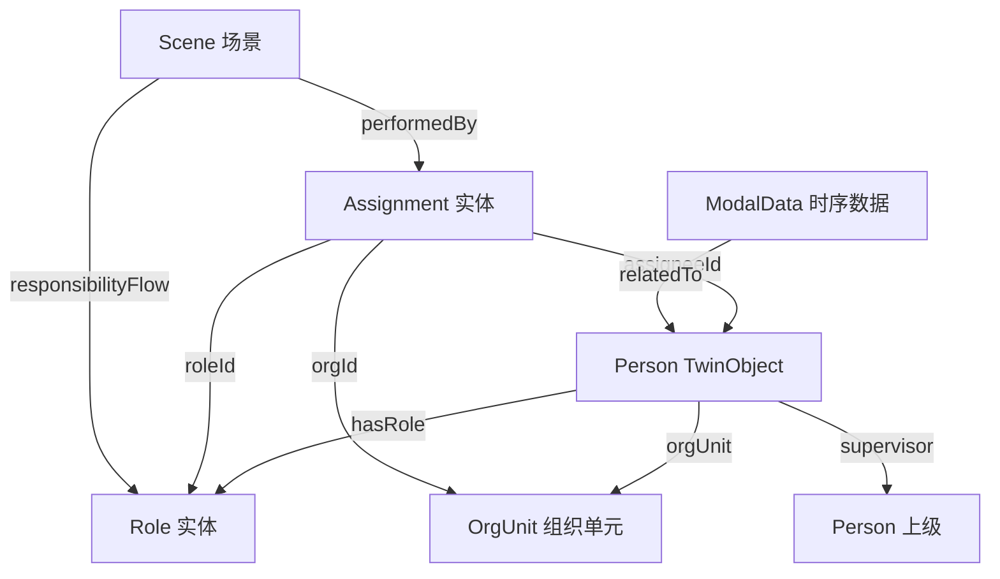

# Person 子类型特有字段元模型设计说明文档

## 版本: V1.0 | 发布日期: 2025-10-27

---

## 文档概述

本文档定义了TwinObject元模型中**Person(人员)**子类型的特有扩展字段规范。Person实体表示生产系统中的操作人员、工程师、管理人员等人力资源,是实现"人岗分离"和时态化责任追溯的基础数据单元。

**适用对象**: 数据建模工程师、HRM系统集成开发人员、数字孪生平台开发者  
**前置依赖**: `twinobject_core_schema.json` (核心统一元模型)  
**相关规范**: 专题三《组织角色与时态化责任 (Role & Assignment)》  
**配套文件**: `person_extension_schema.json`

---

## 目录

1. [设计定位与理念](#1-设计定位与理念)
2. [Person特有字段详解](#2-person特有字段详解)
3. [数据脱敏与隐私保护](#3-数据脱敏与隐私保护)
4. [状态管理规范](#4-状态管理规范)
5. [能力与资质建模](#5-能力与资质建模)
6. [与Role/Assignment的协同](#6-与roleassignment的协同)
7. [完整建模示例](#7-完整建模示例)
8. [常见问题FAQ](#8-常见问题faq)
9. [附录](#9-附录)

---

## 1. 设计定位与理念

### 1.1 Person在数字孪生体系中的角色

Person实体是数字孪生系统中**人力资源**的数字化表达,具有以下关键特征:

**核心定位**:
- **构成性对象** (Constituent): 人员不随工艺流程移动,属于生产系统的固定资产
- **能力承载者**: 通过技能、资质、证书等属性表达人员的**可用能力**
- **责任追溯锚点**: 通过与Role/Assignment关联,实现"谁在何时做了什么"的完整追溯链

**设计原则**:
1. **人岗分离**: Person描述**人员本身的属性**,不直接固化当前职责
2. **时态无关**: Person实体是相对稳定的主数据,当前任务/班次等动态信息通过stateAttr管理
3. **隐私优先**: 支持多级数据脱敏,满足GDPR/个人信息保护法要求

### 1.2 与核心元模型的关系

Person扩展字段在核心统一元模型基础上增加以下特有语义:

```
TwinObject 核心字段 (20个)
    ├─ 通用字段: id, type, name, twinType, subType, functionCategory...
    ├─ 条件必填: hasRole (仅Person使用)
    └─ 通用可选: capabilities, specifications...
         ↓ 扩展
Person 特有字段 (12个)
    ├─ 身份标识: employeeId, department, workgroup
    ├─ 能力资质: skills, certifications, qualificationLevel
    ├─ 组织归属: orgUnit, supervisor
    ├─ 人事信息: employmentType, hireDate, shiftPattern
    ├─ 隐私控制: personalDataMask, consentLevel
```

---

## 2. Person特有字段详解

### 2.1 字段分类与层级

Person特有字段按功能分为**4个类别**:

| 类别 | 字段数 | 用途 | 典型字段 |
|------|--------|------|----------|
| **身份标识** | 3 | 人员唯一性识别与组织归属 | employeeId, department, workgroup |
| **能力资质** | 3 | 技能水平、证书、资格等级 | skills, certifications, qualificationLevel |
| **组织关系** | 3 | 部门、上级、组织单元 | orgUnit, supervisor, teamRole |
| **人事信息** | 3 | 雇佣类型、入职日期、班次模式 | employmentType, hireDate, shiftPattern |

### 2.2 详细字段定义

#### 2.2.1 身份标识类

##### `employeeId` (必填)

**定义**: 企业内部唯一的员工编号  
**NGSI-LD类型**: Property  
**数据类型**: String  
**约束**: 
- 必须全局唯一
- 建议格式: `EMP-YYYYMMDD-序号` (如 `EMP-20250101`)
- 用于跨系统集成(HRM、MES、ERP等)

**业务语义**:
- 作为外部系统的主键映射
- 支持脱敏场景(可作为公开标识)
- 与TwinObject的`id`字段**解耦**: `id`是孪生体全局标识,`employeeId`是企业HR系统标识

**示例**:
```json
"employeeId": {
  "type": "Property",
  "value": "EMP-20250101"
}
```

##### `department` (必填)

**定义**: 人员所属部门名称  
**NGSI-LD类型**: Property  
**数据类型**: String  
**约束**: 建议使用标准化部门编码

**业务语义**:
- 用于权限控制和报表归集
- 与`orgUnit`字段的区别: `department`是人类可读名称,`orgUnit`是关系型引用

**示例**:
```json
"department": {
  "type": "Property",
  "value": "侧墙车间"
}
```

##### `workgroup` (可选)

**定义**: 人员所属班组/小组  
**NGSI-LD类型**: Property  
**数据类型**: String  

**业务语义**:
- 细化到班组级别的组织归属
- 用于班组绩效统计和排班管理

**示例**:
```json
"workgroup": {
  "type": "Property",
  "value": "A班焊接组"
}
```

---

#### 2.2.2 能力资质类

##### `skills` (建议必填)

**定义**: 人员具备的技能标签列表  
**NGSI-LD类型**: Property  
**数据类型**: Array[String]  
**约束**: 
- 建议使用标准化技能编码(如 `Skill.Welder.L2`)
- 与核心字段`capabilities`的区别: `capabilities`是通用能力标签,`skills`是人员专属技能

**业务语义**:
- 用于任务匹配和资源调度
- 支持多技能/跨工种人员建模
- 与Role的`qualificationReq`配合使用

**示例**:
```json
"skills": {
  "type": "Property",
  "value": [
    "Skill.Welder.L2",
    "Skill.QualityInspect.L1",
    "Skill.CraneOperation.Basic"
  ]
}
```

##### `certifications` (建议必填)

**定义**: 人员持有的证书列表  
**NGSI-LD类型**: Property  
**数据类型**: Array[Object]  
**对象结构**:
```json
{
  "cert_type": "焊工证",
  "cert_id": "WLD-2024-001234",
  "issue_date": "2024-01-15",
  "expiry_date": "2029-01-15",
  "issuer": "人社部职业技能鉴定中心"
}
```

**约束**:
- 必须包含有效期(`expiry_date`)
- 建议记录证书编号便于验证

**业务语义**:
- 合规性要求(特种作业必须持证上岗)
- 与Assignment的`qualificationRef`配合进行资质校验

**示例**:
```json
"certifications": {
  "type": "Property",
  "value": [
    {
      "cert_type": "焊工证",
      "cert_id": "WLD-2024-001234",
      "issue_date": "2024-01-15",
      "expiry_date": "2029-01-15",
      "issuer": "人社部职业技能鉴定中心"
    },
    {
      "cert_type": "安全培训证",
      "cert_id": "SAFE-2024-5678",
      "issue_date": "2024-03-01",
      "expiry_date": "2025-03-01",
      "issuer": "公司安全部"
    }
  ]
}
```

##### `qualificationLevel` (可选)

**定义**: 人员综合资格等级  
**NGSI-LD类型**: Property  
**数据类型**: String  
**枚举值**: `Entry | Junior | Intermediate | Senior | Expert`

**业务语义**:
- 用于快速筛选和能力分级
- 与具体技能等级(`skills`中的L1/L2)互补

**示例**:
```json
"qualificationLevel": {
  "type": "Property",
  "value": "Senior"
}
```

---

#### 2.2.3 组织关系类

##### `orgUnit` (必填)

**定义**: 人员所属组织单元的引用  
**NGSI-LD类型**: Relationship  
**对象类型**: OrgUnit实体URN  
**约束**: 必须引用有效的OrgUnit实体

**业务语义**:
- 建立与组织架构的关联
- 用于责任流追溯(Assignment的`orgId`字段引用同一OrgUnit)

**示例**:
```json
"orgUnit": {
  "type": "Relationship",
  "object": "urn:ngsi-ld:OrgUnit:SideWallShop:A-Line"
}
```

##### `supervisor` (可选)

**定义**: 直接上级/主管的引用  
**NGSI-LD类型**: Relationship  
**对象类型**: Person实体URN  

**业务语义**:
- 建立汇报关系
- 用于审批流和责任升级

**示例**:
```json
"supervisor": {
  "type": "Relationship",
  "object": "urn:ngsi-ld:TwinObject:Person:EMP-20240801"
}
```

##### `teamRole` (可选)

**定义**: 在团队中的角色定位  
**NGSI-LD类型**: Property  
**数据类型**: String  
**典型值**: `Leader | Member | Trainer | Quality Representative`

**业务语义**:
- 描述非正式职责(不影响Assignment)
- 用于团队协作和知识管理

**示例**:
```json
"teamRole": {
  "type": "Property",
  "value": "Trainer"
}
```

---

#### 2.2.4 人事信息类

##### `employmentType` (必填)

**定义**: 雇佣类型  
**NGSI-LD类型**: Property  
**数据类型**: String  
**枚举值**: `FullTime | PartTime | Contract | Temporary | Intern`

**业务语义**:
- 影响权限和排班策略
- 用于劳动力成本统计

**示例**:
```json
"employmentType": {
  "type": "Property",
  "value": "FullTime"
}
```

##### `hireDate` (建议必填)

**定义**: 入职日期  
**NGSI-LD类型**: Property  
**数据类型**: String (ISO 8601日期格式)  

**业务语义**:
- 计算工龄和试用期
- 用于人员流动分析

**示例**:
```json
"hireDate": {
  "type": "Property",
  "value": "2024-01-15"
}
```

##### `shiftPattern` (可选)

**定义**: 常规班次模式  
**NGSI-LD类型**: Property  
**数据类型**: String  
**典型值**: `Fixed-Day | Rotating-3Shift | Flexible | OnCall`

**业务语义**:
- 描述人员的排班类型(非当前班次)
- 当前班次通过`stateAttr.current_shift`表达

**示例**:
```json
"shiftPattern": {
  "type": "Property",
  "value": "Rotating-3Shift"
}
```

---

#### 2.2.5 隐私控制类(扩展)

##### `personalDataMask` (可选)

**定义**: 个人信息脱敏级别  
**NGSI-LD类型**: Property  
**数据类型**: String  
**枚举值**: `None | Partial | Full | Encrypted`

**业务语义**:
- 控制Person实体在不同接口的展示策略
- `None`: 完整显示姓名等信息
- `Partial`: 显示"张*"
- `Full`: 仅显示员工编号
- `Encrypted`: 加密存储,需解密权限查看

**示例**:
```json
"personalDataMask": {
  "type": "Property",
  "value": "Full"
}
```

##### `consentLevel` (可选)

**定义**: 数据使用授权级别  
**NGSI-LD类型**: Property  
**数据类型**: String  
**枚举值**: `Essential | Analytics | Marketing | Research`

**业务语义**:
- 符合GDPR/个人信息保护法要求
- 限定数据可用于的业务场景

**示例**:
```json
"consentLevel": {
  "type": "Property",
  "value": "Analytics"
}
```

---

## 3. 数据脱敏与隐私保护

### 3.1 脱敏策略

**三级脱敏模式**:

| 级别 | name字段显示 | 真实姓名位置 | 适用场景 |
|------|-------------|--------------|----------|
| **Level 0 (无脱敏)** | "张三" | name.value | 内部HR系统 |
| **Level 1 (部分脱敏)** | "张*" | specifications.real_name_masked | 生产看板/MES界面 |
| **Level 2 (完全脱敏)** | "员工编号EMP-20250101" | specifications.real_name_encrypted | 数据分析/第三方接口 |

### 3.2 最佳实践

**推荐配置**:
```json
{
  "id": "urn:ngsi-ld:TwinObject:Person:EMP-20250101",
  "name": {
    "type": "Property",
    "value": "员工编号EMP-20250101"  // 对外显示
  },
  "employeeId": {
    "type": "Property",
    "value": "EMP-20250101"
  },
  "personalDataMask": {
    "type": "Property",
    "value": "Full"
  },
  "specifications": {
    "type": "Property",
    "value": {
      "real_name_encrypted": "U2FsdGVkX1...",  // AES加密
      "real_name_hash": "5d41402abc4b..."      // SHA256哈希(用于去重)
    }
  }
}
```

**权限控制**:
- 只有HR系统管理员可访问`real_name_encrypted`
- 数字孪生分析层仅使用`employeeId`
- 审计日志记录解密操作

---

## 4. 状态管理规范

### 4.1 Person的状态属性 (stateAttr)

Person对象的`stateAttr`字段用于记录**当前动态状态**,典型属性包括:

| 状态名 | 数据类型 | 说明 | 示例值 |
|--------|----------|------|--------|
| `attendance_status` | String | 出勤状态 | `在岗` / `请假` / `离岗` |
| `current_shift` | String | 当前班次 | `早班` / `中班` / `晚班` |
| `current_station` | String | 当前工位 | `ST-GZ-03` |
| `current_task` | String | 当前任务 | `Scene:PO123:FrontWelding_001` |
| `work_status` | String | 工作状态 | `Working` / `Break` / `Training` |

**示例**:
```json
"stateAttr": {
  "type": "Property",
  "value": [
    {"name": "attendance_status", "value": "在岗"},
    {"name": "current_shift", "value": "早班"},
    {"name": "current_station", "value": "ST-GZ-03"},
    {"name": "work_status", "value": "Working"}
  ]
}
```

### 4.2 状态更新机制

**更新触发源**:
1. **考勤系统**: 打卡时更新`attendance_status`
2. **MES系统**: 场景启动时更新`current_task`
3. **定位系统**: RFID/UWB更新`current_station`
4. **班次调度**: 排班系统更新`current_shift`

**更新原则**:
- `stateAttr`是快照,历史状态通过ModalData时序数据记录
- 状态变更应触发事件(用于责任流追溯)

---

## 5. 能力与资质建模

### 5.1 技能分级体系

建议采用**三级编码**:

```
Skill.{Domain}.{Level}
  ├─ Domain: 技能领域 (Welder/QualityInspect/CraneOperation...)
  └─ Level: 等级 (Basic/L1/L2/L3/Expert)
```

**示例**:
- `Skill.Welder.L2`: 二级焊工
- `Skill.QualityInspect.Expert`: 质量检验专家
- `Skill.CraneOperation.Basic`: 基础起重操作

### 5.2 资质与Role的映射

**设计模式**:
```
Person.skills → 声明"我能做什么"
       ↓ 匹配
Role.qualificationReq → 定义"岗位需要什么"
       ↓ 校验
Assignment → 确认"是否满足要求"
```

**校验规则**:
```python
# 伪代码
if person.skills ∩ role.qualificationReq != ∅:
    allow_assignment = True
else:
    raise QualificationMismatchError
```

### 5.3 证书有效期管理

**自动化检查**:
1. 每日批量检查`certifications.expiry_date`
2. 过期前30天触发预警
3. 过期后自动将相关Assignment状态置为`Suspended`

---

## 6. 与Role/Assignment的协同

### 6.1 三者关系图

```
┌─────────────┐
│   Person    │  静态主数据: 人员属性、技能、证书
│  (Who I am) │  
└──────┬──────┘
       │ hasRole (声明资格)
       ↓
┌─────────────┐
│    Role     │  静态定义: 岗位职责、权限要求
│ (What is    │
│  required)  │
└──────┬──────┘
       │
       │ ← Assignment (动态绑定)
       ↓
┌─────────────┐
│  Execution  │  运行时: 场景执行、步骤日志
│ (What I do) │
└─────────────┘
```

### 6.2 关键字段对应

| Person字段 | Role字段 | Assignment字段 | 用途 |
|-----------|----------|---------------|------|
| `skills` | `qualificationReq` | `qualificationRef` | 资质匹配 |
| `orgUnit` | `orgScope` | `orgId` | 组织归属 |
| `hasRole` | `id` | `roleId` | 角色关联 |
| `employeeId` | - | `assigneeId` (引用Person.id) | 人员识别 |

### 6.3 责任追溯流程

**完整链条**:
```
Scene.stepLog.performedBy
    ├─ personId: "urn:ngsi-ld:TwinObject:Person:EMP-20250101"
    └─ roleId: "urn:ngsi-ld:Role:Welder"
         ↓ 验证
Assignment (validFrom ≤ timestamp ≤ validTo)
    ├─ assigneeId: "urn:ngsi-ld:TwinObject:Person:EMP-20250101"
    ├─ roleId: "urn:ngsi-ld:Role:Welder"
    └─ assignmentStatus: "Active"
         ↓ 查询
Person.skills 包含 Role.qualificationReq → ✅ 合规
```

---

## 7. 完整建模示例

### 7.1 示例1: 高级焊接操作工

```json
{
  "@context": [
    "https://uri.etsi.org/ngsi-ld/v1/ngsi-ld-core-context.jsonld"
  ],
  "id": "urn:ngsi-ld:TwinObject:Person:EMP-20250101",
  "type": "TwinObject",
  
  "name": {
    "type": "Property",
    "value": "员工编号EMP-20250101"
  },
  
  "twinType": {
    "type": "Property",
    "value": "Constituent"
  },
  
  "subType": {
    "type": "Property",
    "value": "Person"
  },
  
  "functionCategory": {
    "type": "Property",
    "value": "F1.2.1"
  },
  
  "functionDesc": {
    "type": "Property",
    "value": "焊接操作工,负责侧墙焊接作业"
  },
  
  "twinLevel": {
    "type": "Property",
    "value": 4
  },
  
  "hasRole": {
    "type": "Relationship",
    "object": "urn:ngsi-ld:Role:WeldOperator"
  },
  
  "capabilities": {
    "type": "Property",
    "value": [
      "Skill.Welder.L2",
      "Skill.Safety.Certified"
    ]
  },
  
  "stateAttr": {
    "type": "Property",
    "value": [
      {"name": "attendance_status", "value": "在岗"},
      {"name": "current_shift", "value": "早班"},
      {"name": "current_station", "value": "ST-GZ-03"},
      {"name": "work_status", "value": "Working"}
    ]
  },
  
  "specifications": {
    "type": "Property",
    "value": {
      "real_name_encrypted": "U2FsdGVkX1+abc123...",
      "real_name_hash": "5d41402abc4b2a76b9719d911017c592"
    }
  },
  
  "_comment": "===== Person特有字段 =====",
  
  "employeeId": {
    "type": "Property",
    "value": "EMP-20250101"
  },
  
  "department": {
    "type": "Property",
    "value": "侧墙车间"
  },
  
  "workgroup": {
    "type": "Property",
    "value": "A班焊接组"
  },
  
  "skills": {
    "type": "Property",
    "value": [
      "Skill.Welder.L2",
      "Skill.QualityInspect.L1",
      "Skill.Safety.Advanced"
    ]
  },
  
  "certifications": {
    "type": "Property",
    "value": [
      {
        "cert_type": "焊工证",
        "cert_id": "WLD-2024-001234",
        "level": "L2",
        "issue_date": "2024-01-15",
        "expiry_date": "2029-01-15",
        "issuer": "人社部职业技能鉴定中心"
      },
      {
        "cert_type": "安全培训证",
        "cert_id": "SAFE-2024-5678",
        "issue_date": "2024-03-01",
        "expiry_date": "2025-03-01",
        "issuer": "公司安全部"
      }
    ]
  },
  
  "qualificationLevel": {
    "type": "Property",
    "value": "Senior"
  },
  
  "orgUnit": {
    "type": "Relationship",
    "object": "urn:ngsi-ld:OrgUnit:SideWallShop:A-Line"
  },
  
  "supervisor": {
    "type": "Relationship",
    "object": "urn:ngsi-ld:TwinObject:Person:EMP-20240801"
  },
  
  "teamRole": {
    "type": "Property",
    "value": "Member"
  },
  
  "employmentType": {
    "type": "Property",
    "value": "FullTime"
  },
  
  "hireDate": {
    "type": "Property",
    "value": "2024-01-15"
  },
  
  "shiftPattern": {
    "type": "Property",
    "value": "Rotating-3Shift"
  },
  
  "personalDataMask": {
    "type": "Property",
    "value": "Full"
  },
  
  "consentLevel": {
    "type": "Property",
    "value": "Analytics"
  }
}
```

### 7.2 示例2: 质量工程师

```json
{
  "@context": [
    "https://uri.etsi.org/ngsi-ld/v1/ngsi-ld-core-context.jsonld"
  ],
  "id": "urn:ngsi-ld:TwinObject:Person:EMP-20230615",
  "type": "TwinObject",
  
  "name": {
    "type": "Property",
    "value": "李工(Quality Engineer)"
  },
  
  "twinType": {
    "type": "Property",
    "value": "Constituent"
  },
  
  "subType": {
    "type": "Property",
    "value": "Person"
  },
  
  "functionCategory": {
    "type": "Property",
    "value": "F2.1.3"
  },
  
  "functionDesc": {
    "type": "Property",
    "value": "质量工程师,负责工艺质量分析与改进"
  },
  
  "twinLevel": {
    "type": "Property",
    "value": 3
  },
  
  "hasRole": {
    "type": "Relationship",
    "object": "urn:ngsi-ld:Role:QualityEngineer"
  },
  
  "stateAttr": {
    "type": "Property",
    "value": [
      {"name": "attendance_status", "value": "在岗"},
      {"name": "current_shift", "value": "白班"},
      {"name": "work_status", "value": "Meeting"}
    ]
  },
  
  "employeeId": {
    "type": "Property",
    "value": "EMP-20230615"
  },
  
  "department": {
    "type": "Property",
    "value": "质量部"
  },
  
  "workgroup": {
    "type": "Property",
    "value": "侧墙质量小组"
  },
  
  "skills": {
    "type": "Property",
    "value": [
      "Skill.QualityAnalysis.Expert",
      "Skill.MSA.Advanced",
      "Skill.SPC.Advanced",
      "Skill.ProcessImprovement.L3"
    ]
  },
  
  "certifications": {
    "type": "Property",
    "value": [
      {
        "cert_type": "质量工程师证",
        "cert_id": "QE-2023-5678",
        "level": "中级",
        "issue_date": "2023-06-01",
        "expiry_date": null,
        "issuer": "中国质量协会"
      },
      {
        "cert_type": "六西格玛黑带",
        "cert_id": "6S-BB-2022-1234",
        "issue_date": "2022-10-15",
        "expiry_date": null,
        "issuer": "ASQ"
      }
    ]
  },
  
  "qualificationLevel": {
    "type": "Property",
    "value": "Expert"
  },
  
  "orgUnit": {
    "type": "Relationship",
    "object": "urn:ngsi-ld:OrgUnit:QualityDept"
  },
  
  "supervisor": {
    "type": "Relationship",
    "object": "urn:ngsi-ld:TwinObject:Person:EMP-20200301"
  },
  
  "teamRole": {
    "type": "Property",
    "value": "Leader"
  },
  
  "employmentType": {
    "type": "Property",
    "value": "FullTime"
  },
  
  "hireDate": {
    "type": "Property",
    "value": "2023-06-15"
  },
  
  "shiftPattern": {
    "type": "Property",
    "value": "Fixed-Day"
  },
  
  "personalDataMask": {
    "type": "Property",
    "value": "Partial"
  },
  
  "consentLevel": {
    "type": "Property",
    "value": "Research"
  }
}
```

---

## 8. 常见问题FAQ

### Q1: Person的name字段和employeeId有什么区别?

**A**: 两者服务不同目的:
- **name**: 人类可读标识,用于UI展示,支持脱敏(如"员工编号EMP-20250101")
- **employeeId**: 企业HR系统的唯一标识,用于系统集成和数据关联

### Q2: hasRole和Assignment有什么区别?

**A**: 
- **hasRole** (Person字段): 声明人员**有资格担任**的角色列表(静态能力)
- **Assignment** (独立实体): 记录人员**在特定时段实际担任**的角色(时态绑定)

类比: hasRole = 驾驶证, Assignment = 租车合同

### Q3: skills和capabilities有什么区别?

**A**:
- **capabilities** (核心字段): 通用能力标签,适用所有TwinObject类型
- **skills** (Person特有): 专门描述人员技能,语义更明确

建议: Person对象两者都填写,保持一致性

### Q4: 如何处理一人多岗?

**A**: 通过**多个Assignment**实现:
```json
// Person有资格担任多个Role
Person.hasRole → [Role:Welder, Role:QualityInspect]

// 同时存在两个有效Assignment
Assignment1: Person → Role:Welder (8:00-16:00)
Assignment2: Person → Role:QualityInspect (16:00-18:00)
```

### Q5: 证书过期后如何处理?

**A**: 分三步:
1. 每日批量检查`certifications.expiry_date`
2. 过期后自动将相关Assignment状态置为`Suspended`
3. 触发人工审核流程(续证或重新培训)

### Q6: 如何实现人员定位?

**A**: 两种方式:
1. **静态位置**: 通过`stateAttr.current_station`记录当前工位
2. **实时坐标**: 通过核心字段`location` (GeoProperty) 记录GPS/UWB坐标

### Q7: 实习生和正式员工建模有区别吗?

**A**: 通过`employmentType`区分:
- 正式员工: `employmentType = "FullTime"`
- 实习生: `employmentType = "Intern"`

权限和排班策略根据此字段调整

### Q8: 如何实现多语言支持?

**A**: 使用NGSI-LD的languageMap机制:
```json
"name": {
  "type": "Property",
  "languageMap": {
    "zh": "张三",
    "en": "Zhang San"
  }
}
```

---

## 9. 附录

### 9.1 Person特有字段总览表

| 字段名 | NGSI-LD类型 | 数据类型 | 必填性 | 业务语义 |
|--------|-------------|----------|--------|----------|
| **身份标识类** |
| `employeeId` | Property | String | 必填 | 企业员工编号 |
| `department` | Property | String | 必填 | 所属部门 |
| `workgroup` | Property | String | 可选 | 所属班组 |
| **能力资质类** |
| `skills` | Property | Array[String] | 建议必填 | 技能标签列表 |
| `certifications` | Property | Array[Object] | 建议必填 | 证书列表 |
| `qualificationLevel` | Property | String(Enum) | 可选 | 综合资格等级 |
| **组织关系类** |
| `orgUnit` | Relationship | URN | 必填 | 组织单元引用 |
| `supervisor` | Relationship | URN | 可选 | 直接上级引用 |
| `teamRole` | Property | String | 可选 | 团队角色定位 |
| **人事信息类** |
| `employmentType` | Property | String(Enum) | 必填 | 雇佣类型 |
| `hireDate` | Property | Date | 建议必填 | 入职日期 |
| `shiftPattern` | Property | String | 可选 | 常规班次模式 |
| **隐私控制类** |
| `personalDataMask` | Property | String(Enum) | 可选 | 脱敏级别 |
| `consentLevel` | Property | String(Enum) | 可选 | 授权级别 |

### 9.2 与其他实体的关系图



### 9.3 JSON Schema文件位置

完整的JSON Schema定义见配套文件:
- **文件名**: `person_extension_schema.json`
- **Schema ID**: `https://example.com/schemas/TwinObject.Person.Extension.schema.json`

### 9.4 变更日志

| 版本 | 日期 | 变更内容 |
|------|------|----------|
| V1.0 | 2025-10-27 | 初始发布,定义14个Person特有字段 |

---

**文档结束**

如有疑问或建议,请联系数字孪生架构团队。
