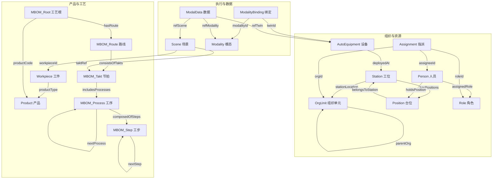

# 动车组侧墙产线数字孪生实体数据契约 - 总契约

**Digital Twin Entity Data Contract - Master Contract**

---

## 契约元信息

| 项目 | 内容 |
|-----|------|
| **契约版本** | v1.0.0 |
| **生效日期** | 2025-11-10 |
| **适用范围** | 所有四项任务 (数字孪生管理平台、产线2D地图、业务优化智能应用、生产系统仿真) |
| **产品范围** | M670型侧墙、M803型一位侧墙 |
| **维护团队** | 数字孪生项目组 |
| **契约状态** | 🟢 生效中 |

---

## 1. 契约目的与原则

### 1.1 契约目的

本数据契约体系旨在:

1. **统一数据语义**: 确保四项任务对实体的理解完全一致
2. **规范数据结构**: 明确每个实体的字段、类型、约束、关系
3. **支撑并行开发**: 各任务团队基于契约独立开发,无需等待依赖
4. **保障集成质量**: 通过契约验证工具,确保数据质量和一致性
5. **管理变更影响**: 版本化管理,清晰追踪变更对各任务的影响

### 1.2 契约原则

- **✅ 精确性**: 每个字段必须有明确的类型、约束、枚举值
- **✅ 完整性**: 覆盖所有实体类型、所有关系、所有业务场景
- **✅ 一致性**: 跨实体的通用规范保持一致 (如URN格式、时间格式)
- **✅ 可验证性**: 契约必须可通过自动化工具验证
- **✅ 可追溯性**: 所有变更必须记录,版本化管理

---

## 2. 契约体系结构

### 2.1 契约文件清单

```
实体数据契约体系/
│
├─ 00_总契约.md (本文档)
│   └─ 8大实体类型总览、关系图谱、全局规范
│
├─ 01_TwinObject契约.md
│   └─ TwinObject核心字段 + 11种子类型契约
│
├─ 02_MBOM契约.md
│   └─ 4层工艺结构契约 (Root/Route/Takt/Process/Step)
│
├─ 03_Scene契约.md
│   └─ 生产场景实体契约
│
├─ 04_Modality契约.md
│   └─ 数据模态定义契约
│
├─ 05_ModalityBinding契约.md
│   └─ 模态绑定契约
│
├─ 06_ModalData契约.md
│   └─ 运行数据实体契约
│
├─ 07_Role契约.md
│   └─ 角色定义契约
│
└─ 08_Assignment契约.md
    └─ 岗位指派契约
```

### 2.2 契约阅读顺序

**首次阅读**: 00_总契约 → 01_TwinObject → (其他契约按需)

**开发时查阅**: 直接查阅对应实体契约

**集成测试**: 参考总契约中的"集成测试场景"章节

---

## 3. 实体类型总览

### 3.1 八大实体类型

| 序号 | 实体大类 | 实体类型标识 | 所属层级 | 实例数量 | 子类型数 | 契约文档 |
|-----|---------|------------|---------|---------|---------|---------|
| 1 | **TwinObject** | `TwinObject` | Resource | - | 11种 | 01_TwinObject契约.md |
| 2 | **MBOM** | `MBOM` | Process | 234 | 5种 | 02_MBOM契约.md |
| 3 | **Scene** | `Scene` | Execution | 10 | - | 03_Scene契约.md |
| 4 | **Modality** | `Modality` | Execution | 40 | - | 04_Modality契约.md |
| 5 | **ModalityBinding** | `ModalityBinding` | Execution | 352 | - | 05_ModalityBinding契约.md |
| 6 | **ModalData** | `ModalData` | Runtime | 1,971+ | - | 06_ModalData契约.md |
| 7 | **Role** | `Role` | Resource | 18 | - | 07_Role契约.md |
| 8 | **Assignment** | `Assignment` | Resource | - | - | 08_Assignment契约.md |

### 3.2 TwinObject 子类型清单

| 序号 | 子类型 | subType值 | 中文名称 | 典型实例数 | 核心用途 |
|-----|-------|----------|---------|-----------|---------|
| 1.1 | OrgUnit | `OrgUnit` | 组织单元 | 4 | 组织层级结构 |
| 1.2 | Station | `Station` | 工位 | 28 | 生产工位定义 |
| 1.3 | Position | `Position` | 台位 | - | 工位内作业位置 |
| 1.4 | AutoEquipment | `AutoEquipment` | 自动化设备 | 33 | 焊接机器人、变位机等 |
| 1.5 | TransportEquip | `TransportEquipment` | 运输设备 | - | 天车、AGV等 |
| 1.6 | Person | `Person` | 人员 | - | 员工信息 |
| 1.7 | Material | `Material` | 物料 | - | 原材料、辅料 |
| 1.8 | Product | `Product` | 产品 | 2 | M670、M803 |
| 1.9 | Workpiece | `Workpiece` | 工件 | 10 | 生产中的侧墙工件 |
| 1.10 | QCTool | `QCTool` | 检具 | - | 质检工具 |

### 3.3 MBOM 子类型清单

| 序号 | 子类型 | mbomType值 | 中文名称 | 实例数 | 层级 |
|-----|-------|-----------|---------|-------|------|
| 2.1 | MBOM_Root | `MBOMRoot` | MBOM根 | 2 | L1 |
| 2.2 | MBOM_Route | `Route` | 路线 | 2 | L2 |
| 2.3 | MBOM_Takt | `Takt` | 节拍 | 15 | L3 |
| 2.4 | MBOM_Process | `Process` | 工序 | 141 | L4 |
| 2.5 | MBOM_Step | `Step` | 工步 | 74 | L5 |

---

## 4. 实体关系图谱

### 4.1 关系类型定义

本契约定义的所有关系均为NGSI-LD Relationship类型:

```json
{
  "relationshipName": {
    "type": "Relationship",
    "object": "urn:ngsi-ld:EntityType:EntityId"
  }
}
```

### 4.2 核心关系总图



### 4.3 关系清单表

| 关系名 | 源实体 | 目标实体 | 基数 | 必填 | 说明 |
|-------|-------|---------|------|-----|------|
| **组织层级** |
| parentOrg | OrgUnit | OrgUnit | N:1 | 否 | 上级组织 |
| childOrgs | OrgUnit | OrgUnit | 1:N | 否 | 下级组织列表 |
| **资源部署** |
| stationLocation | Station | OrgUnit | N:1 | 否 | 工位所属组织 |
| hasPositions | Station | Position | 1:N | 否 | 工位包含台位 |
| belongsToStation | Position | Station | N:1 | ✓ | 台位所属工位 |
| deployedAt | AutoEquipment | Station | N:1 | 否 | 设备部署位置 |
| **人员关系** |
| holdsPosition | Person | Position | N:1 | 否 | 人员任职岗位 |
| assignedRole | Person | Role | N:M | 否 | 人员分配角色 |
| assigneeId | Assignment | Person | N:1 | ✓ | 指派的人员 |
| roleId | Assignment | Role | N:1 | ✓ | 指派的角色 |
| orgId | Assignment | OrgUnit | N:1 | ✓ | 指派的组织 |
| sceneId | Assignment | Scene | N:1 | 否 | 临时任务场景 |
| **产品工艺** |
| productType | Workpiece | Product | N:1 | ✓ | 工件的产品类型 |
| hasRoute | MBOM_Root | MBOM_Route | 1:1 | ✓ | MBOM根指向路线 |
| partOfMBOM | MBOM_Route | MBOM_Root | N:1 | ✓ | 路线所属MBOM |
| consistsOfTakts | MBOM_Route | MBOM_Takt | 1:N | ✓ | 路线包含节拍 |
| partOfRoute | MBOM_Takt | MBOM_Route | N:1 | ✓ | 节拍所属路线 |
| includesProcesses | MBOM_Takt | MBOM_Process | 1:N | ✓ | 节拍包含工序 |
| partOfTakt | MBOM_Process | MBOM_Takt | N:1 | ✓ | 工序所属节拍 |
| nextProcess | MBOM_Process | MBOM_Process | 1:1 | 否 | 后续工序 |
| composedOfSteps | MBOM_Process | MBOM_Step | 1:N | ✓ | 工序包含工步 |
| partOfProcess | MBOM_Step | MBOM_Process | N:1 | ✓ | 工步所属工序 |
| nextStep | MBOM_Step | MBOM_Step | 1:1 | 否 | 后续工步 |
| **执行场景** |
| workpieceId | Scene | Workpiece | N:1 | ✓ | 场景关联工件 |
| taktRef | Scene | MBOM_Takt | N:1 | ✓ | 场景关联节拍 |
| **模态数据** |
| twinId | ModalityBinding | TwinObject | N:1 | ✓ | 绑定的孪生体 |
| modalityId | ModalityBinding | Modality | N:1 | ✓ | 绑定的模态 |
| refTwin | ModalData | TwinObject | N:1 | ✓ | 数据来源孪生体 |
| refScene | ModalData | Scene | N:1 | ✓ | 数据产生场景 |
| refModality | ModalData | Modality | N:1 | ✓ | 数据的模态类型 |

---

## 5. 全局命名与格式规范

### 5.1 URN命名规范

**统一格式**:
```
urn:ngsi-ld:{EntityType}:{UniqueIdentifier}
```

**各实体类型URN规范**:

| 实体类型 | URN格式 | 示例 |
|---------|--------|------|
| TwinObject | `urn:ngsi-ld:TwinObject:{SubType}:{Id}` | `urn:ngsi-ld:TwinObject:AutoEquipment:361-01173` |
| MBOM | `urn:ngsi-ld:MBOM:{ProductCode}:{TaktSeq}:{ProcSeq}:{StepSeq}` | `urn:ngsi-ld:MBOM:M000004670327:T01:P0010:S01` |
| Scene | `urn:ngsi-ld:Scene:{SceneName}` | `urn:ngsi-ld:Scene:FrontWelding_20250808_093512` |
| Modality | `urn:ngsi-ld:Modality:{ModalityName}` | `urn:ngsi-ld:Modality:WeldingCurrent_Auto` |
| ModalityBinding | `urn:ngsi-ld:ModalityBinding:{TwinName}:{ModalityName}:v{Version}` | `urn:ngsi-ld:ModalityBinding:361-01173:WeldingCurrent_Auto:v1` |
| ModalData | `urn:ngsi-ld:ModalData:{ModalityName}.{SceneName}.{Seq}` | `urn:ngsi-ld:ModalData:WeldingCurrent.FrontWelding_20250808.0001` |
| Role | `urn:ngsi-ld:Role:{RoleName}` | `urn:ngsi-ld:Role:Welder` |
| Assignment | `urn:ngsi-ld:Assignment:{PersonCode}:{RoleCode}:{OrgCode}:{Timestamp}` | `urn:ngsi-ld:Assignment:Person.ZhangSan:Welder:SideWallShop:20250908-EarlyShift` |

**命名约束**:
- ✅ 使用英文字母、数字、下划线、连字符
- ❌ 禁止使用空格、特殊字符
- ✅ 区分大小写
- ✅ 保持语义化和可读性

### 5.2 时间格式规范

**ISO 8601标准**:
```
YYYY-MM-DDTHH:MM:SS.sssZ
```

**示例**:
- `2025-08-08T09:35:12.123Z` (UTC时间)
- `2025-08-08T17:35:12.123+08:00` (北京时间,带时区)

**约束**:
- ✅ 必须包含时区信息 (Z 或 +HH:MM)
- ✅ 推荐使用UTC时间 (Z)
- ✅ 毫秒精度可选

### 5.3 @context规范

**标准@context结构**:
```json
{
  "@context": [
    "https://uri.etsi.org/ngsi-ld/v1/ngsi-ld-core-context.jsonld",
    "https://example.com/contexts/{domain}-context.jsonld"
  ]
}
```

**各实体类型context**:
- TwinObject: `https://example.com/contexts/twinobject-context.jsonld`
- MBOM: `https://example.com/contexts/mbom-context.jsonld`
- Scene: `https://example.com/contexts/scene-context.jsonld`
- Modality: `https://example.com/contexts/modality-context.jsonld`
- 等...

---

## 6. 全局枚举值总表

### 6.1 跨实体通用枚举

#### 实体类型 (type)
```
TwinObject, MBOM, Scene, Modality, ModalityBinding, ModalData, Role, Assignment
```

#### NGSI-LD字段类型
```
Property, Relationship, GeoProperty
```

#### 时间单位 (unitCode for time)
```
MIN, SEC, HOUR, DAY
```

#### 状态类通用值
```
Active, Inactive, Suspended, Revoked, Expired, Draft, Deprecated
```

### 6.2 实体特定枚举 (详见各实体契约)

| 枚举字段 | 适用实体 | 契约文档 |
|---------|---------|---------|
| subType | TwinObject | 01_TwinObject契约.md |
| mbomType | MBOM | 02_MBOM契约.md |
| orgUnitType | TwinObject(OrgUnit) | 01_TwinObject契约.md |
| stationCategory | TwinObject(Station) | 01_TwinObject契约.md |
| equipmentType | TwinObject(AutoEquipment) | 01_TwinObject契约.md |
| processKind | MBOM_Process, MBOM_Step | 02_MBOM契约.md |
| category | Modality | 04_Modality契约.md |
| valueType | Modality | 04_Modality契约.md |
| source | Modality | 04_Modality契约.md |
| qualityTag | ModalData | 06_ModalData契约.md |
| assignmentStatus | Assignment | 08_Assignment契约.md |

---

## 7. 四项任务视图

### 7.1 任务1: 数字孪生管理平台

**角色**: 数据管理者、契约执行者

**关注点**:
- ✅ 所有实体的CRUD操作
- ✅ 实体关系的完整性校验
- ✅ URN唯一性约束
- ✅ 订阅管理 (Subscription)
- ✅ 契约验证工具集成

**特殊要求**:
- 支持实体版本管理
- 提供关系导航API
- 实现批量导入/导出
- 支持基于契约的数据校验

**使用的实体**: 全部8大类实体

---

### 7.2 任务2: 产线2D地图

**角色**: 数据消费者、可视化展示

**关注点**:
- ✅ TwinObject的地理位置 (location字段)
- ✅ Station的部署关系 (deployedEquipments)
- ✅ Workpiece的当前位置 (currentLocation)
- ✅ ModalData的实时值 (用于状态显示)

**特殊要求**:
- 地理坐标有效性验证
- 实时位置更新订阅
- 设备状态快速查询

**重点使用的实体**:
| 实体 | 用途 |
|-----|------|
| OrgUnit | 组织区域布局 |
| Station | 工位位置和设备部署 |
| AutoEquipment | 设备位置和状态 |
| Workpiece | 工件当前位置 |
| ModalData | 设备实时状态 |

---

### 7.3 任务3: 业务优化智能应用

**角色**: 数据消费者、分析者

**关注点** (按4个业务方向):

#### 3.1 生产计划可行性验证
- ✅ MBOM完整工艺路线
- ✅ Station产能和在制品容量
- ✅ AutoEquipment可用性
- ✅ Person技能和排班
- ✅ Assignment人员指派时间段
- ✅ Scene历史执行时间

#### 3.2 生产价值流分析
- ✅ Workpiece工件追踪
- ✅ Scene完整执行过程
- ✅ MBOM_Step标准工时和类型
- ✅ ModalData过程数据
- ✅ stepLog实际执行时间

#### 3.3 在制品库存控制
- ✅ Workpiece当前状态和位置
- ✅ Scene执行状态
- ✅ Station在制品容量
- ✅ MBOM_Takt节拍顺序

#### 3.4 侧墙生产质量改进
- ✅ MBOM_Step测量要求
- ✅ Modality质量参数定义
- ✅ ModalData实际质量数据
- ✅ stepLog.qualityStatus
- ✅ AutoEquipment设备信息

**特殊要求**:
- 数据完整性保证
- 时序数据查询性能
- 历史数据统计分析
- 跨实体关联查询

**使用的实体**: 全部8大类实体

---

### 7.4 任务4: 生产系统仿真

**角色**: 数据生产者、数据补充者

**关注点**:
- ✅ MBOM工艺定义 (作为仿真输入)
- ✅ Station工位配置 (仿真环境)
- ✅ AutoEquipment设备参数 (仿真资源)
- ✅ Scene仿真生成的执行记录
- ✅ ModalData仿真产生的数据

**特殊要求**:
- 读取MBOM进行仿真配置
- 生成符合契约的Scene和ModalData
- 支持参数调整和多场景仿真
- 仿真数据需标注来源 (provenance.method = "Simulated")

**重点使用的实体**:
| 实体 | 用途 |
|-----|------|
| MBOM | 仿真输入:工艺流程 |
| Station | 仿真环境:工位配置 |
| AutoEquipment | 仿真资源:设备参数 |
| Scene | 仿真输出:执行记录 |
| ModalData | 仿真输出:过程数据 |

---

## 8. 集成测试场景

### 8.1 场景1: 工件生产全流程

**目标**: 验证从工件创建到质量分析的完整数据流

**步骤**:

| 步骤 | 执行任务 | 操作 | 验证点 |
|-----|---------|------|--------|
| 1 | 任务1(平台) | 创建Workpiece实体 | ✓ URN格式正确 <br> ✓ productType关联有效 |
| 2 | 任务4(仿真) | 仿真生成Scene | ✓ workpieceId正确关联 <br> ✓ taktRef有效 <br> ✓ stepLog结构完整 |
| 3 | 任务4(仿真) | 生成ModalData | ✓ refTwin/refScene/refModality三锚点正确 <br> ✓ qualityTag合法 <br> ✓ provenance.method = "Simulated" |
| 4 | 任务1(平台) | 数据入库 | ✓ 所有实体通过契约验证 <br> ✓ 关系完整性检查通过 |
| 5 | 任务3(应用) | 质量数据分析 | ✓ 能正确查询工件的所有Scene <br> ✓ 能正确查询Scene的所有ModalData <br> ✓ 能正确关联Modality定义 |
| 6 | 任务2(地图) | 可视化工件轨迹 | ✓ 能正确显示工件当前位置 <br> ✓ 能正确显示历史轨迹 |

**成功标准**:
- ✅ 所有URN在各任务间一致
- ✅ 关系引用均有效(无悬空引用)
- ✅ 时间戳顺序正确
- ✅ 数据通过契约验证

---

### 8.2 场景2: 设备状态监控与数据绑定

**目标**: 验证设备-模态-数据的完整链路

**步骤**:

| 步骤 | 执行任务 | 操作 | 验证点 |
|-----|---------|------|--------|
| 1 | 任务1(平台) | 创建AutoEquipment | ✓ deployedAt指向有效Station |
| 2 | 任务1(平台) | 创建ModalityBinding | ✓ twinId指向上述设备 <br> ✓ modalityId指向有效Modality <br> ✓ pointRef格式正确 |
| 3 | 任务1(平台) | 记录ModalData | ✓ refTwin指向设备 <br> ✓ refModality匹配绑定 <br> ✓ value类型符合Modality.valueType |
| 4 | 任务2(地图) | 显示设备状态 | ✓ 能通过设备查询到最新ModalData <br> ✓ 正确显示设备位置和状态 |
| 5 | 任务3(应用) | 参数分析 | ✓ 能正确统计设备的历史数据 <br> ✓ 能正确关联Modality的allowedRange |

**成功标准**:
- ✅ ModalityBinding正确建立设备-模态绑定
- ✅ ModalData的value类型与Modality定义一致
- ✅ 各任务能正确查询和展示数据

---

### 8.3 场景3: 人员指派与责任追溯

**目标**: 验证人员-角色-组织-场景的关联链路

**步骤**:

| 步骤 | 执行任务 | 操作 | 验证点 |
|-----|---------|------|--------|
| 1 | 任务1(平台) | 创建Person | ✓ employeeId唯一 <br> ✓ skills数组格式正确 |
| 2 | 任务1(平台) | 创建Assignment | ✓ assigneeId/roleId/orgId有效 <br> ✓ validFrom < validTo <br> ✓ assignmentStatus合法 |
| 3 | 任务4(仿真) | 生成Scene | ✓ stepLog.operators中personId有效 <br> ✓ stepLog.operators中roleId匹配 |
| 4 | 任务3(应用) | 质量责任追溯 | ✓ 能从NG工件查询到Scene <br> ✓ 能从Scene查询到操作人员 <br> ✓ 能从人员查询到Assignment <br> ✓ 能从Assignment查询到Role职责 |

**成功标准**:
- ✅ Assignment正确建立人员-角色-组织时态绑定
- ✅ Scene.stepLog正确记录实际操作人员
- ✅ 完整的责任追溯链路可用

---

## 9. 契约变更管理

### 9.1 版本号规范

**语义化版本**: `主版本.次版本.修订版` (如 v1.2.3)

- **主版本(Major)**: 破坏性变更
  - 删除字段
  - 修改字段类型
  - 删除枚举值
  - 修改关系基数
  
- **次版本(Minor)**: 向后兼容的新增
  - 新增可选字段
  - 新增枚举值
  - 新增实体类型
  - 新增关系
  
- **修订版(Patch)**: 文档修正
  - 说明文字优化
  - 示例更新
  - 错误修正(不影响结构)

### 9.2 变更流程

```
1. 提出变更需求
   ├─ 任意任务团队发起
   ├─ 填写变更申请表
   └─ 说明变更原因和影响

2. 评审变更影响
   ├─ 召集所有任务团队评审
   ├─ 评估对各任务的影响
   └─ 确定版本号升级类型

3. 更新契约文档
   ├─ 修改受影响的契约文档
   ├─ 更新版本号
   └─ 记录变更历史

4. 更新验证工具
   ├─ 修改契约验证脚本
   └─ 增加新的测试用例

5. 通知所有任务
   ├─ 发送变更通知邮件
   ├─ 更新项目Wiki
   └─ 组织宣讲会(如需要)

6. 设置过渡期(如需要)
   ├─ 主版本升级:设置1个月过渡期
   ├─ 次版本升级:设置2周过渡期
   └─ 修订版升级:立即生效
```

### 9.3 变更记录模板

```markdown
## 变更记录

### v1.1.0 (2025-12-01)
**变更类型**: 次版本升级 (向后兼容)

**变更内容**:
- [新增] TwinObject新增可选字段 `maintenanceSchedule`
- [新增] ModalData新增枚举值 qualityTag = "Recalibrated"
- [优化] 优化MBOM遍历示例说明

**影响范围**:
- 任务1(平台): 需更新实体schema和验证规则
- 任务2(地图): 无影响
- 任务3(应用): 可选使用新字段
- 任务4(仿真): 无影响

**迁移指南**: 无需迁移,新字段为可选

---

### v1.0.0 (2025-11-10)
**变更类型**: 初始版本

**变更内容**:
- 创建8大类实体契约
- 定义实体关系图谱
- 制定全局规范
```

---

## 10. 契约验证工具

### 10.1 验证工具清单

```
验证工具/
├─ validate_contract.py (主入口,批量验证)
├─ validators/
│   ├─ validate_twinobject.py
│   ├─ validate_mbom.py
│   ├─ validate_scene.py
│   ├─ validate_modality.py
│   ├─ validate_modalitybinding.py
│   ├─ validate_modaldata.py
│   ├─ validate_role.py
│   └─ validate_assignment.py
├─ schemas/ (JSON Schema文件)
│   ├─ twinobject_schema.json
│   ├─ mbom_schema.json
│   └─ ...
└─ tests/ (测试用例)
    ├─ test_valid_cases.py
    └─ test_invalid_cases.py
```

### 10.2 验证工具使用

**验证单个实体**:
```bash
python validators/validate_twinobject.py --file data/autoequipment_instances.json
```

**批量验证**:
```bash
python validate_contract.py --dir data/ --report report.html
```

**集成到CI/CD**:
```yaml
# .github/workflows/validate.yml
- name: Validate Data Contract
  run: python validate_contract.py --dir data/ --strict
```

### 10.3 验证报告示例

```
=================================================
契约验证报告
=================================================
验证时间: 2025-11-10 14:30:00
契约版本: v1.0.0
数据目录: data/

-------------------------------------------------
TwinObject实体验证
-------------------------------------------------
✓ autoequipment_instances.json (33个实例)
  - 所有URN格式正确
  - 所有subType值合法
  - 所有关系引用有效
  
✗ station_instances.json (28个实例)
  - 错误: 3个实例缺少必填字段 stationCategory
  - 警告: 5个实例的 deployedEquipments 引用的设备不存在

-------------------------------------------------
MBOM实体验证
-------------------------------------------------
✓ mbom_M000004670327_entities.json (117个实例)
  - MBOM层级结构正确
  - 工序链完整性验证通过
  
-------------------------------------------------
汇总
-------------------------------------------------
总实例数: 234
验证通过: 231 (98.7%)
验证失败: 3 (1.3%)

详细错误列表请查看: report.html
```

---

## 11. 常见问题FAQ

### Q1: 如果某个任务需要新增字段怎么办?

**A**: 按照变更流程提出需求,评审后决定是否纳入契约。如果是任务特定需求,可以在`metadata`扩展字段中添加,无需修改契约。

---

### Q2: 契约验证失败是否可以继续开发?

**A**: 
- **强制验证**: 任务1(平台)必须通过验证才能入库
- **建议验证**: 任务2、3、4开发阶段可以宽松验证,但集成测试前必须通过

---

### Q3: 仿真数据和真实数据如何区分?

**A**: 通过`ModalData.provenance.method`区分:
- `"Sensor"` - 真实传感器数据
- `"Simulated"` - 仿真生成数据
- `"Manual"` - 手动录入数据
- `"Calculated"` - 计算得出数据

---

### Q4: 契约文档和JSON Schema哪个优先?

**A**: 
- **契约文档**是人类可读的权威规范
- **JSON Schema**是机器验证的技术实现
- 发生冲突时,以契约文档为准,并及时修正JSON Schema

---

### Q5: 如何处理历史数据不符合新契约的情况?

**A**:
- 主版本升级:提供数据迁移脚本
- 次版本升级:新字段使用默认值或null
- 修订版升级:不影响数据

---

## 12. 附录

### 附录A: 契约文档模板

参考 `01_TwinObject契约.md` 作为单实体契约的标准模板。

### 附录B: 参考资料

- NGSI-LD规范: https://www.etsi.org/deliver/etsi_gs/CIM/001_099/009/01.06.01_60/gs_CIM009v010601p.pdf
- FIWARE文档: https://fiware-orion.readthedocs.io/
- 数字孪生实体数据目录: 见项目文档
- 数字孪生平台数据服务接口技术规范: 见项目文档

### 附录C: 联系方式

- 契约维护团队: digital-twin-team@example.com
- 变更申请邮件: contract-change@example.com
- 技术支持: support@example.com

---

**文档结束**

---

**契约维护记录**

| 版本 | 日期 | 修订人 | 修订内容 |
|-----|------|-------|---------|
| v1.0.0 | 2025-11-10 | 数字孪生项目组 | 初始版本 |
