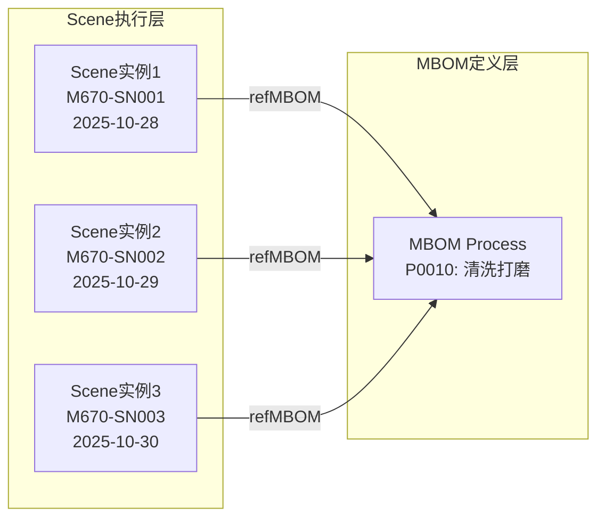
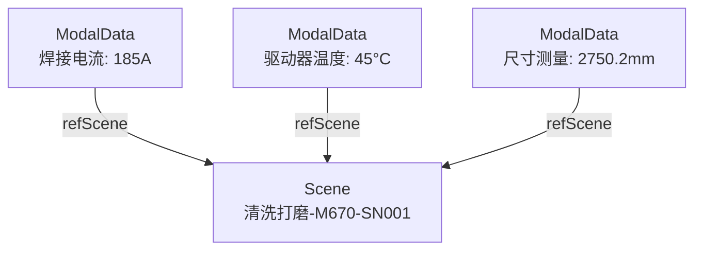

# Scene实体数据契约

**Entity Data Contract - Scene**

---

## 契约元信息

| 项目 | 内容 |
|-----|------|
| **契约版本** | v1.0.0 |
| **所属总契约** | 00_总契约.md v1.0.0 |
| **生效日期** | 2025-11-10 |
| **实体类型** | Scene (生产场景) |
| **所属层级** | 执行场景层 (Execution Scene Layer) |
| **契约状态** | 🟢 生效中 |

---

## 1. 实体概述

### 1.1 实体定义

**Scene** (生产场景) 是执行场景层的核心实体,记录工件在特定MBOM节点的实际执行过程,是"计划(MBOM) → 执行(Scene) → 数据(ModalData)"三层架构的中间层。

**核心作用**:
- **执行记录**: 记录某个工件在某个MBOM节点(Route/Takt/Process/Step)的实际执行情况
- **业务上下文**: 为ModalData提供业务上下文定位(三锚点之一)
- **责任追溯**: 记录执行过程中涉及的人员、设备、物料等资源
- **时间对齐**: 记录实际开始/结束时间,支持计划与实际对比

### 1.2 场景层级

Scene支持多层级粒度,与MBOM层级对应:

| 场景层级 | sceneLevel值 | 对应MBOM层级 | 用途 | 典型实例数 |
|---------|-------------|-------------|------|-----------|
| Route | `Route` | L2: Route | 记录完整路线执行 | 每个工件1个 |
| Takt | `Takt` | L3: Takt | 记录节拍执行 | 每个工件15个 |
| Process | `Process` | L4: Process | 记录工序执行 | 每个工件117个 |
| Step | `Step` | L5: Step | 记录工步执行(可选) | 按需创建 |

**当前系统**: 主要创建Process级和Takt级Scene,Step级按需创建

### 1.3 典型URN示例

```
urn:ngsi-ld:Scene:Route:M670-SN001:RT_M000004670327:20251028090000
urn:ngsi-ld:Scene:Takt:M670-SN001:T01:20251028090000
urn:ngsi-ld:Scene:Process:M670-SN001:T01:P0010:20251028090000
urn:ngsi-ld:Scene:Step:M670-SN001:T01:P0010:S01:20251028090015
```

---

## 2. 核心字段契约

### 2.1 必填字段

| 字段名 | NGSI-LD类型 | 数据类型 | 约束 | 说明 | 示例 |
|-------|------------|---------|------|------|------|
| **id** | - | URN | 必填,唯一 | 全局唯一标识符 | `urn:ngsi-ld:Scene:Process:M670-SN001:T01:P0010:20251028090000` |
| **type** | - | String | 必填,固定值 | 固定为"Scene" | `"Scene"` |
| **@context** | - | Array | 必填 | NGSI-LD上下文 | `["https://uri.etsi.org/ngsi-ld/v1/ngsi-ld-core-context.jsonld", "https://example.com/contexts/scene-context.jsonld"]` |
| **sceneLevel** | Property | String | 必填,枚举 | 场景层级标识 | `"Process"`, `"Takt"`, `"Route"`, `"Step"` |
| **sceneCode** | Property | String | 必填 | 场景业务编码 | `"SC-M670-SN001-T01:P0010"` |
| **sceneName** | Property | String | 必填 | 场景名称 | `"清洗打磨侧墙坯-M670-SN001"` |
| **refMBOM** | Relationship | URN | 必填 | 引用MBOM节点 | `urn:ngsi-ld:MBOM:M000004670327:T01:P0010` |
| **refMBOMVersion** | Property | String | 必填 | MBOM版本号 | `"V1.0"` |
| **timeFrame** | Property | Object | 必填 | 时间区间 | `{"start": "...", "end": "...", "actualDuration": 3600}` |
| **status** | Property | String | 必填,枚举 | 执行状态 | `"Completed"`, `"InProgress"`, `"Pending"`, `"Failed"`, `"Cancelled"` |

### 2.2 推荐字段

| 字段名 | NGSI-LD类型 | 数据类型 | 约束 | 说明 | 示例 |
|-------|------------|---------|------|------|------|
| **location** | Property | Object | 推荐 | 执行位置信息 | `{"lineCode": "TS361202", "zoneId": "ZONE-T01"}` |
| **partOf** | Relationship | URN | 推荐 | 所属上级Scene | `urn:ngsi-ld:Scene:Takt:M670-SN001:T01:20251028090000` |
| **includesSubScenes** | Relationship[] | URN[] | 可选 | 包含的下级Scene列表 | `[...Process Scene URNs...]` |
| **refFinalProduct** | Relationship | URN | 推荐 | 引用最终产品 | `urn:ngsi-ld:TwinObject:Product:M670-SN001` |
| **involvesAsset** | Relationship[] | URN[] | 推荐 | 涉及的资产列表 | `[<Robot URN>, <Person URN>]` |

### 2.3 关键可选字段

| 字段名 | NGSI-LD类型 | 数据类型 | 说明 | 示例 |
|-------|------------|---------|------|------|
| **inputWorkpiece** | Relationship | URN | 输入工件 | `urn:ngsi-ld:TwinObject:Workpiece:M670-SN001-T01-Input` |
| **outputWorkpiece** | Relationship | URN | 输出工件 | `urn:ngsi-ld:TwinObject:Workpiece:M670-SN001-T01-P0010-Output` |
| **inputMaterials** | Property | Array[Object] | 输入物料列表 | `[{materialId, quantity, batchNo}]` |
| **stepLog** | Property | Array[Object] | 工步执行日志 | `[{stepId, performedBy, duration, resultData}]` |
| **qualityResult** | Property | Object | 质量检验结果 | `{overallStatus: "Pass", score: 95}` |
| **exceptionLog** | Property | Array[Object] | 异常记录 | `[{exceptionType, timestamp, severity, description}]` |

---

## 3. 详细字段定义

### 3.1 核心字段

#### 3.1.1 sceneLevel (场景层级)

**类型**: Property  
**值类型**: String  
**枚举值**:
```
Route    - 路线级场景
Takt     - 节拍级场景
Process  - 工序级场景
Step     - 工步级场景
```

**验证规则**:
- ✅ 必须从枚举值中选择
- ✅ sceneLevel必须与refMBOM指向的MBOM实体的mbomType对应

#### 3.1.2 refMBOM (引用MBOM节点)

**类型**: Relationship  
**目标实体**: MBOM (任意层级)  
**基数**: N:1  

**验证规则**:
- ✅ 必须指向有效的MBOM实体
- ✅ MBOM实体的mbomType必须与sceneLevel对应:
  - sceneLevel=`Route` → mbomType=`Route`
  - sceneLevel=`Takt` → mbomType=`Takt`
  - sceneLevel=`Process` → mbomType=`Process`
  - sceneLevel=`Step` → mbomType=`Step`

**示例**:
```json
{
  "type": "Relationship",
  "object": "urn:ngsi-ld:MBOM:M000004670327:T01:P0010"
}
```

#### 3.1.3 timeFrame (时间区间)

**类型**: Property  
**值类型**: Object  

**结构定义**:
```json
{
  "type": "Property",
  "value": {
    "start": "<ISO 8601 DateTime>",
    "end": "<ISO 8601 DateTime>",
    "actualDuration": <秒数, Integer>
  }
}
```

**字段说明**:
- `start`: 实际开始时间 (必填)
- `end`: 实际结束时间 (可选,进行中的Scene为null)
- `actualDuration`: 实际持续时长,单位:秒 (可选,可计算得出)

**验证规则**:
- ✅ start必须为有效的ISO 8601时间格式
- ✅ 如果end存在,必须 >= start
- ✅ 如果actualDuration存在,应等于 end - start (秒数)

**示例**:
```json
{
  "type": "Property",
  "value": {
    "start": "2025-10-28T09:00:00Z",
    "end": "2025-10-28T10:00:00Z",
    "actualDuration": 3600
  }
}
```

#### 3.1.4 status (执行状态)

**类型**: Property  
**值类型**: String  

**枚举值**:
```
Pending    - 待执行 (已创建但未开始)
InProgress - 执行中 (start已设置,end未设置)
Completed  - 已完成 (正常结束)
Failed     - 失败 (执行出现错误)
Cancelled  - 已取消 (人为中止)
OnHold     - 暂停 (临时挂起)
```

**状态转换规则**:
```
Pending → InProgress → Completed
                    → Failed
                    → Cancelled
        → OnHold → InProgress
```

---

### 3.2 层级关系字段

#### 3.2.1 partOf (所属上级Scene)

**类型**: Relationship  
**目标实体**: Scene (上级层级)  
**基数**: N:1  

**验证规则**:
- ✅ Process级Scene的partOf必须指向Takt级Scene
- ✅ Takt级Scene的partOf必须指向Route级Scene
- ✅ Step级Scene的partOf必须指向Process级Scene
- ✅ Route级Scene无partOf关系

**示例**:
```json
{
  "type": "Relationship",
  "object": "urn:ngsi-ld:Scene:Takt:M670-SN001:T01:20251028090000"
}
```

#### 3.2.2 includesSubScenes (包含的下级Scene列表)

**类型**: Relationship[]  
**目标实体**: Scene[] (下级层级)  
**基数**: 1:N  

**验证规则**:
- ✅ Route级Scene的includesSubScenes指向Takt级Scene列表
- ✅ Takt级Scene的includesSubScenes指向Process级Scene列表
- ✅ Process级Scene的includesSubScenes指向Step级Scene列表(可选)
- ✅ Step级Scene无includesSubScenes关系

**示例**:
```json
[
  {"type": "Relationship", "object": "urn:ngsi-ld:Scene:Process:M670-SN001:T01:P0010:20251028090000"},
  {"type": "Relationship", "object": "urn:ngsi-ld:Scene:Process:M670-SN001:T01:P0020:20251028100000"}
]
```

---

### 3.3 工件与物料字段

#### 3.3.1 inputWorkpiece (输入工件)

**类型**: Relationship  
**目标实体**: TwinObject (subType=Workpiece)  
**基数**: N:1  

**说明**: 该Scene开始时的输入工件状态

**示例**:
```json
{
  "type": "Relationship",
  "object": "urn:ngsi-ld:TwinObject:Workpiece:M670-SN001-T01-Input"
}
```

#### 3.3.2 outputWorkpiece (输出工件)

**类型**: Relationship  
**目标实体**: TwinObject (subType=Workpiece)  
**基数**: N:1  

**说明**: 该Scene结束时的输出工件状态

**示例**:
```json
{
  "type": "Relationship",
  "object": "urn:ngsi-ld:TwinObject:Workpiece:M670-SN001-T01-P0010-Output"
}
```

#### 3.3.3 inputMaterials (输入物料列表)

**类型**: Property  
**值类型**: Array[Object]  

**结构定义**:
```json
{
  "type": "Property",
  "value": [
    {
      "materialId": "<Material URN>",
      "materialName": "<物料名称>",
      "quantity": <数量>,
      "unit": "<单位>",
      "batchNo": "<批次号>"
    }
  ]
}
```

**示例**:
```json
{
  "type": "Property",
  "value": [
    {
      "materialId": "urn:ngsi-ld:TwinObject:Material:SteelPlate-Q235B",
      "materialName": "Q235B钢板",
      "quantity": 1,
      "unit": "piece",
      "batchNo": "BATCH-20251028-001"
    }
  ]
}
```

---

### 3.4 执行日志字段

#### 3.4.1 stepLog (工步执行日志)

**类型**: Property  
**值类型**: Array[Object]  

**用途**: 记录Scene中每个工步的实际执行情况,包括执行人员、时长、结果等

**结构定义**:
```json
{
  "type": "Property",
  "value": [
    {
      "stepId": "<Step MBOM URN>",
      "performedBy": {
        "personId": "<Person URN>",
        "roleId": "<Role URN>"
      },
      "observedAt": "<ISO 8601 DateTime>",
      "duration": <秒数, Integer>,
      "resultData": {
        "status": "Pass | Fail | Skip",
        "qualityScore": <0-100>,
        "remarks": "<备注>"
      }
    }
  ]
}
```

**字段说明**:
- `stepId`: 引用MBOM Step实体 (必填)
- `performedBy`: 执行人员信息 (必填)
  - `personId`: 人员URN
  - `roleId`: 角色URN
- `observedAt`: 执行时间戳 (必填)
- `duration`: 实际耗时,单位:秒 (可选)
- `resultData`: 执行结果 (可选)
  - `status`: 执行状态
  - `qualityScore`: 质量得分
  - `remarks`: 备注说明

**验证规则**:
- ✅ stepId必须指向有效的MBOM Step实体
- ✅ personId必须指向有效的Person实体
- ✅ roleId必须指向有效的Role实体
- ✅ observedAt必须在Scene.timeFrame的start和end之间

**示例**:
```json
{
  "type": "Property",
  "value": [
    {
      "stepId": "urn:ngsi-ld:MBOM:M000004670327:T01:P0010:S01",
      "performedBy": {
        "personId": "urn:ngsi-ld:TwinObject:Person:Worker-01",
        "roleId": "urn:ngsi-ld:Role:Operator"
      },
      "observedAt": "2025-10-28T09:00:00Z",
      "duration": 1800,
      "resultData": {
        "status": "Pass",
        "qualityScore": 95,
        "remarks": "表面清洁良好"
      }
    },
    {
      "stepId": "urn:ngsi-ld:MBOM:M000004670327:T01:P0010:S02",
      "performedBy": {
        "personId": "urn:ngsi-ld:TwinObject:Person:Worker-01",
        "roleId": "urn:ngsi-ld:Role:Operator"
      },
      "observedAt": "2025-10-28T09:30:00Z",
      "duration": 1800,
      "resultData": {
        "status": "Pass",
        "qualityScore": 98
      }
    }
  ]
}
```

#### 3.4.2 qualityResult (质量检验结果)

**类型**: Property  
**值类型**: Object  

**结构定义**:
```json
{
  "type": "Property",
  "value": {
    "overallStatus": "Pass | Fail | Conditional",
    "score": <0-100>,
    "inspector": "<Person URN>",
    "inspectionTime": "<ISO 8601 DateTime>",
    "findings": [
      {
        "itemName": "<检验项名称>",
        "result": "OK | NG | Warning",
        "measuredValue": <实测值>,
        "standardValue": <标准值>,
        "deviation": <偏差>
      }
    ],
    "remarks": "<备注>"
  }
}
```

**示例**:
```json
{
  "type": "Property",
  "value": {
    "overallStatus": "Pass",
    "score": 95,
    "inspector": "urn:ngsi-ld:TwinObject:Person:QC-Inspector-01",
    "inspectionTime": "2025-10-28T10:00:00Z",
    "findings": [
      {
        "itemName": "侧墙高度",
        "result": "OK",
        "measuredValue": 2750.2,
        "standardValue": 2750,
        "deviation": 0.2
      }
    ]
  }
}
```

#### 3.4.3 exceptionLog (异常记录)

**类型**: Property  
**值类型**: Array[Object]  

**结构定义**:
```json
{
  "type": "Property",
  "value": [
    {
      "exceptionType": "EquipmentFailure | QualityIssue | MaterialShortage | SafetyIncident | Other",
      "timestamp": "<ISO 8601 DateTime>",
      "severity": "Critical | High | Medium | Low",
      "description": "<异常描述>",
      "reportedBy": "<Person URN>",
      "resolution": "<处理措施>",
      "resolvedAt": "<ISO 8601 DateTime>"
    }
  ]
}
```

**示例**:
```json
{
  "type": "Property",
  "value": [
    {
      "exceptionType": "EquipmentFailure",
      "timestamp": "2025-10-28T09:30:00Z",
      "severity": "High",
      "description": "焊接机器人伺服电机报警",
      "reportedBy": "urn:ngsi-ld:TwinObject:Person:Operator-01",
      "resolution": "重启设备,检查伺服参数",
      "resolvedAt": "2025-10-28T09:45:00Z"
    }
  ]
}
```

---

### 3.5 资产关联字段

#### 3.5.1 involvesAsset (涉及的资产列表)

**类型**: Relationship[]  
**目标实体**: TwinObject[] (AutoEquipment, Person, QCTool等)  
**基数**: N:M  

**说明**: 该Scene执行过程中涉及的所有设备、人员、工具等资产

**示例**:
```json
[
  {"type": "Relationship", "object": "urn:ngsi-ld:TwinObject:AutoEquipment:361-01173"},
  {"type": "Relationship", "object": "urn:ngsi-ld:TwinObject:Person:Worker-01"},
  {"type": "Relationship", "object": "urn:ngsi-ld:TwinObject:QCTool:Caliper-01"}
]
```

---

## 4. URN命名规范

### 4.1 URN格式定义

**通用格式**:
```
urn:ngsi-ld:Scene:{sceneLevel}:{workpieceSerialNo}:{mbomNodeCode}:{timestamp}
```

**各层级具体格式**:

| sceneLevel | URN格式 | 示例 |
|-----------|--------|------|
| Route | `urn:ngsi-ld:Scene:Route:{workpieceSN}:{routeCode}:{yyyyMMddHHmmss}` | `urn:ngsi-ld:Scene:Route:M670-SN001:RT_M000004670327:20251028090000` |
| Takt | `urn:ngsi-ld:Scene:Takt:{workpieceSN}:T{seq}:{yyyyMMddHHmmss}` | `urn:ngsi-ld:Scene:Takt:M670-SN001:T01:20251028090000` |
| Process | `urn:ngsi-ld:Scene:Process:{workpieceSN}:T{taktSeq}:P{procCode}:{yyyyMMddHHmmss}` | `urn:ngsi-ld:Scene:Process:M670-SN001:T01:P0010:20251028090000` |
| Step | `urn:ngsi-ld:Scene:Step:{workpieceSN}:T{taktSeq}:P{procCode}:S{stepSeq}:{yyyyMMddHHmmss}` | `urn:ngsi-ld:Scene:Step:M670-SN001:T01:P0010:S01:20251028090015` |

**命名约束**:
- ✅ workpieceSN: 工件序列号,如 `M670-SN001`
- ✅ timestamp: 格式为 `yyyyMMddHHmmss`,表示Scene开始时间
- ✅ mbomNodeCode: 与对应MBOM实体的编码保持一致

---

## 5. 典型使用场景

### 5.1 场景创建流程

**步骤**:
1. 工件进入某个工位,触发Scene创建
2. 设置Scene.refMBOM指向对应的MBOM节点
3. 设置Scene.timeFrame.start = 当前时间
4. 设置Scene.status = `InProgress`
5. 执行过程中记录stepLog, involvesAsset等信息
6. 执行完成后:
   - 设置Scene.timeFrame.end = 当前时间
   - 计算Scene.timeFrame.actualDuration
   - 设置Scene.status = `Completed`
   - 创建输出工件(outputWorkpiece)

### 5.2 查询工件完整生产历史

**场景**: 给定工件序列号,查询其完整的生产执行历史

**步骤**:
1. 查询所有Scene,过滤workpieceSN
2. 按sceneLevel分组
3. 按timeFrame.start排序

**伪代码**:
```python
scenes = query(
    "id LIKE 'urn:ngsi-ld:Scene:%:M670-SN001:%'",
    "order by timeFrame.value.start ASC"
)

# 分组
route_scenes = [s for s in scenes if s.sceneLevel == "Route"]
takt_scenes = [s for s in scenes if s.sceneLevel == "Takt"]
process_scenes = [s for s in scenes if s.sceneLevel == "Process"]
```

### 5.3 质量责任追溯

**场景**: 某工件质检NG,追溯到具体执行人员

**步骤**:
1. 查询NG工件关联的Scene (通过outputWorkpiece)
2. 从Scene.stepLog中提取performedBy信息
3. 查询Person和Role实体,获取详细信息

**伪代码**:
```python
# 1. 查询Scene
scene = query(
    "outputWorkpiece.object = 'urn:ngsi-ld:TwinObject:Workpiece:M670-SN001-NG'"
)

# 2. 提取执行人员
operators = []
for step_log in scene.stepLog.value:
    person_id = step_log['performedBy']['personId']
    role_id = step_log['performedBy']['roleId']
    
    person = get_entity(person_id)
    role = get_entity(role_id)
    
    operators.append({
        'stepId': step_log['stepId'],
        'personName': person.name,
        'roleName': role.name,
        'timestamp': step_log['observedAt']
    })
```

### 5.4 计划与实际对比

**场景**: 对比MBOM计划工时与Scene实际工时

**步骤**:
1. 查询MBOM Process的stdTime
2. 查询对应Scene的timeFrame.actualDuration
3. 计算偏差

**伪代码**:
```python
mbom_process = get_entity("urn:ngsi-ld:MBOM:M000004670327:T01:P0010")
planned_time = mbom_process.stdTime.value  # 分钟

scene = query(
    "refMBOM.object = 'urn:ngsi-ld:MBOM:M000004670327:T01:P0010'",
    "status.value = 'Completed'"
)[0]
actual_time = scene.timeFrame.value['actualDuration'] / 60  # 秒转分钟

deviation = actual_time - planned_time
deviation_percent = (deviation / planned_time) * 100

print(f"计划工时: {planned_time}分钟")
print(f"实际工时: {actual_time}分钟")
print(f"偏差: {deviation}分钟 ({deviation_percent}%)")
```

---

## 6. 数据质量约束

### 6.1 必填字段完整性检查

**验证规则**:
- ✅ 所有必填字段必须存在且非空
- ✅ URN格式必须符合命名规范
- ✅ 枚举字段的值必须在允许的枚举值范围内

### 6.2 关系完整性检查

**验证规则**:
- ✅ refMBOM必须指向有效的MBOM实体
- ✅ partOf必须指向有效的上级Scene实体(除Route级外)
- ✅ includesSubScenes必须指向有效的下级Scene实体列表
- ✅ inputWorkpiece/outputWorkpiece必须指向有效的Workpiece实体
- ✅ involvesAsset必须指向有效的TwinObject实体
- ✅ stepLog中的stepId必须指向有效的MBOM Step实体
- ✅ stepLog中的personId必须指向有效的Person实体
- ✅ stepLog中的roleId必须指向有效的Role实体
- ❌ 不允许悬空引用

### 6.3 时间逻辑约束

**验证规则**:
- ✅ timeFrame.start必须为有效时间
- ✅ 如果timeFrame.end存在,必须 >= timeFrame.start
- ✅ stepLog中的observedAt必须在timeFrame的start和end之间
- ✅ exceptionLog中的timestamp必须在timeFrame的start和end之间

### 6.4 层级一致性约束

**验证规则**:
- ✅ sceneLevel必须与refMBOM指向的MBOM实体的mbomType对应
- ✅ Process级Scene的partOf必须指向Takt级Scene
- ✅ Takt级Scene的partOf必须指向Route级Scene
- ✅ Step级Scene的partOf必须指向Process级Scene

### 6.5 状态一致性约束

**验证规则**:
- ✅ status=`InProgress`时,timeFrame.end必须为null或不存在
- ✅ status=`Completed`时,timeFrame.end必须存在且 >= timeFrame.start
- ✅ status=`Pending`时,timeFrame.start可以是未来时间
- ✅ status=`Failed`或`Cancelled`时,timeFrame.end应该存在

---

## 7. 与其他实体的关系

### 7.1 Scene与MBOM的关系



**说明**: 
- 1个MBOM节点可以对应N个Scene实例(每个工件执行一次)
- Scene.refMBOM是关键桥梁,连接"计划"与"执行"

### 7.2 Scene与ModalData的关系



**说明**: 
- Scene是ModalData的业务上下文(三锚点之一)
- 1个Scene可以产生N个ModalData实例
- 通过Scene,可以将数据追溯到具体的工件、时间、MBOM节点

---

## 8. 完整实例示例

### 8.1 Process级Scene示例

```json
{
  "@context": [
    "https://uri.etsi.org/ngsi-ld/v1/ngsi-ld-core-context.jsonld",
    "https://example.com/contexts/scene-context.jsonld"
  ],
  "id": "urn:ngsi-ld:Scene:Process:M670-SN001:T01:P0010:20251028090000",
  "type": "Scene",
  "sceneLevel": {
    "type": "Property",
    "value": "Process"
  },
  "sceneCode": {
    "type": "Property",
    "value": "SC-M670-SN001-T01:P0010"
  },
  "sceneName": {
    "type": "Property",
    "value": "清洗打磨侧墙坯-M670-SN001"
  },
  "refMBOM": {
    "type": "Relationship",
    "object": "urn:ngsi-ld:MBOM:M000004670327:T01:P0010"
  },
  "refMBOMVersion": {
    "type": "Property",
    "value": "V1.0"
  },
  "timeFrame": {
    "type": "Property",
    "value": {
      "start": "2025-10-28T09:00:00Z",
      "end": "2025-10-28T10:00:00Z",
      "actualDuration": 3600
    }
  },
  "location": {
    "type": "Property",
    "value": {
      "lineCode": "TS361202",
      "zoneId": "ZONE-T01",
      "stationCode": "FrontWelding"
    }
  },
  "status": {
    "type": "Property",
    "value": "Completed"
  },
  "partOf": {
    "type": "Relationship",
    "object": "urn:ngsi-ld:Scene:Takt:M670-SN001:T01:20251028090000"
  },
  "outputWorkpiece": {
    "type": "Relationship",
    "object": "urn:ngsi-ld:TwinObject:Workpiece:M670-SN001-T01-P0010-Output"
  },
  "inputMaterials": {
    "type": "Property",
    "value": [
      {
        "materialId": "urn:ngsi-ld:TwinObject:Material:SteelPlate-Q235B",
        "materialName": "Q235B钢板",
        "quantity": 1,
        "unit": "piece",
        "batchNo": "BATCH-20251028-001"
      }
    ]
  },
  "refFinalProduct": {
    "type": "Relationship",
    "object": "urn:ngsi-ld:TwinObject:Product:M670-SN001"
  },
  "involvesAsset": [
    {
      "type": "Relationship",
      "object": "urn:ngsi-ld:TwinObject:AutoEquipment:361-01173"
    },
    {
      "type": "Relationship",
      "object": "urn:ngsi-ld:TwinObject:Person:Worker-01"
    }
  ],
  "stepLog": {
    "type": "Property",
    "value": [
      {
        "stepId": "urn:ngsi-ld:MBOM:M000004670327:T01:P0010:S01",
        "performedBy": {
          "personId": "urn:ngsi-ld:TwinObject:Person:Worker-01",
          "roleId": "urn:ngsi-ld:Role:Operator"
        },
        "observedAt": "2025-10-28T09:00:00Z",
        "duration": 1800,
        "resultData": {
          "status": "Pass",
          "qualityScore": 95,
          "remarks": "表面清洁良好"
        }
      },
      {
        "stepId": "urn:ngsi-ld:MBOM:M000004670327:T01:P0010:S02",
        "performedBy": {
          "personId": "urn:ngsi-ld:TwinObject:Person:Worker-01",
          "roleId": "urn:ngsi-ld:Role:Operator"
        },
        "observedAt": "2025-10-28T09:30:00Z",
        "duration": 1800,
        "resultData": {
          "status": "Pass",
          "qualityScore": 98
        }
      }
    ]
  },
  "qualityResult": {
    "type": "Property",
    "value": {
      "overallStatus": "Pass",
      "score": 96,
      "inspector": "urn:ngsi-ld:TwinObject:Person:QC-Inspector-01",
      "inspectionTime": "2025-10-28T10:00:00Z"
    }
  }
}
```

---

## 9. 变更历史

### v1.0.0 (2025-11-10)

**变更类型**: 初始版本

**变更内容**:
- 创建Scene实体契约,定义多层级场景结构
- 定义完整的字段契约和关系契约
- 制定URN命名规范和枚举值规范
- 提供详细的stepLog结构定义
- 提供典型使用场景示例

**影响范围**:
- 任务1(平台): 需实现Scene实体的CRUD和验证
- 任务2(地图): 需基于Scene显示工件实时位置和历史轨迹
- 任务3(应用): 需基于Scene进行质量分析和责任追溯
- 任务4(仿真): 需生成符合契约的Scene实例

---

**文档结束**

---

**契约维护记录**

| 版本 | 日期 | 修订人 | 修订内容 |
|-----|------|-------|---------|
| v1.0.0 | 2025-11-10 | 数字孪生项目组 | 初始版本 |
