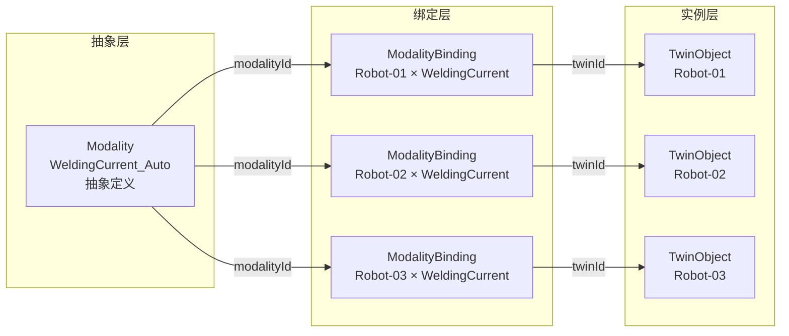
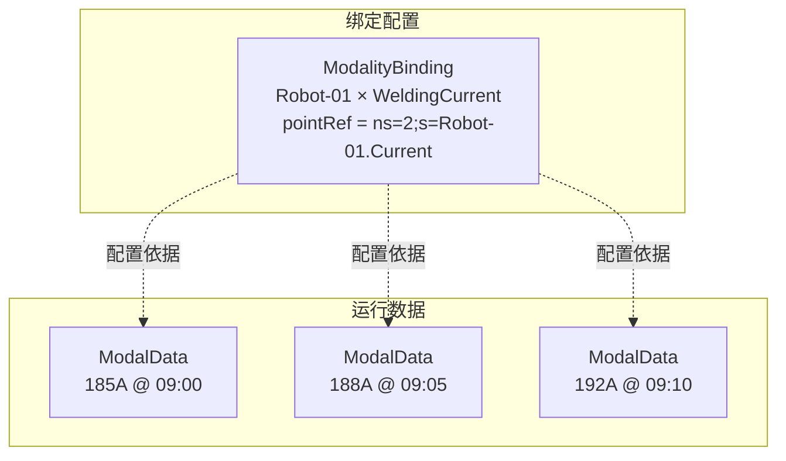

# ModalityBinding实体数据契约

**Entity Data Contract - ModalityBinding**

---

## 契约元信息

| 项目 | 内容 |
|-----|------|
| **契约版本** | v1.0.0 |
| **所属总契约** | 00_总契约.md v1.0.0 |
| **生效日期** | 2025-11-10 |
| **实体类型** | ModalityBinding (模态绑定) |
| **所属层级** | 执行场景层 (Execution Scene Layer) |
| **契约状态** | 🟢 生效中 |

---

## 1. 实体概述

### 1.1 实体定义

**ModalityBinding** (模态绑定) 实现"Modality数据字典"到"具体TwinObject"的绑定配置,是连接抽象定义与具体实例的桥梁。

**核心作用**:
- **具体化绑定**: 将抽象的Modality绑定到具体的TwinObject上
- **采集配置**: 定义该设备上该数据点的具体采集配置(pointRef, sampleRate等)
- **版本管理**: 支持绑定配置的版本演进和变更追溯
- **参数覆盖**: 允许在绑定层覆盖Modality定义的通用参数(如单位)

**设计理念**: 
```
Modality (抽象定义) × TwinObject (具体实例) = ModalityBinding (具体绑定配置)
```

### 1.2 典型场景

**场景1: 同一Modality绑定到多个设备**
```
Modality: WeldingCurrent_Auto
  ├─ ModalityBinding: Robot-01 × WeldingCurrent_Auto
  ├─ ModalityBinding: Robot-02 × WeldingCurrent_Auto
  └─ ModalityBinding: Robot-03 × WeldingCurrent_Auto
```

**场景2: 多点采集**
```
Modality: DriveTemp (驱动器温度)
  ├─ ModalityBinding: CNC-01 × DriveTemp (X主轴)
  ├─ ModalityBinding: CNC-01 × DriveTemp (Y主轴)
  ├─ ModalityBinding: CNC-01 × DriveTemp (Z主轴)
  └─ ModalityBinding: CNC-01 × DriveTemp (A轴)
```

### 1.3 实例数量

**当前系统**: 352个ModalityBinding实例

**分布情况**:
- 33个AutoEquipment × 平均10-12个Modality = ~350个绑定

### 1.4 典型URN示例

```
urn:ngsi-ld:ModalityBinding:361-01173:WeldingCurrent_Auto:v1
urn:ngsi-ld:ModalityBinding:046-00019:DriveTemp:v1
urn:ngsi-ld:ModalityBinding:269-00067:RobotLinearSpeed:v1
```

---

## 2. 核心字段契约

### 2.1 必填字段

| 字段名 | NGSI-LD类型 | 数据类型 | 约束 | 说明 | 示例 |
|-------|------------|---------|------|------|------|
| **id** | - | URN | 必填,唯一 | 全局唯一标识符 | `urn:ngsi-ld:ModalityBinding:361-01173:WeldingCurrent_Auto:v1` |
| **type** | - | String | 必填,固定值 | 固定为"ModalityBinding" | `"ModalityBinding"` |
| **@context** | - | Array | 必填 | NGSI-LD上下文 | `["https://uri.etsi.org/ngsi-ld/v1/ngsi-ld-core-context.jsonld"]` |
| **twinId** | Relationship | URN | 必填 | 关联的TwinObject | `urn:ngsi-ld:TwinObject:AutoEquipment:361-01173` |
| **modalityId** | Relationship | URN | 必填 | 关联的Modality | `urn:ngsi-ld:Modality:WeldingCurrent_Auto` |
| **pointRef** | Property | String | 必填 | 数据点引用地址 | `"ns=2;s=361-01173.WeldingCurrent_Auto"` |

### 2.2 推荐字段

| 字段名 | NGSI-LD类型 | 数据类型 | 约束 | 说明 | 示例 |
|-------|------------|---------|------|------|------|
| **bindingVersion** | Property | String | 推荐 | 绑定配置版本号 | `"1.0.0"` |
| **changeId** | Property | String | 推荐 | 变更标识符 | `"CHG-INITIAL-SETUP-2025"` |
| **effectiveFrom** | Property | DateTime | 推荐 | 生效起始时间 | `"2025-01-01T00:00:00Z"` |
| **effectiveTo** | Property | DateTime | 可选 | 生效结束时间 | `"2025-12-31T23:59:59Z"` |

### 2.3 可选覆盖字段

| 字段名 | NGSI-LD类型 | 数据类型 | 说明 | 示例 |
|-------|------------|---------|------|------|
| **unit** | Property | String | 覆盖Modality定义的单位 | `"mA"` |
| **sampleRate** | Property | String | 采样频率 | `"100ms"`, `"10s"` |
| **allowedRange** | Property | Array[Number] | 覆盖Modality定义的值域 | `[150, 220]` |
| **discriminator** | Property | Object | 区分器(多点采集时使用) | `{"axis": "X", "location": "Main"}` |

---

## 3. 详细字段定义

### 3.1 核心关系字段

#### 3.1.1 twinId (关联的TwinObject)

**类型**: Relationship  
**目标实体**: TwinObject (任意subType)  
**基数**: N:1  
**必填**: ✓  

**说明**: 该绑定所属的TwinObject,表示在哪个设备/对象上采集数据

**验证规则**:
- ✅ 必须指向有效的TwinObject实体
- ✅ TwinObject必须支持该Modality (可通过TwinObject.supportedModalities验证)

**示例**:
```json
{
  "type": "Relationship",
  "object": "urn:ngsi-ld:TwinObject:AutoEquipment:361-01173"
}
```

#### 3.1.2 modalityId (关联的Modality)

**类型**: Relationship  
**目标实体**: Modality  
**基数**: N:1  
**必填**: ✓  

**说明**: 该绑定关联的Modality,定义数据的类型和规范

**验证规则**:
- ✅ 必须指向有效的Modality实体

**示例**:
```json
{
  "type": "Relationship",
  "object": "urn:ngsi-ld:Modality:WeldingCurrent_Auto"
}
```

---

### 3.2 数据点定位字段

#### 3.2.1 pointRef (数据点引用地址)

**类型**: Property  
**值类型**: String  
**必填**: ✓  

**说明**: 数据采集的物理地址或逻辑引用,用于数据采集系统定位具体数据源

**常见格式**:
- **OPC-UA格式**: `ns=2;s=<NodeId>`
- **MQTT Topic格式**: `devices/<deviceId>/telemetry/<pointName>`
- **Modbus地址格式**: `<SlaveId>:<RegisterType>:<Address>`
- **数据库表列**: `<TableName>.<ColumnName>`

**示例**:
```json
{
  "type": "Property",
  "value": "ns=2;s=361-01173.WeldingCurrent_Auto"
}
```

**OPC-UA格式详解**:
```
ns=2;s=361-01173.WeldingCurrent_Auto
│   │  └──────────┬──────────────┘
│   │             └─ NodeId (设备编号.数据点名称)
│   └─ 命名空间索引
└─ 命名空间前缀
```

---

### 3.3 版本管理字段

#### 3.3.1 bindingVersion (绑定配置版本号)

**类型**: Property  
**值类型**: String  
**格式**: 语义化版本 `major.minor.patch`  

**说明**: 该绑定配置的版本号,用于追溯配置变更历史

**版本升级规则**:
- **Major**: 破坏性变更(如更换Modality, 更改pointRef)
- **Minor**: 向后兼容的新增(如新增sampleRate配置)
- **Patch**: 修正(如修正unit拼写错误)

**示例**:
```json
{
  "type": "Property",
  "value": "1.0.0"
}
```

#### 3.3.2 changeId (变更标识符)

**类型**: Property  
**值类型**: String  

**说明**: 关联到变更管理系统的变更单号,用于追溯配置变更原因

**示例**:
```json
{
  "type": "Property",
  "value": "CHG-INITIAL-SETUP-2025"
}
```

#### 3.3.3 effectiveFrom / effectiveTo (生效时间段)

**类型**: Property  
**值类型**: DateTime (ISO 8601)  

**说明**: 该绑定配置的生效时间段,支持时间段内的配置演进

**验证规则**:
- ✅ effectiveFrom必须为有效的ISO 8601时间
- ✅ 如果effectiveTo存在,必须 >= effectiveFrom
- ✅ 同一(twinId, modalityId)组合,不同版本的生效时间段不应重叠

**示例**:
```json
{
  "effectiveFrom": {
    "type": "Property",
    "value": "2025-01-01T00:00:00Z"
  },
  "effectiveTo": {
    "type": "Property",
    "value": "2025-12-31T23:59:59Z"
  }
}
```

---

### 3.4 可选覆盖字段

#### 3.4.1 unit (单位覆盖)

**类型**: Property  
**值类型**: String  

**说明**: 覆盖Modality定义的通用单位,用于处理同一物理量不同单位的情况

**使用场景**: 
- Modality定义: `unit = "A"` (安培)
- 某设备传感器输出: `mA` (毫安)
- ModalityBinding覆盖: `unit = "mA"`

**示例**:
```json
{
  "type": "Property",
  "value": "mA"
}
```

#### 3.4.2 sampleRate (采样频率)

**类型**: Property  
**值类型**: String  

**格式**: 
- 时间间隔: `"100ms"`, `"1s"`, `"10s"`, `"1min"`
- 采样方式: `"onChange"` (值变化时), `"onDemand"` (按需)

**说明**: 定义该数据点的采样频率

**示例**:
```json
{
  "type": "Property",
  "value": "100ms"
}
```

#### 3.4.3 allowedRange (值域覆盖)

**类型**: Property  
**值类型**: Array[Number]  

**说明**: 覆盖Modality定义的通用值域,用于处理同一Modality在不同设备上的值域差异

**使用场景**: 
- Modality定义: `allowedRange = [180, 200]` (通用范围)
- 某设备工艺要求: 电流控制在 [185, 195]
- ModalityBinding覆盖: `allowedRange = [185, 195]`

**示例**:
```json
{
  "type": "Property",
  "value": [185, 195]
}
```

#### 3.4.4 discriminator (区分器)

**类型**: Property  
**值类型**: Object  

**说明**: 用于多点采集场景,区分同一设备上同一Modality的多个数据点

**典型字段**:
- `axis`: 轴向 (`"X"`, `"Y"`, `"Z"`, `"A"`, `"C"`)
- `location`: 位置 (`"Main"`, `"Forward"`, `"Slave"`, `"TopLeft"`)
- `channel`: 通道号 (`1`, `2`, `3`)

**示例**:
```json
{
  "type": "Property",
  "value": {
    "axis": "X",
    "location": "Main"
  }
}
```

**多点采集示例**: CNC机床的8个驱动器温度点
```
Modality: DriveTemp
设备: CNC-01
绑定:
  - ModalityBinding-1: discriminator = {axis: "X", location: "Main"}
  - ModalityBinding-2: discriminator = {axis: "X", location: "Forward"}
  - ModalityBinding-3: discriminator = {axis: "X", location: "Slave"}
  - ModalityBinding-4: discriminator = {axis: "X", location: "ForwardSlave"}
  - ModalityBinding-5: discriminator = {axis: "Y"}
  - ModalityBinding-6: discriminator = {axis: "Z"}
  - ModalityBinding-7: discriminator = {axis: "A"}
  - ModalityBinding-8: discriminator = {axis: "C"}
```

---

## 4. URN命名规范

### 4.1 URN格式定义

**标准格式**:
```
urn:ngsi-ld:ModalityBinding:{TwinName}:{ModalityName}:v{Version}
```

**带区分器格式** (多点采集):
```
urn:ngsi-ld:ModalityBinding:{TwinName}:{ModalityName}:{Discriminator}:v{Version}
```

**命名约束**:
- ✅ TwinName: TwinObject的业务名称或编码 (如 `361-01173`, `Robot-01`)
- ✅ ModalityName: Modality的业务名称 (如 `WeldingCurrent_Auto`)
- ✅ Discriminator: 可选,用于多点采集时区分 (如 `X_Main`, `TopLeft`)
- ✅ Version: 版本号,格式 `v{major}` (如 `v1`, `v2`)

### 4.2 URN示例

**标准绑定**:
```
urn:ngsi-ld:ModalityBinding:361-01173:WeldingCurrent_Auto:v1
urn:ngsi-ld:ModalityBinding:046-00019:ToolLinearSpeed:v1
urn:ngsi-ld:ModalityBinding:269-00067:AmbientTemp_Auto:v1
```

**多点采集**:
```
urn:ngsi-ld:ModalityBinding:CNC-01:DriveTemp:X_Main:v1
urn:ngsi-ld:ModalityBinding:CNC-01:DriveTemp:X_Forward:v1
urn:ngsi-ld:ModalityBinding:Station-01:AmbientTemp:TopLeft:v1
urn:ngsi-ld:ModalityBinding:Station-01:AmbientTemp:TopRight:v1
```

---

## 5. 典型ModalityBinding示例

### 5.1 标准绑定示例: 焊接电流

```json
{
  "@context": [
    "https://uri.etsi.org/ngsi-ld/v1/ngsi-ld-core-context.jsonld",
    "https://example.com/contexts/binding-context.jsonld"
  ],
  "id": "urn:ngsi-ld:ModalityBinding:361-01173:WeldingCurrent_Auto:v1",
  "type": "ModalityBinding",
  "twinId": {
    "type": "Relationship",
    "object": "urn:ngsi-ld:TwinObject:AutoEquipment:361-01173"
  },
  "modalityId": {
    "type": "Relationship",
    "object": "urn:ngsi-ld:Modality:WeldingCurrent_Auto"
  },
  "pointRef": {
    "type": "Property",
    "value": "ns=2;s=361-01173.WeldingCurrent_Auto"
  },
  "bindingVersion": {
    "type": "Property",
    "value": "1.0.0"
  },
  "changeId": {
    "type": "Property",
    "value": "CHG-INITIAL-SETUP-2025"
  },
  "effectiveFrom": {
    "type": "Property",
    "value": "2025-01-01T00:00:00Z"
  },
  "sampleRate": {
    "type": "Property",
    "value": "100ms"
  }
}
```

### 5.2 多点采集示例: 驱动器温度

```json
{
  "@context": [
    "https://uri.etsi.org/ngsi-ld/v1/ngsi-ld-core-context.jsonld"
  ],
  "id": "urn:ngsi-ld:ModalityBinding:046-00019:DriveTemp:X_Main:v1",
  "type": "ModalityBinding",
  "twinId": {
    "type": "Relationship",
    "object": "urn:ngsi-ld:TwinObject:AutoEquipment:046-00019"
  },
  "modalityId": {
    "type": "Relationship",
    "object": "urn:ngsi-ld:Modality:DriveTemp"
  },
  "pointRef": {
    "type": "Property",
    "value": "ns=2;s=046-00019.DriveTemp.X_Main"
  },
  "bindingVersion": {
    "type": "Property",
    "value": "1.0.0"
  },
  "effectiveFrom": {
    "type": "Property",
    "value": "2025-01-01T00:00:00Z"
  },
  "sampleRate": {
    "type": "Property",
    "value": "10s"
  },
  "discriminator": {
    "type": "Property",
    "value": {
      "axis": "X",
      "location": "Main"
    }
  }
}
```

### 5.3 参数覆盖示例: 单位转换

```json
{
  "@context": [
    "https://uri.etsi.org/ngsi-ld/v1/ngsi-ld-core-context.jsonld"
  ],
  "id": "urn:ngsi-ld:ModalityBinding:269-00067:PowerConsumption:v1",
  "type": "ModalityBinding",
  "twinId": {
    "type": "Relationship",
    "object": "urn:ngsi-ld:TwinObject:AutoEquipment:269-00067"
  },
  "modalityId": {
    "type": "Relationship",
    "object": "urn:ngsi-ld:Modality:PowerConsumption"
  },
  "pointRef": {
    "type": "Property",
    "value": "ns=2;s=269-00067.PowerConsumption"
  },
  "bindingVersion": {
    "type": "Property",
    "value": "1.0.0"
  },
  "effectiveFrom": {
    "type": "Property",
    "value": "2025-01-01T00:00:00Z"
  },
  "unit": {
    "type": "Property",
    "value": "W",
    "observedAt": "2025-01-01T00:00:00Z",
    "datasetId": "urn:override:unit"
  },
  "allowedRange": {
    "type": "Property",
    "value": [500, 5000],
    "observedAt": "2025-01-01T00:00:00Z",
    "datasetId": "urn:override:range"
  }
}
```

---

## 6. 典型使用场景

### 6.1 创建ModalityBinding

**场景**: 新设备上线,需要配置数据采集

**步骤**:
1. 创建TwinObject实体
2. 确定该设备支持的Modality列表
3. 为每个Modality创建ModalityBinding
4. 配置pointRef, sampleRate等参数

**伪代码**:
```python
# 1. 创建设备
equipment = create_entity({
    "id": "urn:ngsi-ld:TwinObject:AutoEquipment:NEW-001",
    "type": "TwinObject",
    "subType": "AutoEquipment",
    ...
})

# 2. 支持的Modality列表
supported_modalities = [
    "urn:ngsi-ld:Modality:WeldingCurrent_Auto",
    "urn:ngsi-ld:Modality:WeldingVoltage_Auto",
    "urn:ngsi-ld:Modality:DriveTemp"
]

# 3. 为每个Modality创建绑定
for modality_id in supported_modalities:
    binding = create_entity({
        "id": f"urn:ngsi-ld:ModalityBinding:NEW-001:{modality_name}:v1",
        "type": "ModalityBinding",
        "twinId": equipment.id,
        "modalityId": modality_id,
        "pointRef": f"ns=2;s=NEW-001.{modality_name}",
        "bindingVersion": "1.0.0",
        "effectiveFrom": datetime.now()
    })
```

### 6.2 查询设备的所有绑定

**场景**: 给定设备,查询其所有数据点绑定

**伪代码**:
```python
bindings = query(
    "type = 'ModalityBinding'",
    f"twinId.object = '{equipment_urn}'"
)

for binding in bindings:
    modality = get_entity(binding.modalityId.object)
    print(f"数据点: {modality.name.value}")
    print(f"地址: {binding.pointRef.value}")
    print(f"采样频率: {binding.sampleRate.value if binding.sampleRate else 'N/A'}")
```

### 6.3 查询Modality的所有绑定设备

**场景**: 给定Modality,查询哪些设备绑定了该模态

**伪代码**:
```python
bindings = query(
    "type = 'ModalityBinding'",
    f"modalityId.object = '{modality_urn}'"
)

devices = []
for binding in bindings:
    device = get_entity(binding.twinId.object)
    devices.append(device)

print(f"共有 {len(devices)} 个设备绑定了该模态")
```

### 6.4 版本升级场景

**场景**: 设备采集配置发生变化,需要升级绑定版本

**步骤**:
1. 设置旧版本的effectiveTo
2. 创建新版本的ModalityBinding
3. 设置新版本的effectiveFrom

**伪代码**:
```python
# 1. 终止旧版本
old_binding = get_entity("urn:ngsi-ld:ModalityBinding:Robot-01:WeldingCurrent:v1")
old_binding.effectiveTo = datetime.now()
update_entity(old_binding)

# 2. 创建新版本
new_binding = create_entity({
    "id": "urn:ngsi-ld:ModalityBinding:Robot-01:WeldingCurrent:v2",
    "type": "ModalityBinding",
    "twinId": old_binding.twinId,
    "modalityId": old_binding.modalityId,
    "pointRef": "ns=2;s=Robot-01.WeldingCurrent_New",  # 新地址
    "bindingVersion": "2.0.0",
    "changeId": "CHG-2025-UPGRADE-001",
    "effectiveFrom": datetime.now()
})
```

---

## 7. 数据质量约束

### 7.1 必填字段完整性检查

**验证规则**:
- ✅ 所有必填字段必须存在且非空
- ✅ URN格式必须符合命名规范

### 7.2 关系完整性检查

**验证规则**:
- ✅ twinId必须指向有效的TwinObject实体
- ✅ modalityId必须指向有效的Modality实体
- ❌ 不允许悬空引用

### 7.3 唯一性约束

**验证规则**:
- ✅ 同一时间点,同一(twinId, modalityId, discriminator)组合只能有一个生效的ModalityBinding
- ✅ 不同版本的ModalityBinding,其生效时间段不应重叠

**检查逻辑**:
```python
def check_binding_uniqueness(new_binding):
    existing_bindings = query(
        f"twinId.object = '{new_binding.twinId.object}'",
        f"modalityId.object = '{new_binding.modalityId.object}'",
        f"discriminator = '{new_binding.discriminator}'"  # 如果有
    )
    
    for existing in existing_bindings:
        if time_ranges_overlap(
            existing.effectiveFrom, existing.effectiveTo,
            new_binding.effectiveFrom, new_binding.effectiveTo
        ):
            raise ValidationError("生效时间段重叠")
```

### 7.4 pointRef格式检查

**验证规则**:
- ✅ pointRef必须为非空字符串
- ✅ 推荐使用标准格式 (OPC-UA, MQTT等)
- ⚠️ 如果pointRef包含设备标识,应与twinId保持一致

### 7.5 参数覆盖一致性检查

**验证规则**:
- ✅ 如果unit存在,应与Modality.valueType兼容
- ✅ 如果allowedRange存在,应为长度为2的数组,且 [0] <= [1]
- ✅ 如果sampleRate存在,应为有效的时间间隔格式

---

## 8. 与其他实体的关系

### 8.1 ModalityBinding的桥梁作用



### 8.2 ModalityBinding与ModalData的关系



**说明**: 
- ModalityBinding定义"如何采集"(pointRef, sampleRate)
- ModalData存储"采集结果"(value, observedAt)
- ModalData通过refTwin和refModality间接关联到ModalityBinding

---

## 9. 高级特性

### 9.1 多版本共存

**场景**: 设备升级过程中,新旧配置并行存在

```
时间轴: ──────────┬────────────┬─────────→
                 t1          t2
                  
v1.0: ═══════════╪════════════╡
                  effectiveTo=t2
                  
v2.0:              ╞═══════════╪════════►
                   effectiveFrom=t2
```

### 9.2 配置继承

**场景**: 批量创建绑定时,从模板继承通用配置

```python
# 模板
template = {
    "bindingVersion": "1.0.0",
    "changeId": "CHG-BATCH-SETUP-2025",
    "effectiveFrom": "2025-01-01T00:00:00Z",
    "sampleRate": "100ms"
}

# 批量创建
for device in devices:
    for modality in modalities:
        binding = create_entity({
            **template,  # 继承模板
            "id": f"urn:ngsi-ld:ModalityBinding:{device.name}:{modality.name}:v1",
            "twinId": device.id,
            "modalityId": modality.id,
            "pointRef": f"ns=2;s={device.name}.{modality.name}"
        })
```

### 9.3 动态绑定发现

**场景**: 系统自动发现设备支持的数据点

```python
def discover_and_bind(equipment):
    # 1. 通过OPC-UA浏览设备节点
    opc_client = connect_opcua(equipment.opcua_endpoint)
    available_nodes = opc_client.browse_nodes()
    
    # 2. 匹配Modality
    modality_catalog = get_all_modalities()
    
    for node in available_nodes:
        matching_modality = find_matching_modality(node.name, modality_catalog)
        
        if matching_modality:
            # 3. 自动创建绑定
            create_entity({
                "type": "ModalityBinding",
                "twinId": equipment.id,
                "modalityId": matching_modality.id,
                "pointRef": node.node_id,
                "bindingVersion": "1.0.0",
                "effectiveFrom": datetime.now()
            })
```

---

## 10. 变更历史

### v1.0.0 (2025-11-10)

**变更类型**: 初始版本

**变更内容**:
- 创建ModalityBinding实体契约
- 定义"Modality × TwinObject"的绑定机制
- 制定完整的字段契约和版本管理规范
- 定义discriminator机制支持多点采集
- 提供3个典型绑定示例

**影响范围**:
- 任务1(平台): 需实现ModalityBinding实体的CRUD和验证
- 任务2(地图): 需根据ModalityBinding配置数据点显示
- 任务3(应用): 需基于ModalityBinding进行数据采集配置管理
- 任务4(仿真): 无直接影响,但需了解绑定机制

---

**文档结束**

---

**契约维护记录**

| 版本 | 日期 | 修订人 | 修订内容 |
|-----|------|-------|---------|
| v1.0.0 | 2025-11-10 | 数字孪生项目组 | 初始版本 |
