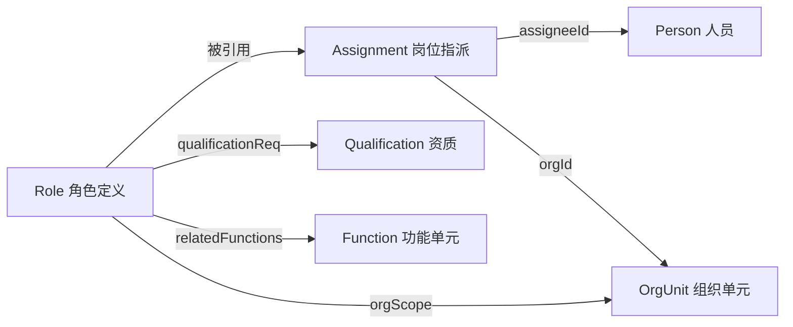
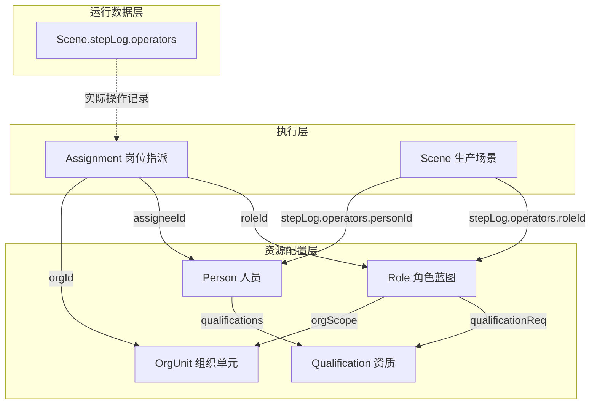
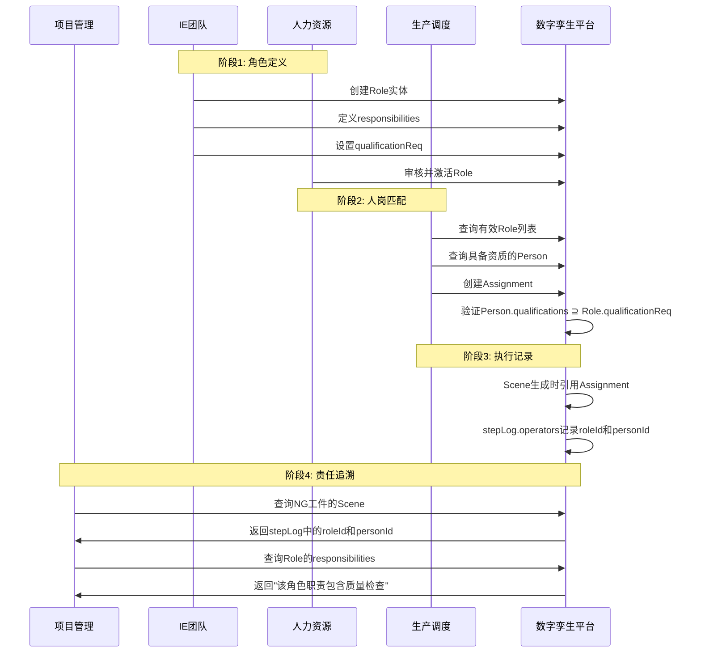

# Role实体数据契约

**Entity Data Contract - Role**

---

## 契约元信息

| 项目 | 内容 |
|-----|------|
| **契约版本** | v1.0.0 |
| **所属总契约** | 00_总契约.md v1.0.0 |
| **生效日期** | 2025-11-10 |
| **实体类型** | Role (角色) |
| **所属层级** | 资源配置层 (Resource Configuration Layer) |
| **契约状态** | 🟢 生效中 |

---

## 1. 实体概述

### 1.1 实体定义

**Role** (角色) 是资源配置层的岗位职责实体,代表企业组织中的一个标准化岗位角色定义。它是职责与个体解耦的静态蓝图,定义了"这个岗位需要做什么"而非"谁在做"。

Role实体遵循基于角色的访问控制(RBAC)模式,支持:
- 职责静态化定义与版本管理
- 系统权限集合的集中管理
- 任职资质要求的规范化约束
- KPI归属与组织功能的清晰映射

### 1.2 实体用途

| 用途类别 | 具体应用 |
|---------|---------|
| 职责管理 | 定义岗位的核心工作职责清单 |
| 权限控制 | 基于角色的系统操作权限管理(RBAC) |
| 资质约束 | 明确岗位任职的资格证书要求 |
| 绩效管理 | 关联岗位负责的KPI指标 |
| 组织治理 | 映射岗位与企业功能架构的关系 |
| 责任追溯 | 通过Assignment实现人员-职责-事件追溯链 |

### 1.3 与相关实体的关系



**关键区别**:
- **Role**: 静态的岗位蓝图,定义职责、权限、要求
- **Assignment**: 动态的人岗绑定,实现"谁在什么时间担任什么角色"
- **Person**: 个体信息,包含技能、资质等
- **Scene.stepLog.operators**: 运行时实际执行记录

### 1.4 典型URN示例

```
urn:ngsi-ld:Role:WeldingTeamLeader
urn:ngsi-ld:Role:IEEngineer
urn:ngsi-ld:Role:QualitySupervisor
urn:ngsi-ld:Role:WaterSpider
urn:ngsi-ld:Role:ProductionPlanner
urn:ngsi-ld:Role:MaintenanceTechnician
```

---

## 2. 核心字段契约

### 2.1 必填字段

| 字段名 | NGSI-LD类型 | 数据类型 | 约束 | 说明 | 示例 |
|-------|------------|---------|------|------|------|
| **id** | - | URN | 必填,唯一 | Role实体的全局唯一标识符 | `urn:ngsi-ld:Role:WeldingTeamLeader` |
| **type** | - | String | 必填,固定值 | 固定为"Role" | `"Role"` |
| **@context** | - | Array | 必填 | NGSI-LD上下文定义 | `["https://uri.etsi.org/ngsi-ld/v1/ngsi-ld-core-context.jsonld", "https://example.com/contexts/role-context.jsonld"]` |
| **name** | Property | String | 必填,1-100字符 | 角色名称的人类可读标识 | `"焊接班组长"` |
| **responsibilities** | Property | Array[String] | 必填,≥1项 | 主要工作职责列表 | `["落实工序质量检查", "响应焊接异常"]` |

**URN命名规范**:
```
格式: urn:ngsi-ld:Role:{RoleCode}
约束:
- RoleCode使用PascalCase或kebab-case
- 必须语义化,体现岗位职能
- 示例: WeldingTeamLeader, IEEngineer, QualitySupervisor
```

### 2.2 推荐字段

| 字段名 | NGSI-LD类型 | 数据类型 | 说明 | 示例 |
|-------|------------|---------|------|------|
| **description** | Property | String | 角色的详细描述 | `"负责焊接工序现场管理和质量控制的班组长角色"` |
| **permissionSet** | Property | Array[String] | 系统操作权限码列表 | `["MES_ResolveAndon", "MES_ConfirmProcess"]` |
| **qualificationReq** | Relationship[] | URN[] | 任职要求的资质列表 | `[{type: "Relationship", object: "urn:ngsi-ld:Qualification:SeniorWelderCert"}]` |
| **kpiOwnership** | Property | Array[String] | 岗位负责的KPI指标名称 | `["CycleTimeVariance", "FirstTimeYield"]` |
| **effectiveFrom** | Property | DateTime | 角色定义生效时间 | `"2025-01-01T00:00:00Z"` |
| **effectiveTo** | Property | DateTime | 角色定义失效时间 | `"2025-12-31T23:59:59Z"` |

### 2.3 可选字段

| 字段名 | NGSI-LD类型 | 数据类型 | 说明 | 示例 |
|-------|------------|---------|------|------|
| **orgScope** | Relationship | URN | 角色适用的组织范围 | `{type: "Relationship", object: "urn:ngsi-ld:OrgUnit:ProductionDept"}` |
| **relatedFunctions** | Relationship[] | URN[] | 关联的企业功能单元 | `[{type: "Relationship", object: "urn:ngsi-ld:Function:F2.3.1"}]` |
| **ownerOrg** | Relationship | URN | 负责该角色管理的组织单元 | `{type: "Relationship", object: "urn:ngsi-ld:OrgUnit:IE-Team"}` |
| **policyRef** | Relationship | URN | 关联的管理制度或SOP文档 | `{type: "Relationship", object: "urn:ngsi-ld:Policy:SOP-WLD-001"}` |

---

## 3. 字段详细规范

### 3.1 responsibilities (核心字段)

**字段结构**:
```json
{
  "responsibilities": {
    "type": "Property",
    "value": [
      "职责描述1",
      "职责描述2",
      "职责描述3"
    ]
  }
}
```

**内容规范**:
- ✅ **必须完整列举**: 涵盖岗位的所有核心工作职责
- ✅ **结果导向**: 描述"需要做什么"而非"如何做"
- ✅ **简洁明确**: 每条职责1-2句话,清晰具体
- ✅ **可验证**: 职责应可通过观察或记录验证完成情况
- ❌ **避免模糊**: 不使用"协助"、"配合"等模糊词汇

**示例**:
```json
{
  "responsibilities": {
    "type": "Property",
    "value": [
      "落实工序质量检查与自检互检",
      "响应处置焊接异常并组织5Why分析",
      "协调人员保障产线节拍与异常支援",
      "执行班组安全巡检与隐患上报",
      "汇总班组日报并参与早会交接"
    ]
  }
}
```

---

### 3.2 permissionSet (权限管理)

**字段结构**:
```json
{
  "permissionSet": {
    "type": "Property",
    "value": [
      "SYSTEM_PERMISSION_CODE_1",
      "SYSTEM_PERMISSION_CODE_2"
    ]
  }
}
```

**权限码规范**:
- ✅ 格式: `{系统}_{操作动词}{对象}` (全大写,下划线分隔)
- ✅ 示例: `MES_ResolveAndon`, `QMS_ApproveNCR`, `WMS_ConfirmShipment`
- ✅ 唯一性: 同一权限码不重复

**常见权限码**:
| 权限码 | 说明 | 适用角色 |
|-------|------|---------|
| `MES_ResolveAndon` | 处理Andon异常 | 班组长、工段长 |
| `MES_ConfirmProcess` | 确认工序完成 | 操作工 |
| `QMS_ApproveQualityIssue` | 审批质量问题 | 质量主管 |
| `PLM_EditBOM` | 编辑BOM | IE工程师 |
| `WMS_ReleaseInventory` | 释放库存 | 仓库管理员 |

**使用指南**:
- 权限码应与企业实际的IT系统权限体系对齐
- 通过Assignment将权限授予具体人员
- 支持基于角色的访问控制(RBAC)

---

### 3.3 qualificationReq (资质要求)

**字段结构**:
```json
{
  "qualificationReq": [
    {
      "type": "Relationship",
      "object": "urn:ngsi-ld:Qualification:SeniorWelderCert"
    },
    {
      "type": "Relationship",
      "object": "urn:ngsi-ld:Qualification:ISO9001Auditor"
    }
  ]
}
```

**资质类型**:
- 技能证书: 焊工证、电工证、叉车证等
- 体系认证: ISO9001内审员、6σ绿带等
- 企业内训: 企业内部技能等级认证
- 法定资质: 特种作业操作证等

**约束规则**:
- 通过Assignment实现人岗匹配时,系统应验证:
  - `Person.qualifications` ⊇ `Role.qualificationReq`
  - 即: 人员持有的资质必须覆盖岗位要求的资质

**验证逻辑**:
```python
def validate_assignment(person, role):
    person_quals = set(person.qualifications)
    required_quals = set(role.qualificationReq)
    if not required_quals.issubset(person_quals):
        raise ValidationError(
            f"人员 {person.id} 缺少必需资质: {required_quals - person_quals}"
        )
```

---

### 3.4 kpiOwnership (绩效指标)

**字段结构**:
```json
{
  "kpiOwnership": {
    "type": "Property",
    "value": [
      "CycleTimeVariance",
      "LaborUtilization",
      "FirstTimeYield"
    ]
  }
}
```

**KPI命名规范**:
- ✅ 使用PascalCase或kebab-case
- ✅ 保持简洁且语义明确
- ✅ 与企业KPI体系保持一致

**常见KPI示例**:
| KPI名称 | 中文名称 | 适用角色 |
|---------|---------|---------|
| `FirstTimeYield` | 一次合格率 | 质量主管、班组长 |
| `CycleTimeVariance` | 节拍偏差率 | 班组长、工段长 |
| `OEE` | 设备综合效率 | 设备管理员 |
| `LaborUtilization` | 人员利用率 | 生产调度 |
| `InventoryTurnover` | 库存周转率 | 仓库管理员 |
| `PPM` | 百万分之缺陷率 | 质量工程师 |

---

### 3.5 relatedFunctions (功能架构映射)

**字段结构**:
```json
{
  "relatedFunctions": [
    {
      "type": "Relationship",
      "object": "urn:ngsi-ld:Function:F2.3.1"
    },
    {
      "type": "Relationship",
      "object": "urn:ngsi-ld:Function:F2.3.2"
    }
  ]
}
```

**功能编码说明**:
- 遵循企业功能架构编码规范 (如ISA-95功能层次)
- 示例:
  - `F1`: 生产管理功能域
  - `F2`: 质量管理功能域
  - `F2.3`: 过程质量控制功能
  - `F2.3.1`: 工序质量检验
  - `F2.3.2`: 不良品处置

**用途**:
- 支撑组织设计与功能架构的一致性
- 便于从功能视角分析岗位职责覆盖度
- 支持组织重组时的职责重新分配

---

### 3.6 时间有效性管理

**effectiveFrom / effectiveTo**:
```json
{
  "effectiveFrom": {
    "type": "Property",
    "value": "2025-01-01T00:00:00Z"
  },
  "effectiveTo": {
    "type": "Property",
    "value": "2025-12-31T23:59:59Z"
  }
}
```

**使用场景**:
- **角色版本演进**: 当职责范围变化时,创建新版本Role
- **临时岗位**: 项目制岗位设置明确的失效时间
- **组织重组**: 标记旧Role的失效时间,新Role的生效时间

**约束规则**:
- `effectiveTo`为空表示当前仍有效
- `effectiveFrom` < `effectiveTo` (如果effectiveTo不为空)
- 创建Assignment时应验证当前时间在Role的有效期内

---

## 4. 实体示例

### 4.1 示例1: 焊接班组长

```json
{
  "@context": [
    "https://uri.etsi.org/ngsi-ld/v1/ngsi-ld-core-context.jsonld",
    "https://example.com/contexts/role-context.jsonld"
  ],
  "id": "urn:ngsi-ld:Role:WeldingTeamLeader",
  "type": "Role",
  "name": {
    "type": "Property",
    "value": "焊接班组长"
  },
  "description": {
    "type": "Property",
    "value": "负责焊接工序现场管理和质量控制的班组长角色"
  },
  "responsibilities": {
    "type": "Property",
    "value": [
      "落实工序质量检查与自检互检",
      "响应处置焊接异常并组织5Why分析",
      "协调人员保障产线节拍与异常支援",
      "执行班组安全巡检与隐患上报",
      "汇总班组日报并参与早会交接"
    ]
  },
  "permissionSet": {
    "type": "Property",
    "value": [
      "MES_ResolveAndon",
      "MES_ConfirmProcess",
      "QMS_ApproveQualityIssue"
    ]
  },
  "qualificationReq": [
    {
      "type": "Relationship",
      "object": "urn:ngsi-ld:Qualification:SeniorWelderCert"
    },
    {
      "type": "Relationship",
      "object": "urn:ngsi-ld:Qualification:ISO9001Auditor"
    }
  ],
  "kpiOwnership": {
    "type": "Property",
    "value": [
      "CycleTimeVariance",
      "LaborUtilization",
      "FirstTimeYield"
    ]
  },
  "orgScope": {
    "type": "Relationship",
    "object": "urn:ngsi-ld:OrgUnit:ProductionDept"
  },
  "relatedFunctions": [
    {
      "type": "Relationship",
      "object": "urn:ngsi-ld:Function:F2.3.1"
    },
    {
      "type": "Relationship",
      "object": "urn:ngsi-ld:Function:F2.3.2"
    }
  ],
  "effectiveFrom": {
    "type": "Property",
    "value": "2025-01-01T00:00:00Z"
  },
  "ownerOrg": {
    "type": "Relationship",
    "object": "urn:ngsi-ld:OrgUnit:IE-Team"
  }
}
```

---

### 4.2 示例2: IE工程师

```json
{
  "@context": [
    "https://uri.etsi.org/ngsi-ld/v1/ngsi-ld-core-context.jsonld",
    "https://example.com/contexts/role-context.jsonld"
  ],
  "id": "urn:ngsi-ld:Role:IEEngineer",
  "type": "Role",
  "name": {
    "type": "Property",
    "value": "IE工程师"
  },
  "description": {
    "type": "Property",
    "value": "工业工程师,负责工艺优化、标准工时制定和产线布局改善"
  },
  "responsibilities": {
    "type": "Property",
    "value": [
      "制定和维护标准工时及MBOM",
      "分析生产瓶颈并提出改善方案",
      "设计工位布局与物流动线",
      "推动精益生产工具的应用",
      "支持新产品导入的工艺评审"
    ]
  },
  "permissionSet": {
    "type": "Property",
    "value": [
      "PLM_EditBOM",
      "PLM_EditProcess",
      "MES_ConfigStation",
      "ANALYTICS_ViewKPI"
    ]
  },
  "qualificationReq": [
    {
      "type": "Relationship",
      "object": "urn:ngsi-ld:Qualification:IEEngineerCert"
    },
    {
      "type": "Relationship",
      "object": "urn:ngsi-ld:Qualification:LeanGreenBelt"
    }
  ],
  "kpiOwnership": {
    "type": "Property",
    "value": [
      "ProcessEfficiency",
      "CycleTimeReduction",
      "LayoutOptimization"
    ]
  },
  "orgScope": {
    "type": "Relationship",
    "object": "urn:ngsi-ld:OrgUnit:EngineeringDept"
  },
  "relatedFunctions": [
    {
      "type": "Relationship",
      "object": "urn:ngsi-ld:Function:F1.2.1"
    },
    {
      "type": "Relationship",
      "object": "urn:ngsi-ld:Function:F1.2.3"
    }
  ],
  "effectiveFrom": {
    "type": "Property",
    "value": "2025-01-01T00:00:00Z"
  },
  "ownerOrg": {
    "type": "Relationship",
    "object": "urn:ngsi-ld:OrgUnit:IE-Team"
  },
  "policyRef": {
    "type": "Relationship",
    "object": "urn:ngsi-ld:Policy:IE-Methodology-Standard"
  }
}
```

---

### 4.3 示例3: 水蜘蛛(物料配送员)

```json
{
  "@context": [
    "https://uri.etsi.org/ngsi-ld/v1/ngsi-ld-core-context.jsonld",
    "https://example.com/contexts/role-context.jsonld"
  ],
  "id": "urn:ngsi-ld:Role:WaterSpider",
  "type": "Role",
  "name": {
    "type": "Property",
    "value": "水蜘蛛"
  },
  "description": {
    "type": "Property",
    "value": "物料配送岗位,负责按拉动信号及时配送物料至工位"
  },
  "responsibilities": {
    "type": "Property",
    "value": [
      "响应工位物料需求信号并及时配送",
      "执行先进先出(FIFO)原则",
      "维护物料标识卡和看板",
      "清理工位空容器并归位",
      "记录物料配送轨迹"
    ]
  },
  "permissionSet": {
    "type": "Property",
    "value": [
      "WMS_PickMaterial",
      "WMS_ConfirmDelivery",
      "MES_ScanBarcode"
    ]
  },
  "qualificationReq": [
    {
      "type": "Relationship",
      "object": "urn:ngsi-ld:Qualification:ForkliftLicense"
    }
  ],
  "kpiOwnership": {
    "type": "Property",
    "value": [
      "MaterialDeliveryOnTime",
      "LineSideInventoryLevel"
    ]
  },
  "orgScope": {
    "type": "Relationship",
    "object": "urn:ngsi-ld:OrgUnit:LogisticsDept"
  },
  "relatedFunctions": [
    {
      "type": "Relationship",
      "object": "urn:ngsi-ld:Function:F3.2.1"
    }
  ],
  "effectiveFrom": {
    "type": "Property",
    "value": "2025-01-01T00:00:00Z"
  },
  "ownerOrg": {
    "type": "Relationship",
    "object": "urn:ngsi-ld:OrgUnit:LogisticsTeam"
  }
}
```

---

## 5. 关系图谱

### 5.1 Role在数字孪生体系中的位置



### 5.2 核心关系清单

| 关系名 | 源实体 | 目标实体 | 基数 | 必填 | 说明 |
|-------|-------|---------|------|-----|------|
| qualificationReq | Role | Qualification | 1:N | 否 | 岗位要求的资质列表 |
| orgScope | Role | OrgUnit | N:1 | 否 | 角色适用的组织范围 |
| relatedFunctions | Role | Function | 1:N | 否 | 关联的功能单元 |
| ownerOrg | Role | OrgUnit | N:1 | 否 | 负责管理该角色的组织 |
| policyRef | Role | Policy | N:1 | 否 | 关联的管理制度 |
| roleId (in Assignment) | Assignment | Role | N:1 | ✓ | Assignment引用的角色 |
| roleId (in Scene.stepLog) | Scene | Role | N:1 | - | 实际执行场景中操作者的角色 |

---

## 6. 数据验证规则

### 6.1 结构验证

```python
def validate_role_structure(role_entity):
    """Role实体结构验证"""
    errors = []
    
    # 必填字段检查
    required_fields = ['id', 'type', 'name', 'responsibilities']
    for field in required_fields:
        if field not in role_entity:
            errors.append(f"缺少必填字段: {field}")
    
    # type值验证
    if role_entity.get('type') != 'Role':
        errors.append(f"type字段必须为'Role'")
    
    # URN格式验证
    urn_pattern = r'^urn:ngsi-ld:Role:[A-Za-z0-9_-]+$'
    if not re.match(urn_pattern, role_entity.get('id', '')):
        errors.append(f"id不符合URN格式规范")
    
    # responsibilities非空验证
    resp = role_entity.get('responsibilities', {}).get('value', [])
    if not isinstance(resp, list) or len(resp) == 0:
        errors.append("responsibilities至少需要包含1条职责")
    
    return errors
```

### 6.2 语义验证

```python
def validate_role_semantics(role_entity, context_data):
    """Role实体语义验证"""
    warnings = []
    
    # orgScope引用完整性
    if 'orgScope' in role_entity:
        org_id = role_entity['orgScope']['object']
        if org_id not in context_data['orgunit_ids']:
            warnings.append(f"orgScope引用的组织单元不存在: {org_id}")
    
    # qualificationReq引用完整性
    if 'qualificationReq' in role_entity:
        for qual in role_entity['qualificationReq']:
            qual_id = qual['object']
            if qual_id not in context_data['qualification_ids']:
                warnings.append(f"qualificationReq引用的资质不存在: {qual_id}")
    
    # 时间有效性检查
    eff_from = role_entity.get('effectiveFrom', {}).get('value')
    eff_to = role_entity.get('effectiveTo', {}).get('value')
    if eff_from and eff_to:
        if datetime.fromisoformat(eff_from) >= datetime.fromisoformat(eff_to):
            warnings.append("effectiveFrom必须早于effectiveTo")
    
    return warnings
```

### 6.3 JSON Schema验证

**引用Schema文件**: `/mnt/project/role_schema.json`

**验证命令**:
```bash
python validators/validate_role.py --file roles_ngsi_ld.json --schema role_schema.json
```

---

## 7. 四项任务使用指南

### 7.1 任务1: 数字孪生管理平台

**职责**:
- ✅ Role实体的CRUD操作
- ✅ 角色版本管理
- ✅ 关系完整性校验
- ✅ 契约验证集成

**关键操作**:
```python
# 创建角色时
role = create_role(data)
validation_result = validate_role(role)
if validation_result.is_valid:
    db.insert(role)
else:
    raise ValidationError(validation_result.errors)

# 更新角色时(版本化管理)
if role_responsibilities_changed(old_role, new_role):
    # 旧版本失效
    old_role.effectiveTo = datetime.now()
    # 创建新版本
    new_role.id = generate_new_role_version_id()
    new_role.effectiveFrom = datetime.now()
    db.update(old_role)
    db.insert(new_role)
```

**API示例**:
```http
POST /ngsi-ld/v1/entities
Content-Type: application/ld+json

{
  "@context": [...],
  "id": "urn:ngsi-ld:Role:WeldingTeamLeader",
  "type": "Role",
  "name": {"type": "Property", "value": "焊接班组长"},
  "responsibilities": {"type": "Property", "value": ["..."]}
}
```

---

### 7.2 任务2: 产线2D地图

**关注点**:
- Role在地图中不直接显示
- 通过Assignment查询当前在岗人员的角色
- 可视化显示工位的当班人员及其角色

**查询示例**:
```
1. 查询某工位当前时间的所有有效Assignment
2. 获取Assignment.roleId获取角色信息
3. 在地图上显示"工位X - 焊接班组长(张三)"
```

---

### 7.3 任务3: 业务优化智能应用

**不同业务方向的Role使用**:

| 业务方向 | Role的作用 | 关键字段 |
|---------|-----------|---------|
| 生产计划可行性 | 验证班次人员配置是否满足工艺要求 | qualificationReq, responsibilities |
| 价值流分析 | 识别价值流中的职责空白和重叠 | responsibilities, kpiOwnership |
| 库存控制 | 明确库存管理的责任归属 | kpiOwnership, permissionSet |
| 质量改进 | 追溯质量问题的责任链 | responsibilities, qualificationReq |

**智能应用场景示例**:

**场景1: 人岗匹配验证**
```python
def validate_person_role_match(person, role):
    """验证人员是否满足角色要求"""
    # 检查资质匹配
    person_quals = set(person.qualifications)
    required_quals = set(role.qualificationReq)
    if not required_quals.issubset(person_quals):
        return False, f"缺少资质: {required_quals - person_quals}"
    
    # 检查技能匹配
    person_skills = set(person.skills)
    role_skills = extract_skills_from_responsibilities(role.responsibilities)
    if not role_skills.issubset(person_skills):
        return False, f"缺少技能: {role_skills - person_skills}"
    
    return True, "匹配"
```

**场景2: 质量责任追溯**
```python
def trace_quality_responsibility(ng_workpiece):
    """追溯质量问题的责任链"""
    # 1. 查询NG工件的生产场景
    scenes = query_scenes_by_workpiece(ng_workpiece.id)
    
    # 2. 查询场景中的操作记录
    for scene in scenes:
        for step_log in scene.stepLog:
            for operator in step_log.operators:
                # 3. 获取操作者的角色
                role = get_role(operator.roleId)
                # 4. 检查角色职责
                if "质量检查" in role.responsibilities:
                    # 5. 查询该操作者的Assignment
                    assignment = get_assignment(
                        operator.personId,
                        operator.roleId,
                        step_log.timestamp
                    )
                    # 6. 输出责任链
                    print(f"工步: {step_log.stepRef}")
                    print(f"角色: {role.name}")
                    print(f"职责: {role.responsibilities}")
                    print(f"操作者: {operator.personId}")
                    print(f"指派记录: {assignment.id}")
```

---

### 7.4 任务4: 生产系统仿真

**使用场景**:
- 读取Role定义理解岗位职责范围
- 模拟不同角色配置下的生产效率
- 生成符合角色约束的Scene.stepLog记录

**仿真示例**:
```python
def simulate_scene_with_roles(takt, station):
    """仿真场景生成,考虑角色约束"""
    # 1. 查询该节拍需要的角色
    required_roles = get_required_roles_for_takt(takt)
    
    # 2. 为每个角色分配人员
    assigned_operators = []
    for role_id in required_roles:
        role = get_role(role_id)
        # 选择具备资质的人员
        qualified_persons = get_qualified_persons(role.qualificationReq)
        assigned_operators.append({
            'personId': random.choice(qualified_persons),
            'roleId': role_id
        })
    
    # 3. 生成Scene实体
    scene = {
        'id': generate_scene_id(),
        'type': 'Scene',
        'workpieceId': workpiece.id,
        'taktRef': takt.id,
        'stepLog': generate_step_log(takt, assigned_operators),
        'provenance': {
            'method': 'Simulated'
        }
    }
    
    return scene
```

**注意事项**:
- ⚠️ 仿真应遵守Role.qualificationReq约束
- ⚠️ 仿真生成的Scene.stepLog应包含合法的roleId引用
- ⚠️ 通过provenance.method = "Simulated"标识仿真数据

---

## 8. 与Assignment的协同

### 8.1 Role vs Assignment

| 维度 | Role | Assignment |
|-----|------|-----------|
| **性质** | 静态蓝图 | 动态绑定 |
| **内容** | 职责、权限、要求 | 人、角色、组织、时间 |
| **生命周期** | 长期有效(按版本演进) | 有明确起止时间 |
| **实例数** | 相对稳定(18个) | 动态变化(随排班变化) |
| **更新频率** | 低(组织重组时) | 高(每班次/每日) |

### 8.2 协同工作流程



### 8.3 数据一致性约束

**约束1: Assignment引用的Role必须有效**
```sql
-- 验证Assignment.roleId有效性
SELECT a.id
FROM Assignment a
LEFT JOIN Role r ON a.roleId = r.id
WHERE r.id IS NULL
  OR (r.effectiveFrom IS NOT NULL AND a.validFrom < r.effectiveFrom)
  OR (r.effectiveTo IS NOT NULL AND a.validFrom > r.effectiveTo)
```

**约束2: Scene.stepLog引用的Role必须存在**
```python
def validate_scene_role_references(scene):
    """验证Scene中引用的roleId都存在"""
    for step_log in scene.stepLog:
        for operator in step_log.operators:
            if not role_exists(operator.roleId):
                raise ValidationError(
                    f"Scene {scene.id} 引用了不存在的角色: {operator.roleId}"
                )
```

---

## 9. JSON Schema定义

完整的JSON Schema定义参见: `/mnt/project/role_schema.json`

**核心Schema片段**:
```json
{
  "$schema": "http://json-schema.org/draft-07/schema#",
  "title": "Role Entity Schema",
  "type": "object",
  "required": ["id", "type", "name", "responsibilities"],
  "properties": {
    "id": {
      "type": "string",
      "pattern": "^urn:ngsi-ld:Role:[A-Za-z0-9_-]+$"
    },
    "type": {
      "type": "string",
      "const": "Role"
    },
    "name": {
      "type": "object",
      "required": ["type", "value"],
      "properties": {
        "type": {"const": "Property"},
        "value": {
          "type": "string",
          "minLength": 1,
          "maxLength": 100
        }
      }
    },
    "responsibilities": {
      "type": "object",
      "required": ["type", "value"],
      "properties": {
        "type": {"const": "Property"},
        "value": {
          "type": "array",
          "items": {"type": "string", "minLength": 1},
          "minItems": 1
        }
      }
    }
  }
}
```

---

## 10. 变更历史

| 版本 | 日期 | 变更内容 | 影响范围 |
|-----|------|---------|---------|
| v1.0.0 | 2025-11-10 | 初始版本,定义Role实体完整契约 | 所有任务 |

---

## 11. 参考文档

- **00_总契约.md** - 实体数据契约总体规范
- **08_Assignment契约.md** - 岗位指派实体契约
- **01_TwinObject契约.md** - Person子类型定义
- **03_Scene契约.md** - stepLog中的roleId引用
- **/mnt/project/role_schema.json** - Role实体JSON Schema
- **/mnt/project/roles_ngsi_ld.json** - Role实例数据
- **NGSI-LD规范** - https://www.etsi.org/deliver/etsi_gs/CIM/001_099/009/

---

**契约维护**: 数字孪生项目组  
**联系方式**: digital-twin-team@example.com
