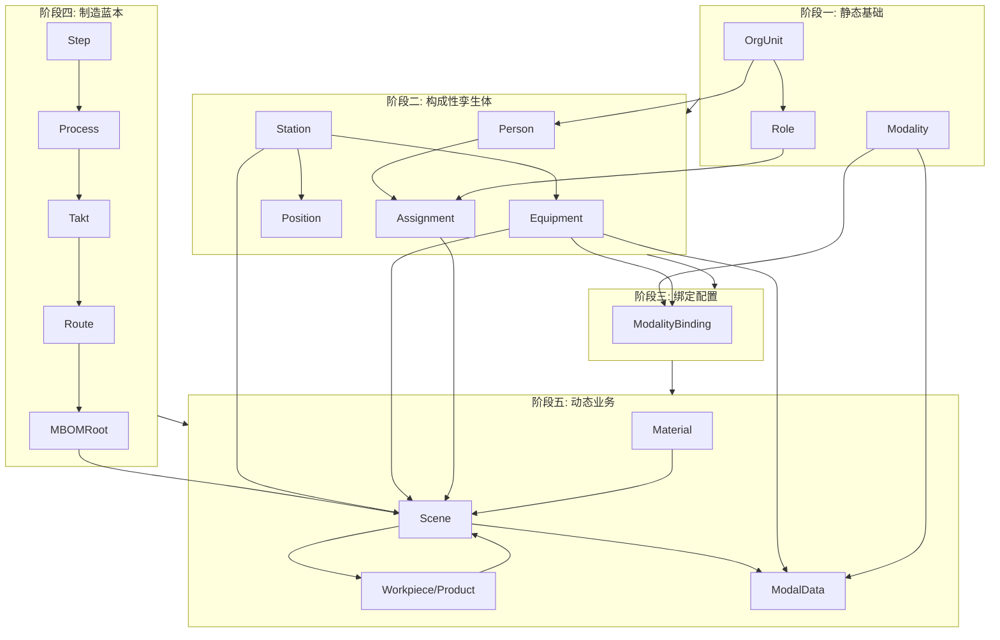

### **实体实例创建顺序指南**

创建过程应遵循**“先静态后动态，先基础后业务”**的原则。整个过程可以分为五个主要阶段：

#### **阶段一：创建静态基础定义 (Foundational Master Data)**

这个阶段的目标是构建整个数字孪生系统的“字典”和“组织框架”。这些实体相对稳定，是后续所有实体存在的基础。

1. **`OrgUnit` (组织单元)**
   - **原因**: 这是责任和资源归属的顶层框架。您需要先定义工厂、车间、产线、班组等组织结构，才能将人员和设备分配到对应的管理单元下。
   - **顺序**: 从最高层级开始，逐级向下创建（例如：工厂 → 车体车间 → 侧墙产线 → 早班班组）。
2. **`Role` (角色)**
   - **原因**: `Role`定义了岗位的职责和权限，是`Assignment`（人岗指派）的前提。必须先知道需要“什么岗位”，才能安排“谁来做”。
   - **顺序**: 创建所有需要的角色，如“焊工”、“质检员”、“班组长”等。
3. **`Qualification` (资质，如果建模)**
   - **原因**: `Role`和`Assignment`都可能引用资质实体，用于人岗匹配的合规性检查。
   - **顺序**: 创建如“高级焊工证”、“安全培训证”等资质实例。
4. **`Modality` (模态)**
   - **原因**: 这是系统的“数据字典”，定义了所有可以采集的数据类型（如“焊接电流-自动采集”）。`ModalityBinding`必须引用`Modality`。
   - **顺序**: 创建所有需要采集和分析的数据类型定义。

#### **阶段二：创建构成性孪生体 (Constituent TwinObjects)**

这个阶段的目标是创建产线上所有固定的物理资产和人员的数字孪生体。

1. **`TwinObject` (subType: "Person")**
   - **原因**: `Assignment`实体需要引用具体的人员实例。
   - **顺序**: 创建所有产线员工的`Person`实例。
2. **`TwinObject` (subType: "Station")**
   - **原因**: 工位是设备部署和工序执行的核心空间单元，是`Scene`执行的位置基础。
   - **顺序**: 创建产线上所有的工位实例。
3. **`TwinObject` (subType: "Position")**
   - **原因**: `Position`（台位）必须归属于一个已存在的`Station`（通过`belongsToStation`字段）。
   - **顺序**: 在创建了对应的`Station`之后，为其创建内部的`Position`实例。
4. **`TwinObject` (subType: "AutoEquipment", "TransportEquipment", "QC_Tool")**
   - **原因**: 这些设备是生产的核心资源，它们通常被部署在`Station`中（通过`deployedEquipment`关联）。
   - **顺序**: 创建所有机器人、焊机、天车、三坐标测量仪等设备实例。

#### **阶段三：建立绑定与配置关系 (Binding and Configuration)**

这个阶段将抽象的定义与具体的物理实体连接起来。

1. **`ModalityBinding`**
   - **原因**: `ModalityBinding`必须同时引用一个`TwinObject`（哪个设备）和一个`Modality`（采集什么数据）。
   - **顺序**: 在`Modality`和相关的`TwinObject`都创建完毕后，为需要采集数据的设备创建绑定配置。

#### **阶段四：创建制造蓝本 (Manufacturing Blueprint)**

这个阶段构建完整的工艺流程定义，是所有生产执行的依据。

1. **`MBOM` 实体网络**
   - **原因**: `Scene`实例必须引用一个MBOM实体来作为其执行的工艺模板。MBOM自身具有严格的层级依赖关系。
   - **顺序**: 必须**自顶向下**创建：
     1. `MBOM` (mbomType: `Step`) - 创建所有最底层的工步。
     2. `MBOM` (mbomType: `Process`) - 创建工序，并关联已创建的`Step`。
     3. `MBOM` (mbomType: `Takt`) - 创建节拍，并关联已创建的`Process`。
     4. `MBOM` (mbomType: `Route`) - 创建工艺路线，并关联已创建的`Takt`。
     5. `MBOM` (mbomType: `MBOMRoot`) - 创建顶层MBOM，并关联已创建的`Route`。

#### **阶段五：创建动态业务实例 (Dynamic Transactional Instances)**

这个阶段是模拟或记录实际生产过程，实体实例会大量、动态地被创建。

1. **`TwinObject` (subType: "Material")**
   - **原因**: 这是生产流程的输入物料，需要在`Scene`开始前存在。
   - **顺序**: 在生产订单下达后，根据需要创建代表原材料或采购件的`Material`实例。
2. **`Assignment` (人岗指派)**
   - **原因**: `Assignment`必须引用已存在的`Person`和`Role`。它定义了在特定时间段内谁在岗，是`Scene`启动前的必要条件。
   - **顺序**: 在班次开始前或临时任务分配时创建。
3. **`Scene` (场景)**
   - **原因**: `Scene`是生产执行的核心记录。它需要引用`MBOM`、输入的`Workpiece`/`Material`、涉及的`Station`和`Equipment`等。
   - **顺序**: 在一道工序（或节拍、工步）即将开始时创建。
4. **`TwinObject` (subType: "Workpiece" / "Product")**
   - **原因**: `Workpiece`是在制品，是上一个`Scene`的**产出物 (`outputWorkpiece`)**，又是下一个`Scene`的**输入物 (`inputWorkpiece`)**。`Product`是整个`Workpiece`链的最终产物。
   - **顺序**: 在一个`Scene`执行**完成**后，根据其产出创建一个新的`Workpiece`或`Product`实例。
5. **`ModalData` (模态数据)**
   - **原因**: 这是最动态的数据，是生产过程的“心跳”。它的创建必须依赖“三锚点”：一个正在运行的`Scene`、一个产生数据的`TwinObject`和一个数据类型`Modality`。
   - **顺序**: 在`Scene`处于`Running`状态期间，由数据采集系统**持续不断地**创建。

------

### **总结流程图**

Code snippet

遵循以上顺序，您就可以系统性、无冲突地构建起一套完整且逻辑自洽的数字孪生实体实例数据集。